Compilation
================
Emily Lacroix
2024-JAN-09

- [Set-up](#set-up)
  - [Libraries](#libraries)
  - [Files](#files)
  - [Constants](#constants)
  - [Figure Theme](#figure-theme)
  - [Import and Combine](#import-and-combine)
- [PCA](#pca)
  - [Check normality and outliers](#check-normality-and-outliers)
    - [EAC to EEC](#eac-to-eec)
    - [nirK per g soil](#nirk-per-g-soil)
    - [nirS per g soil](#nirs-per-g-soil)
    - [mcrA per g soil](#mcra-per-g-soil)
  - [Create tibble for PCA](#create-tibble-for-pca)
- [Relationships between PC1 and Soil
  Properties](#relationships-between-pc1-and-soil-properties)
  - [Soil C Content](#soil-c-content)
    - [Linear Model](#linear-model)
    - [Figure](#figure)
  - [Site Position](#site-position)
    - [Statistics](#statistics)
- [Basic Correlations](#basic-correlations)

This script:

- combines all data (see `CompositeFigure.Rmd` and `ddPCR-allgenes.Rmd`
  for source of electro and ddPCR csv’s, respectively)
- perform a PCA on all of the rough indicators for reducing conditions
- see if this metric for reducing conditions correlates with
  anything/varies predictably by depth or position

# Set-up

## Libraries

``` r
library(ggpattern)
library(ggfortify)
library(ggrepel)
library(corrplot)
library(outliers)
library(tidyverse)
library(readxl)
library(car)
```

## Files

``` r
fe_edc_eac_file <- "compiled_fe_edc_eac_v2.csv"

ddpcr_file <- "compiled_ddpcr.csv"

ea_analysis_file <- "TCTN_data_raw.xlsx"
```

## Constants

``` r
site_colors <- c("R" = "darkgoldenrod1", "T" = "darkblue")

site_names <- c("R" = "Sandy Loam", "T" = "Loam")

agg_names <- c("B" = "Bulk soil", "IN" = "Agg. Interior")

agg_shapes <- c("Bulk" = 19, "In" = 2)

agg_alpha <- c("B" = 1, "IN" = 0.5)
```

## Figure Theme

``` r
my_theme <- function(base_size = 10, base_family = ""){ ## Control base font face and size. use `rel()` for relative font size.
  theme_bw(base_size = base_size, base_family = base_family) %+replace%
    theme(
      strip.text = element_text(size = 10, face = "bold"),
      axis.text = element_text(size = 10),
      axis.text.x = element_text(size = 10),
      axis.title = element_text(size = 12),
      legend.text = element_text(size = 10),
      legend.title = element_text(size = 12),
      strip.background = element_rect(fill = "transparent"),

      panel.grid.major = element_blank(),
      panel.grid.minor = element_blank(),
      aspect.ratio = 1.5
    )
}
```

## Import and Combine

``` r
electro_fe <- fe_edc_eac_file %>% read_csv()

tc_tn <-
  ea_analysis_file %>% 
  read_xlsx(skip = 5) %>% 
  select(
    date = `...1`,
    sample = `...2`,
    perc_n = `...7`,
    perc_c = `...8`
  ) %>% 
  filter(str_detect(sample, "-")) %>% 
  separate(sample, into = c("site", "hzn", "rep", "bulk_agg")) %>% 
  mutate(across(rep, as.numeric))


ddpcr <- ddpcr_file %>% read_csv()


all_data <- 
  electro_fe %>% 
  left_join(tc_tn, by = c("site", "hzn", "rep", "bulk_agg")) %>% 
  left_join(
    ddpcr %>% 
      mutate(across(bulk_agg, ~ if_else(. == "B", "Bulk", "In"))), 
    by = c("site", "hzn", "rep", "bulk_agg")
  )
```

# PCA

## Check normality and outliers

We want to perform a PCA on all of our indicators for anoxic conditions,
including:

- `eac_to_eec`
- `nirk_copies_per_g`
- `nirs_copies_per_g`
- `mcra_copies_per_g`

Thus, we need to transform these data to be normal and then remove
outliers.

### EAC to EEC

#### Before transformation

``` r
all_data %>% 
  ggplot(aes(x = eac_to_eec)) + 
  geom_histogram()
```

    ## `stat_bin()` using `bins = 30`. Pick better value with `binwidth`.

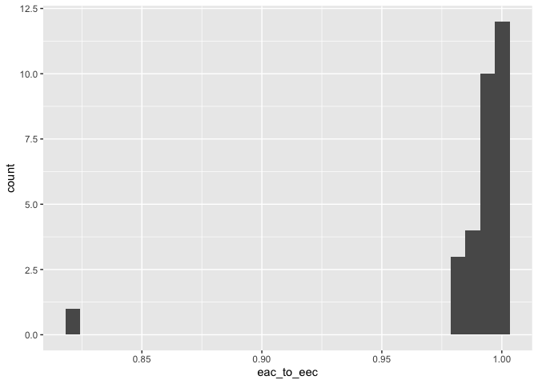<!-- -->

``` r
all_data %>% 
  mutate(
    trans_eac_to_eec = eac_to_eec
  ) %>% 
  pull(trans_eac_to_eec) %>% 
  grubbs.test()
```

    ## 
    ##  Grubbs test for one outlier
    ## 
    ## data:  .
    ## G = 5.212273, U = 0.030875, p-value < 2.2e-16
    ## alternative hypothesis: lowest value 0.82080577269994 is an outlier

#### Transformation

Remove outlier

``` r
all_data %>% 
  mutate(
    trans_eac_to_eec = eac_to_eec
  ) %>% 
  filter(trans_eac_to_eec > 0.85) %>% # this is from the high EDC value
  pull(trans_eac_to_eec) %>% 
  grubbs.test()
```

    ## 
    ##  Grubbs test for one outlier
    ## 
    ## data:  .
    ## G = 2.45114, U = 0.77776, p-value = 0.1426
    ## alternative hypothesis: lowest value 0.980219003885553 is an outlier

``` r
all_data %>% 
  mutate(
    trans_eac_to_eec = eac_to_eec
  ) %>% 
  filter(trans_eac_to_eec > 0.85) %>% 
  ggplot(aes(x = trans_eac_to_eec)) +
  geom_histogram()
```

    ## `stat_bin()` using `bins = 30`. Pick better value with `binwidth`.

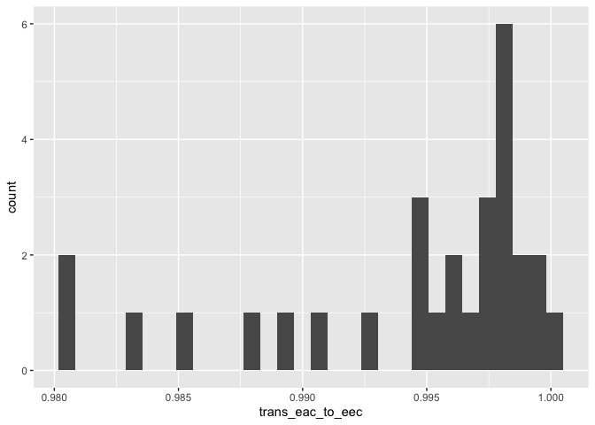<!-- -->

``` r
all_data %>% 
  mutate(
    trans_eac_to_eec = eac_to_eec
  ) %>% 
  filter(trans_eac_to_eec > 0.85) %>% 
  pull(trans_eac_to_eec) %>% 
  shapiro.test()
```

    ## 
    ##  Shapiro-Wilk normality test
    ## 
    ## data:  .
    ## W = 0.7976, p-value = 7.567e-05

Transformation: Raise to the power of 200

``` r
all_data %>% 
  filter(eac_to_eec > 0.85) %>% 
  mutate(
    trans_eac_to_eec = eac_to_eec^200
  ) %>% 
  ggplot(aes(x = trans_eac_to_eec)) +
  geom_histogram()
```

    ## `stat_bin()` using `bins = 30`. Pick better value with `binwidth`.

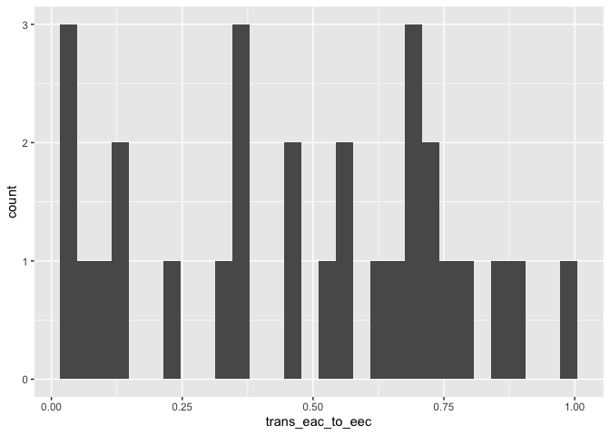<!-- -->

``` r
all_data %>% 
  filter(eac_to_eec > 0.85) %>% 
  mutate(
    trans_eac_to_eec = eac_to_eec^200  
  ) %>% 
  pull(trans_eac_to_eec) %>% 
  shapiro.test()
```

    ## 
    ##  Shapiro-Wilk normality test
    ## 
    ## data:  .
    ## W = 0.93848, p-value = 0.09152

``` r
all_data %>% 
  filter(eac_to_eec > 0.85) %>% 
  mutate(
    trans_eac_to_eec = eac_to_eec^200  
  ) %>% 
  pull(trans_eac_to_eec) %>% 
  grubbs.test()
```

    ## 
    ##  Grubbs test for one outlier
    ## 
    ## data:  .
    ## G = 1.70753, U = 0.89215, p-value = 1
    ## alternative hypothesis: highest value 0.974304473373494 is an outlier

### nirK per g soil

#### Before transformation

``` r
all_data %>% 
  ggplot(aes(x = nirk_copies_per_g)) + 
  geom_histogram()
```

    ## `stat_bin()` using `bins = 30`. Pick better value with `binwidth`.

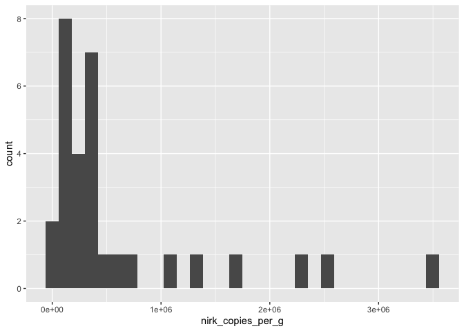<!-- -->

#### Transformation

``` r
all_data %>% 
  ggplot(aes(x = nirk_copies_per_g^(1/3))) + 
  geom_histogram()
```

    ## `stat_bin()` using `bins = 30`. Pick better value with `binwidth`.

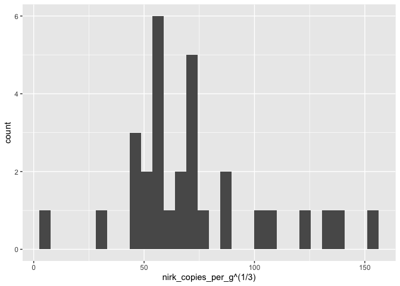<!-- -->

``` r
all_data %>% 
  mutate(
    trans_nirk = nirk_copies_per_g^(1/3)
  ) %>% 
  pull(trans_nirk) %>% 
  shapiro.test()
```

    ## 
    ##  Shapiro-Wilk normality test
    ## 
    ## data:  .
    ## W = 0.93187, p-value = 0.05505

``` r
all_data %>% 
  mutate(
    trans_nirk = nirk_copies_per_g^(1/3)
  ) %>% 
  pull(trans_nirk) %>% 
  grubbs.test()
```

    ## 
    ##  Grubbs test for one outlier
    ## 
    ## data:  .
    ## G = 2.4471, U = 0.7864, p-value = 0.152
    ## alternative hypothesis: highest value 151.793506141895 is an outlier

### nirS per g soil

#### Before transformation

``` r
all_data %>% 
  ggplot(aes(x = nirs_copies_per_g)) + 
  geom_histogram()
```

    ## `stat_bin()` using `bins = 30`. Pick better value with `binwidth`.

    ## Warning: Removed 1 row containing non-finite outside the scale range
    ## (`stat_bin()`).

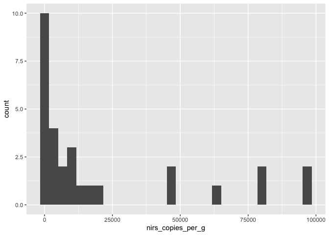<!-- -->

#### Transformation

``` r
all_data %>% 
  ggplot(aes(x = nirs_copies_per_g^(1/3))) + 
  geom_histogram()
```

    ## `stat_bin()` using `bins = 30`. Pick better value with `binwidth`.

    ## Warning: Removed 1 row containing non-finite outside the scale range
    ## (`stat_bin()`).

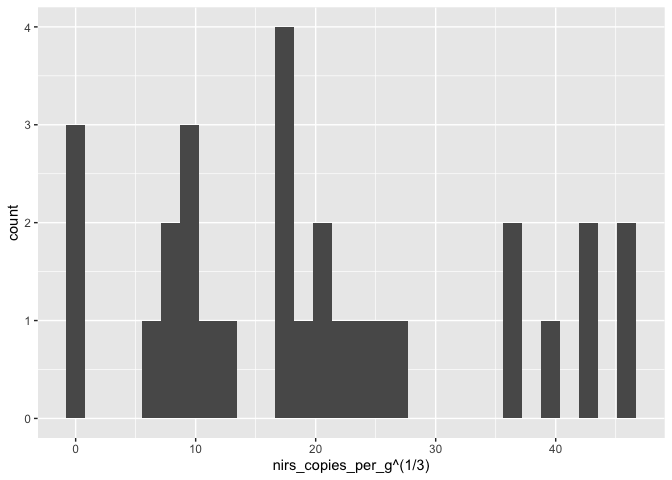<!-- -->

``` r
all_data %>% 
  mutate(
    trans_nirs = nirs_copies_per_g^(1/3)
  ) %>% 
  pull(trans_nirs) %>% 
  shapiro.test()
```

    ## 
    ##  Shapiro-Wilk normality test
    ## 
    ## data:  .
    ## W = 0.93054, p-value = 0.05681

``` r
all_data %>% 
  mutate(
    trans_nirs = nirs_copies_per_g^(1/3)
  ) %>% 
  pull(trans_nirs) %>% 
  grubbs.test()
```

    ## 
    ##  Grubbs test for one outlier
    ## 
    ## data:  .
    ## G = 1.80621, U = 0.87932, p-value = 0.9401
    ## alternative hypothesis: highest value 45.9158680683399 is an outlier

### mcrA per g soil

#### Before transformation

``` r
all_data %>% 
  ggplot(aes(x = mcra_copies_per_g)) + 
  geom_histogram()
```

    ## `stat_bin()` using `bins = 30`. Pick better value with `binwidth`.

    ## Warning: Removed 1 row containing non-finite outside the scale range
    ## (`stat_bin()`).

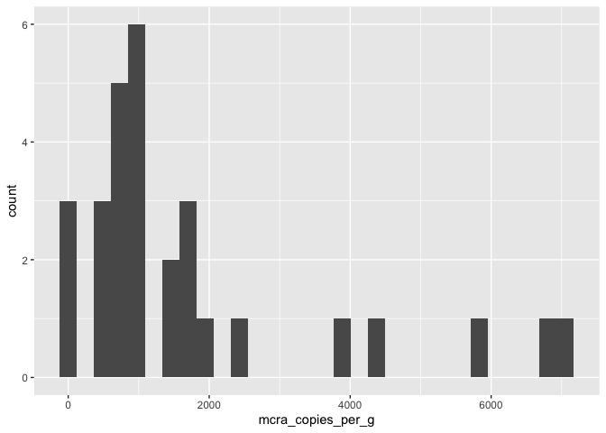<!-- -->

#### Transformation

Find lowest non-zero value:

``` r
all_data %>% 
  filter(mcra_copies_per_g > 0) %>% 
  pull(mcra_copies_per_g) %>% 
  min()
```

    ## [1] 396.0428

Transformation: log10(mcra + 0.5 \* lowest non-zero value)

``` r
all_data %>% 
  ggplot(aes(x = log10(mcra_copies_per_g + 200))) + 
  geom_histogram()
```

    ## `stat_bin()` using `bins = 30`. Pick better value with `binwidth`.

    ## Warning: Removed 1 row containing non-finite outside the scale range
    ## (`stat_bin()`).

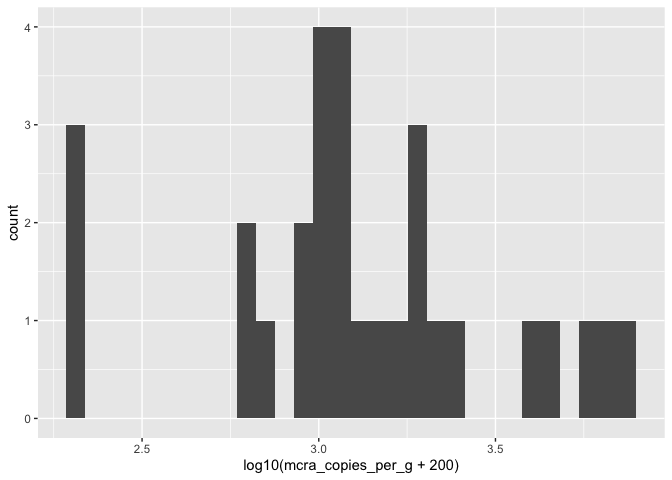<!-- -->

``` r
all_data %>% 
  mutate(
    trans_mcra = log10(mcra_copies_per_g + 200)
  ) %>% 
  pull(trans_mcra) %>% 
  shapiro.test()
```

    ## 
    ##  Shapiro-Wilk normality test
    ## 
    ## data:  .
    ## W = 0.93913, p-value = 0.09512

``` r
all_data %>% 
  mutate(
    trans_nirs = log10(mcra_copies_per_g + 200)
  ) %>% 
  pull(trans_nirs) %>% 
  grubbs.test()
```

    ## 
    ##  Grubbs test for one outlier
    ## 
    ## data:  .
    ## G = 2.00524, U = 0.85127, p-value = 0.5627
    ## alternative hypothesis: lowest value 2.30102999566398 is an outlier

## Create tibble for PCA

The PCA must transform these variables accordingly:

- `eac_to_eec`
  - Remove outlier by retaining values \> 0.85
  - Raise to the power of 200
- `nirk_copies_per_g`
  - Cube root
- `nirs_copies_per_g`
  - Cube root
- `mcra_copies_per_g`
  - log10(mcra + 200)

``` r
pca_tibble <- 
  all_data %>% 
  filter(eac_to_eec > 0.85) %>% # this completely drops the observation
  mutate(
    trans_eac_to_eec = eac_to_eec^200,
    trans_nirk = nirk_copies_per_g^(1/3),
    trans_nirs = nirs_copies_per_g^(1/3),
    trans_mcra = log10(mcra_copies_per_g + 200)
  ) %>% 
  drop_na() %>% 
  mutate(
    across(
      hzn, 
      ~case_when(
        . == "C" ~ "3",
        . == "B" ~ "2",
        . == "A" ~ "1" 
      )
    ) 
  ) 
```

``` r
pca_microsites <- 
  prcomp(
    ~trans_eac_to_eec + trans_nirk + trans_nirs + trans_mcra, 
    data = pca_tibble, 
    scale = TRUE
  )
```

``` r
autoplot(
  pca_microsites,
  loadings = TRUE,
  loadings.label = FALSE,
  data = pca_tibble,
  color = "site",
  shape = "bulk_agg",
  size = 6
) +
  geom_text(
    mapping = aes(label = hzn, color = site),
    size = 5,
    data = . %>%  filter(bulk_agg == "In")
  ) +
  geom_text(
    mapping = aes(label = hzn),
    size = 5,
    color = "white",
    data = . %>%  filter(bulk_agg == "Bulk")
  ) +
  scale_color_manual(
    values = site_colors,
    labels = site_names
  ) +
  scale_shape_manual(
    values = agg_shapes,
    labels = agg_names,
    name = NULL
  ) + 
  theme_bw() + 
  theme(
    aspect.ratio = 1,
    axis.title = element_text(size = 18),
    axis.text = element_text(size = 16),
    legend.text = element_text(size = 16),
    panel.grid = element_blank()
  ) + 
  labs(
    shape = NULL,
    color = NULL
  )
```

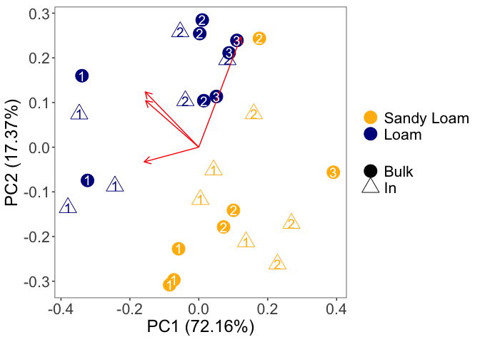<!-- -->

# Relationships between PC1 and Soil Properties

``` r
pc1 <- 
  pca_microsites$x %>% 
  as_tibble() %>% 
  pull(PC1)

pca1_tibble <- 
  pca_tibble %>% 
  add_column(pc1) 
```

## Soil C Content

### Linear Model

``` r
pc1_vs_soilC <- lm(pc1 ~ perc_c, data = pca1_tibble)

pc1_vs_soilC %>% summary()
```

    ## 
    ## Call:
    ## lm(formula = pc1 ~ perc_c, data = pca1_tibble)
    ## 
    ## Residuals:
    ##      Min       1Q   Median       3Q      Max 
    ## -1.73475 -0.48494  0.02337  0.37990  1.95457 
    ## 
    ## Coefficients:
    ##             Estimate Std. Error t value Pr(>|t|)    
    ## (Intercept)   3.0368     0.3321   9.143 1.89e-09 ***
    ## perc_c       -5.0115     0.4916 -10.194 2.17e-10 ***
    ## ---
    ## Signif. codes:  0 '***' 0.001 '**' 0.01 '*' 0.05 '.' 0.1 ' ' 1
    ## 
    ## Residual standard error: 0.763 on 25 degrees of freedom
    ## Multiple R-squared:  0.8061, Adjusted R-squared:  0.7983 
    ## F-statistic: 103.9 on 1 and 25 DF,  p-value: 2.174e-10

### Figure

``` r
pca1_tibble %>% 
  ggplot(aes(x = perc_c, y = pc1)) + 
  geom_smooth(method = "lm", se = FALSE, color = "gray", linetype = 2) + 
  geom_point(
    aes(
      shape = bulk_agg,
      color = site
    ),
    size = 5
  ) + 
geom_text(
  mapping = aes(label = hzn, color = site),
  size = 4,
  data = . %>%  filter(bulk_agg == "In")
) +
geom_text(
  mapping = aes(label = hzn),
  size = 4,
  color = "white",
  data = . %>%  filter(bulk_agg == "Bulk")
) +

scale_color_manual(
  values = site_colors,
  labels = site_names
) +
  scale_shape_manual(
    values = agg_shapes,
    labels = agg_names,
    name = NULL
  ) +
  theme_bw() + 
  theme(
    aspect.ratio = 1,
    axis.title = element_text(size = 16),
    axis.text = element_text(size = 14),
    legend.text = element_text(size = 14)
  ) + 
  labs(
    y = "PC1",
    x = "% Organic C",
    shape = NULL,
    color = NULL
  )
```

    ## `geom_smooth()` using formula = 'y ~ x'

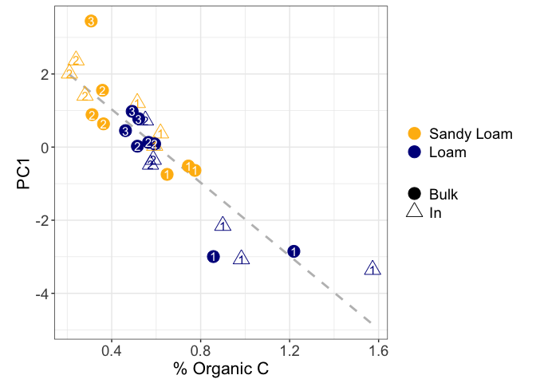<!-- -->

## Site Position

``` r
pca1_tibble %>% 
  group_by(site, hzn, bulk_agg) %>% 
  summarise(
    avg_pc1 = mean(pc1),
    se_pc1 = sd(pc1) / sqrt(n())
  ) %>% 
  ggplot(
    aes(y = hzn, x = avg_pc1, shape = bulk_agg, color = site)
  ) +
  geom_pointrange(
    aes(
      xmin = avg_pc1 - se_pc1, 
      xmax = avg_pc1 + se_pc1),
    size = 0.8
  ) +
  scale_x_reverse() + # NOTE REVERSE AXIS!!
  scale_y_discrete(limits = rev) +
  scale_color_manual(
    values = site_colors,
    labels = site_names,
  ) +
  scale_shape_manual(
    values = agg_shapes,
    labels = agg_names,
    name = NULL
  ) +
  facet_grid(
    cols = vars(site), 
    scales = "free_x",
    labeller = labeller(site = site_names)
  ) +
  my_theme() +
  theme(
      strip.text = element_text(size = 12, face = "bold"),
      axis.text = element_text(size = 12),
      axis.text.x = element_text(size = 12),
      axis.title = element_text(size = 14),
      legend.text = element_text(size = 12),
      legend.title = element_text(size = 14),
  ) +
  labs(
    x = "PC1",
    y = "Horizon",
    color = NULL
  )
```

    ## `summarise()` has grouped output by 'site', 'hzn'. You can override using the
    ## `.groups` argument.

    ## Warning: Removed 1 row containing missing values or values outside the scale range
    ## (`geom_segment()`).

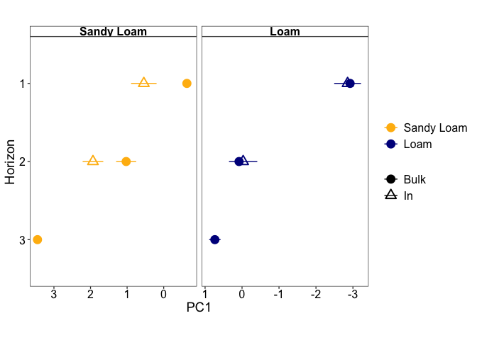<!-- -->

### Statistics

``` r
pca1_tibble %>% 
  filter(hzn != "3", site == "R") %>% 
  group_by(site, hzn, bulk_agg) %>% 
  summarise(
    norm = shapiro.test(pc1)$p.value
  )
```

    ## `summarise()` has grouped output by 'site', 'hzn'. You can override using the
    ## `.groups` argument.

    ## # A tibble: 4 × 4
    ## # Groups:   site, hzn [2]
    ##   site  hzn   bulk_agg  norm
    ##   <chr> <chr> <chr>    <dbl>
    ## 1 R     1     Bulk     0.944
    ## 2 R     1     In       0.543
    ## 3 R     2     Bulk     0.516
    ## 4 R     2     In       0.720

Sandy Loam & Hzn 1

``` r
var.test(
  x = 
    pca1_tibble %>% 
    filter(site == "R", hzn == "1", bulk_agg == "Bulk") %>% 
    pull(pc1),
  y = 
    pca1_tibble %>% 
    filter(site == "R", hzn == "1", bulk_agg == "In") %>% 
    pull(pc1)
)
```

    ## 
    ##  F test to compare two variances
    ## 
    ## data:  pca1_tibble %>% filter(site == "R", hzn == "1", bulk_agg == "Bulk") %>% pull(pc1) and pca1_tibble %>% filter(site == "R", hzn == "1", bulk_agg == "In") %>% pull(pc1)
    ## F = 0.036075, num df = 2, denom df = 2, p-value = 0.06964
    ## alternative hypothesis: true ratio of variances is not equal to 1
    ## 95 percent confidence interval:
    ##  0.0009249933 1.4069148584
    ## sample estimates:
    ## ratio of variances 
    ##         0.03607474

``` r
t.test(
  x = 
    pca1_tibble %>% 
    filter(site == "R", hzn == "1", bulk_agg == "Bulk") %>% 
    pull(pc1),
  y = 
    pca1_tibble %>% 
    filter(site == "R", hzn == "1", bulk_agg == "In") %>% 
    pull(pc1),
  var.equal = TRUE
)
```

    ## 
    ##  Two Sample t-test
    ## 
    ## data:  pca1_tibble %>% filter(site == "R", hzn == "1", bulk_agg == "Bulk") %>% pull(pc1) and pca1_tibble %>% filter(site == "R", hzn == "1", bulk_agg == "In") %>% pull(pc1)
    ## t = -3.3226, df = 4, p-value = 0.02931
    ## alternative hypothesis: true difference in means is not equal to 0
    ## 95 percent confidence interval:
    ##  -2.1595642 -0.1933912
    ## sample estimates:
    ##  mean of x  mean of y 
    ## -0.6335606  0.5429171

Sandy Loam & Horizon 2

``` r
var.test(
  x = 
    pca1_tibble %>% 
    filter(site == "R", hzn == "2", bulk_agg == "Bulk") %>% 
    pull(pc1),
  y = 
    pca1_tibble %>% 
    filter(site == "R", hzn == "2", bulk_agg == "In") %>% 
    pull(pc1)
)
```

    ## 
    ##  F test to compare two variances
    ## 
    ## data:  pca1_tibble %>% filter(site == "R", hzn == "2", bulk_agg == "Bulk") %>% pull(pc1) and pca1_tibble %>% filter(site == "R", hzn == "2", bulk_agg == "In") %>% pull(pc1)
    ## F = 0.94443, num df = 2, denom df = 2, p-value = 0.9714
    ## alternative hypothesis: true ratio of variances is not equal to 1
    ## 95 percent confidence interval:
    ##   0.02421605 36.83260912
    ## sample estimates:
    ## ratio of variances 
    ##          0.9444259

``` r
t.test(
  x = 
    pca1_tibble %>% 
    filter(site == "R", hzn == "2", bulk_agg == "Bulk") %>% 
    pull(pc1),
  y = 
    pca1_tibble %>% 
    filter(site == "R", hzn == "2", bulk_agg == "In") %>% 
    pull(pc1),
  var.equal = TRUE
)
```

    ## 
    ##  Two Sample t-test
    ## 
    ## data:  pca1_tibble %>% filter(site == "R", hzn == "2", bulk_agg == "Bulk") %>% pull(pc1) and pca1_tibble %>% filter(site == "R", hzn == "2", bulk_agg == "In") %>% pull(pc1)
    ## t = -2.3095, df = 4, p-value = 0.08208
    ## alternative hypothesis: true difference in means is not equal to 0
    ## 95 percent confidence interval:
    ##  -1.9980358  0.1834488
    ## sample estimates:
    ## mean of x mean of y 
    ##  1.025804  1.933098

# Basic Correlations

Shows that %Carbon is most closely linked with PC1, rather than other
indicators

``` r
cor_test_tibble <- 
  pca1_tibble %>% 
  filter(sixteenS_copies_per_g > 0) %>% 
  filter(eac_to_eec > 0.85) %>% # remove giant outlier from EAC to EEC 
  select(
    fe_ii_umol_per_g,
    edc_umol_g_soil,
    eac_umol_g_soil,
    eac_to_eec,
    perc_n,
    perc_c,
    sixteenS_copies_per_g,
    nirk_copies_per_g,
    nirs_copies_per_g,
    mcra_copies_per_g,
    pc1
  ) %>% 
  rename(
    `Fe(II)` = fe_ii_umol_per_g,
    EAC = eac_umol_g_soil,
    EDC = edc_umol_g_soil,
    `EAC / EEC` = eac_to_eec,
    `% C` = perc_c,
    `% N` = perc_n,
    `16S` = sixteenS_copies_per_g,
    nirK = nirk_copies_per_g,
    nirS = nirs_copies_per_g,
    mcrA = mcra_copies_per_g,
    PC1 = pc1
  )

correlation_matrix <- 
  cor_test_tibble %>% cor(use = "pairwise.complete.obs", method = "spearman")

correlation_p_values <- cor_test_tibble %>% cor.mtest()
```

``` r
# 
# cor_plot_path =   "[INSERT PATH NAME]"
# 
# png(height=1800, width=1800, file=cor_plot_path, type="quartz")

# Your function to plot image goes here
corrplot(
    correlation_matrix, 
    type = "upper", 
    p.mat = correlation_p_values$p,
    sig.level = 0.05,
    order = "hclust",
    insig = "blank",
    method = "number",
    number.cex = 3,
    cl.cex = 3,
    tl.cex = 3
  )
```

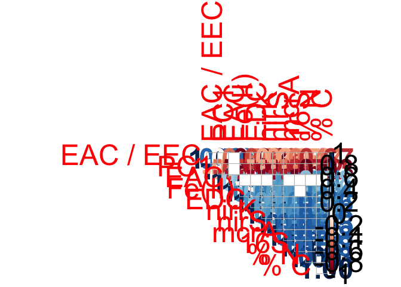<!-- -->

``` r
#dev.off()
```
