CompositeFigure
================
Emily Lacroix
2025-JAN-09

- [Set-up](#set-up)
  - [Libraries](#libraries)
  - [Figure Theme](#figure-theme)
  - [Files](#files)
  - [Constants](#constants)
- [TC and TN Data](#tc-and-tn-data)
  - [Data Import](#data-import)
  - [Total Carbon](#total-carbon)
    - [Statistics](#statistics)
- [Electrochemical Data](#electrochemical-data)
  - [Data Import](#data-import-1)
  - [EDC](#edc)
    - [Test for outliers](#test-for-outliers)
  - [EAC to EEC](#eac-to-eec)
    - [Statistics](#statistics-1)
- [ddPCR](#ddpcr)
  - [Gravimetric data](#gravimetric-data)
  - [WFPS](#wfps)
  - [16S](#16s)
  - [Adjust conc](#adjust-conc)
- [nirK](#nirk)
  - [Horizon Averages](#horizon-averages)
  - [Statistics](#statistics-2)
- [nirS](#nirs)
  - [Horizon Averaged](#horizon-averaged)
  - [Statistics](#statistics-3)
- [mcrA](#mcra)
  - [Statistics](#statistics-4)
- [Composite - Figure 1](#composite---figure-1)
- [Supplementary Figures](#supplementary-figures)
  - [Fe 2+](#fe-2)
    - [Statistics](#statistics-5)
  - [Total Fe (XRF)](#total-fe-xrf)
  - [Acid-extractable Fe(II) normalized to Total Fe
    (XRF)](#acid-extractable-feii-normalized-to-total-fe-xrf)
  - [Total Mn (XRF)](#total-mn-xrf)
  - [16S](#16s-1)
    - [Statistics](#statistics-6)
  - [Total Nitrogen](#total-nitrogen)
  - [EAC](#eac)
    - [Statistics](#statistics-7)

# Set-up

## Libraries

``` r
library(ggpattern)
library(tidyverse)
library(outliers)
library(cowplot)
library(readxl)
library(car)
```

## Figure Theme

``` r
my_theme <- function(base_size = 10, base_family = ""){ ## Control base font face and size. use `rel()` for relative font size.
  theme_bw(base_size = base_size, base_family = base_family) %+replace%
    theme(
      strip.text = element_text(size = 10, face = "bold"),
      axis.text = element_text(size = 10),
      axis.text.x = element_text(size = 10),
      axis.title = element_text(size = 12),
      legend.text = element_text(size = 10),
      legend.title = element_text(size = 12),
      strip.background = element_rect(fill = "transparent"),

      panel.grid.major = element_blank(),
      panel.grid.minor = element_blank(),
      aspect.ratio = 1.5
    )
}
```

## Files

``` r
ea_analysis_file <- "TCTN_data_raw.xlsx"

electro_iron_file <- 
  "UPDATED-240722_MER_MEO_Aggregates_003.xlsx"

ddpcr_data_file_16s <- "EML_16s_09sep2022-manual.csv"

ddpcr_data_file_nirK <- "ASH_nirk_MANUAL.csv"

ddpcr_data_file_nirS <- "ASH_nirS.manual.integration.csv"

ddpcr_data_file_mcrA <- "KRH_mcrA_04032024-manualthreshold.csv"

sample_key_file_nirk <- "nirK plate map 6_22_23 ASH.xlsx"

sample_key_file_nirs <- "mcrA nirS plate prep.xlsx"

sample_key_file_mcra <- "mcra-plate-map-Huy-APR2024.xlsx"

ddpcr_grav_data_file <- "ddPCR-grav-data.xlsx"

write_file_electro_data <- "compiled_fe_edc_eac_v2.csv"
```

## Constants

``` r
reaction_volume_df <- 25 

dna_elution_volume <- 100 #uL

site_colors <- c("R" = "darkgoldenrod1", "T" = "darkblue")

site_names <- c("R" = "Sandy Loam", "T" = "Loam")

agg_names <- c("B" = "Bulk soil", "IN" = "Agg. Interior")

agg_shapes <- c("Bulk" = 19, "In" = 2)

molar_mass_fe <- 55.845
```

# TC and TN Data

## Data Import

``` r
tctn_data <- 
  ea_analysis_file %>% 
  read_xlsx(skip = 5) %>% 
  select(
    date = `...1`,
    sample = `...2`,
    perc_n = `...7`,
    perc_c = `...8`
  ) %>% 
  filter(str_detect(sample, "-")) %>% 
  separate(sample, into = c("site", "hzn", "rep", "bulk_agg")) %>% 
  group_by(site, hzn, bulk_agg) %>% 
  summarise(
    mean_perc_c = mean(perc_c),
    se_perc_c = sd(perc_c) / sqrt(n()),
    mean_perc_n = mean(perc_n),
    se_perc_n = sd(perc_n) / sqrt(n())
  ) %>% 
  ungroup() %>% 
  mutate(
    across(
      hzn, 
      ~case_when(
        . == "A" ~ "1",
        . == "B" ~ "2", 
        . == "C" ~ "3"
      )
    )
  )
```

    ## New names:
    ## `summarise()` has grouped output by 'site', 'hzn'. You can override using the
    ## `.groups` argument.
    ## • `` -> `...1`
    ## • `` -> `...2`
    ## • `` -> `...3`
    ## • `` -> `...4`
    ## • `` -> `...7`
    ## • `` -> `...8`
    ## • `` -> `...10`
    ## • `` -> `...11`
    ## • `` -> `...12`

## Total Carbon

``` r
tc_plot <- 
  tctn_data %>% 
  ggplot(
    aes(y = hzn, x = mean_perc_c, shape = bulk_agg, color = site)
  ) +
  geom_pointrange(
    aes(
      xmin = mean_perc_c - se_perc_c, 
      xmax = mean_perc_c + se_perc_c),
    size = 0.5
  ) +
  scale_y_discrete(limits = rev) +
  scale_shape_manual(
    values = agg_shapes,
    labels = agg_names,
    name = NULL,
    guide = FALSE
  ) +
  scale_color_manual(
    values = site_colors,
    labels = site_names,
    name = "Texture",
    guide = FALSE
  ) +
  facet_grid(
    cols = vars(site), 
    scales = "free_x", 
    labeller = labeller(site = site_names)
  ) +
  my_theme() +
  labs(
    x = "% Organic C",
    y = NULL,
    shape = "Sample"
  )
```

### Statistics

Check normality - All normal

``` r
ea_analysis_file %>% 
  read_xlsx(skip = 5) %>% 
  select(
    date = `...1`,
    sample = `...2`,
    perc_n = `...7`,
    perc_c = `...8`
  ) %>% 
  filter(str_detect(sample, "-")) %>% 
  separate(sample, into = c("site", "hzn", "rep", "bulk_agg")) %>% 
  group_by(site, bulk_agg, hzn) %>% 
  summarise(
    normality = shapiro.test(perc_c)$p.value
  )
```

    ## New names:
    ## `summarise()` has grouped output by 'site', 'bulk_agg'. You can override using
    ## the `.groups` argument.
    ## • `` -> `...1`
    ## • `` -> `...2`
    ## • `` -> `...3`
    ## • `` -> `...4`
    ## • `` -> `...7`
    ## • `` -> `...8`
    ## • `` -> `...10`
    ## • `` -> `...11`
    ## • `` -> `...12`

    ## # A tibble: 10 × 4
    ## # Groups:   site, bulk_agg [4]
    ##    site  bulk_agg hzn   normality
    ##    <chr> <chr>    <chr>     <dbl>
    ##  1 R     Bulk     A         0.433
    ##  2 R     Bulk     B         0.152
    ##  3 R     Bulk     C         0.242
    ##  4 R     In       A         0.468
    ##  5 R     In       B         0.833
    ##  6 T     Bulk     A         0.640
    ##  7 T     Bulk     B         0.681
    ##  8 T     Bulk     C         0.988
    ##  9 T     In       A         0.218
    ## 10 T     In       B         0.678

T-test

Sandy Loam - A Horizon

``` r
tc_stat_data_a <- 
  ea_analysis_file %>% 
  read_xlsx(skip = 5) %>% 
  select(
    date = `...1`,
    sample = `...2`,
    perc_n = `...7`,
    perc_c = `...8`
  ) %>% 
  filter(str_detect(sample, "-")) %>% 
  separate(sample, into = c("site", "hzn", "rep", "bulk_agg")) %>% 
  filter(site == "R", hzn == "A")
```

    ## New names:
    ## • `` -> `...1`
    ## • `` -> `...2`
    ## • `` -> `...3`
    ## • `` -> `...4`
    ## • `` -> `...7`
    ## • `` -> `...8`
    ## • `` -> `...10`
    ## • `` -> `...11`
    ## • `` -> `...12`

``` r
t.test(
  x = tc_stat_data_a %>% filter(bulk_agg == "In") %>% pull(perc_c),
  y = tc_stat_data_a %>% filter(bulk_agg == "Bulk") %>% pull(perc_c),
  var.equal = FALSE
)
```

    ## 
    ##  Welch Two Sample t-test
    ## 
    ## data:  tc_stat_data_a %>% filter(bulk_agg == "In") %>% pull(perc_c) and tc_stat_data_a %>% filter(bulk_agg == "Bulk") %>% pull(perc_c)
    ## t = -2.9904, df = 3.8687, p-value = 0.04207
    ## alternative hypothesis: true difference in means is not equal to 0
    ## 95 percent confidence interval:
    ##  -0.285182774 -0.008668504
    ## sample estimates:
    ## mean of x mean of y 
    ## 0.5758827 0.7228084

Sandy Loam - B Horizon

``` r
tc_stat_data_b <- 
  ea_analysis_file %>% 
  read_xlsx(skip = 5) %>% 
  select(
    date = `...1`,
    sample = `...2`,
    perc_n = `...7`,
    perc_c = `...8`
  ) %>% 
  filter(str_detect(sample, "-")) %>% 
  separate(sample, into = c("site", "hzn", "rep", "bulk_agg")) %>% 
  filter(site == "R", hzn == "B")
```

    ## New names:
    ## • `` -> `...1`
    ## • `` -> `...2`
    ## • `` -> `...3`
    ## • `` -> `...4`
    ## • `` -> `...7`
    ## • `` -> `...8`
    ## • `` -> `...10`
    ## • `` -> `...11`
    ## • `` -> `...12`

``` r
t.test(
  x = tc_stat_data_b %>% filter(bulk_agg == "In") %>% pull(perc_c),
  y = tc_stat_data_b %>% filter(bulk_agg == "Bulk") %>% pull(perc_c),
  var.equal = FALSE
)
```

    ## 
    ##  Welch Two Sample t-test
    ## 
    ## data:  tc_stat_data_b %>% filter(bulk_agg == "In") %>% pull(perc_c) and tc_stat_data_b %>% filter(bulk_agg == "Bulk") %>% pull(perc_c)
    ## t = -3.8697, df = 3.8346, p-value = 0.01948
    ## alternative hypothesis: true difference in means is not equal to 0
    ## 95 percent confidence interval:
    ##  -0.1750684 -0.0273407
    ## sample estimates:
    ## mean of x mean of y 
    ## 0.2432745 0.3444791

# Electrochemical Data

## Data Import

``` r
electro_data <- 
  electro_iron_file %>% 
  read_xlsx(sheet = "Compilation") %>% 
  select(
    sample = Sample,
    fe_ii_umol_per_g = `Fe(II) (µmol (g dry soil)-1)`,
    fe_tot_xrf_ug_g = `Fe (µg/g)`,
    edc_umol_g_soil = `EDC (µmol (g dry soil)-1) m2`,
    eac_umol_g_soil = `EAC (µmol (g dry soil)-1)`
  ) %>%
  separate(sample, into = c("site", "hzn", "rep", "bulk_agg")) %>% 
  mutate(
    eac_to_eec = eac_umol_g_soil / (eac_umol_g_soil + edc_umol_g_soil),
    across(
      hzn, 
      ~case_when(
        . == "A" ~ "1",
        . == "B" ~ "2", 
        . == "C" ~ "3"
      )
    )
  ) 
```

    ## New names:
    ## • `EDC dev %` -> `EDC dev %...18`
    ## • `EDC dev %` -> `EDC dev %...21`

``` r
#electro_data %>% write_csv(file = write_file_electro_data)
electro_data
```

    ## # A tibble: 30 × 9
    ##    site  hzn   rep   bulk_agg fe_ii_umol_per_g fe_tot_xrf_ug_g edc_umol_g_soil
    ##    <chr> <chr> <chr> <chr>               <dbl>           <dbl>           <dbl>
    ##  1 T     1     1     In                  5.77           17703.           5.73 
    ##  2 T     1     2     In                  5.84           17703.           2.33 
    ##  3 T     1     3     In                  5.05           17703.           3.67 
    ##  4 T     2     1     In                  2.82           18220            0.420
    ##  5 T     2     2     In                  0.884          18220            1.82 
    ##  6 T     2     3     In                  0.292          18220            0.666
    ##  7 R     1     1     In                  0.378          13263.           0.623
    ##  8 R     1     2     In                  0.401          13263.           1.04 
    ##  9 R     1     3     In                  0.484          13263.           1.36 
    ## 10 R     2     1     In                  0.538          12010            0.975
    ## # ℹ 20 more rows
    ## # ℹ 2 more variables: eac_umol_g_soil <dbl>, eac_to_eec <dbl>

``` r
mn_data <- 
  electro_iron_file %>% 
  read_xlsx(sheet = "XRF", skip = 1) %>% 
  select(
    sample = Element,
    mn = `Mn...101`,
  ) %>% 
  filter(sample != "Dimension") %>% 
  separate(sample, into = c("site", "hzn", "rep", "bulk_agg")) %>% 
  mutate(
    across(mn, as.numeric),
    across(
      hzn, 
      ~case_when(
        . == "A" ~ "1",
        . == "B" ~ "2", 
        . == "C" ~ "3"
      )
    )
  ) 
```

    ## New names:
    ## • `H` -> `H...5`
    ## • `H` -> `H...6`
    ## • `H` -> `H...7`
    ## • `H` -> `H...8`
    ## • `He` -> `He...9`
    ## • `He` -> `He...10`
    ## • `He` -> `He...11`
    ## • `He` -> `He...12`
    ## • `Li` -> `Li...13`
    ## • `Li` -> `Li...14`
    ## • `Li` -> `Li...15`
    ## • `Li` -> `Li...16`
    ## • `Be` -> `Be...17`
    ## • `Be` -> `Be...18`
    ## • `Be` -> `Be...19`
    ## • `Be` -> `Be...20`
    ## • `B` -> `B...21`
    ## • `B` -> `B...22`
    ## • `B` -> `B...23`
    ## • `B` -> `B...24`
    ## • `C` -> `C...25`
    ## • `C` -> `C...26`
    ## • `C` -> `C...27`
    ## • `C` -> `C...28`
    ## • `N` -> `N...29`
    ## • `N` -> `N...30`
    ## • `N` -> `N...31`
    ## • `N` -> `N...32`
    ## • `O` -> `O...33`
    ## • `O` -> `O...34`
    ## • `O` -> `O...35`
    ## • `O` -> `O...36`
    ## • `F` -> `F...37`
    ## • `F` -> `F...38`
    ## • `F` -> `F...39`
    ## • `F` -> `F...40`
    ## • `Ne` -> `Ne...41`
    ## • `Ne` -> `Ne...42`
    ## • `Ne` -> `Ne...43`
    ## • `Ne` -> `Ne...44`
    ## • `Na` -> `Na...45`
    ## • `Na` -> `Na...46`
    ## • `Na` -> `Na...47`
    ## • `Na` -> `Na...48`
    ## • `Mg` -> `Mg...49`
    ## • `Mg` -> `Mg...50`
    ## • `Mg` -> `Mg...51`
    ## • `Mg` -> `Mg...52`
    ## • `Al` -> `Al...53`
    ## • `Al` -> `Al...54`
    ## • `Al` -> `Al...55`
    ## • `Al` -> `Al...56`
    ## • `Si` -> `Si...57`
    ## • `Si` -> `Si...58`
    ## • `Si` -> `Si...59`
    ## • `Si` -> `Si...60`
    ## • `P` -> `P...61`
    ## • `P` -> `P...62`
    ## • `P` -> `P...63`
    ## • `P` -> `P...64`
    ## • `S` -> `S...65`
    ## • `S` -> `S...66`
    ## • `S` -> `S...67`
    ## • `S` -> `S...68`
    ## • `Cl` -> `Cl...69`
    ## • `Cl` -> `Cl...70`
    ## • `Cl` -> `Cl...71`
    ## • `Cl` -> `Cl...72`
    ## • `Ar` -> `Ar...73`
    ## • `Ar` -> `Ar...74`
    ## • `Ar` -> `Ar...75`
    ## • `Ar` -> `Ar...76`
    ## • `K` -> `K...77`
    ## • `K` -> `K...78`
    ## • `K` -> `K...79`
    ## • `K` -> `K...80`
    ## • `Ca` -> `Ca...81`
    ## • `Ca` -> `Ca...82`
    ## • `Ca` -> `Ca...83`
    ## • `Ca` -> `Ca...84`
    ## • `Sc` -> `Sc...85`
    ## • `Sc` -> `Sc...86`
    ## • `Sc` -> `Sc...87`
    ## • `Sc` -> `Sc...88`
    ## • `Ti` -> `Ti...89`
    ## • `Ti` -> `Ti...90`
    ## • `Ti` -> `Ti...91`
    ## • `Ti` -> `Ti...92`
    ## • `V` -> `V...93`
    ## • `V` -> `V...94`
    ## • `V` -> `V...95`
    ## • `V` -> `V...96`
    ## • `Cr` -> `Cr...97`
    ## • `Cr` -> `Cr...98`
    ## • `Cr` -> `Cr...99`
    ## • `Cr` -> `Cr...100`
    ## • `Mn` -> `Mn...101`
    ## • `Mn` -> `Mn...102`
    ## • `Mn` -> `Mn...103`
    ## • `Mn` -> `Mn...104`
    ## • `Fe` -> `Fe...105`
    ## • `Fe` -> `Fe...106`
    ## • `Fe` -> `Fe...107`
    ## • `Fe` -> `Fe...108`
    ## • `Co` -> `Co...109`
    ## • `Co` -> `Co...110`
    ## • `Co` -> `Co...111`
    ## • `Co` -> `Co...112`
    ## • `Ni` -> `Ni...113`
    ## • `Ni` -> `Ni...114`
    ## • `Ni` -> `Ni...115`
    ## • `Ni` -> `Ni...116`
    ## • `Cu` -> `Cu...117`
    ## • `Cu` -> `Cu...118`
    ## • `Cu` -> `Cu...119`
    ## • `Cu` -> `Cu...120`
    ## • `Zn` -> `Zn...121`
    ## • `Zn` -> `Zn...122`
    ## • `Zn` -> `Zn...123`
    ## • `Zn` -> `Zn...124`
    ## • `Ga` -> `Ga...125`
    ## • `Ga` -> `Ga...126`
    ## • `Ga` -> `Ga...127`
    ## • `Ga` -> `Ga...128`
    ## • `Ge` -> `Ge...129`
    ## • `Ge` -> `Ge...130`
    ## • `Ge` -> `Ge...131`
    ## • `Ge` -> `Ge...132`
    ## • `As` -> `As...133`
    ## • `As` -> `As...134`
    ## • `As` -> `As...135`
    ## • `As` -> `As...136`
    ## • `Se` -> `Se...137`
    ## • `Se` -> `Se...138`
    ## • `Se` -> `Se...139`
    ## • `Se` -> `Se...140`
    ## • `Br` -> `Br...141`
    ## • `Br` -> `Br...142`
    ## • `Br` -> `Br...143`
    ## • `Br` -> `Br...144`
    ## • `Kr` -> `Kr...145`
    ## • `Kr` -> `Kr...146`
    ## • `Kr` -> `Kr...147`
    ## • `Kr` -> `Kr...148`
    ## • `Rb` -> `Rb...149`
    ## • `Rb` -> `Rb...150`
    ## • `Rb` -> `Rb...151`
    ## • `Rb` -> `Rb...152`
    ## • `Sr` -> `Sr...153`
    ## • `Sr` -> `Sr...154`
    ## • `Sr` -> `Sr...155`
    ## • `Sr` -> `Sr...156`
    ## • `Y` -> `Y...157`
    ## • `Y` -> `Y...158`
    ## • `Y` -> `Y...159`
    ## • `Y` -> `Y...160`
    ## • `Zr` -> `Zr...161`
    ## • `Zr` -> `Zr...162`
    ## • `Zr` -> `Zr...163`
    ## • `Zr` -> `Zr...164`
    ## • `Nb` -> `Nb...165`
    ## • `Nb` -> `Nb...166`
    ## • `Nb` -> `Nb...167`
    ## • `Nb` -> `Nb...168`
    ## • `Mo` -> `Mo...169`
    ## • `Mo` -> `Mo...170`
    ## • `Mo` -> `Mo...171`
    ## • `Mo` -> `Mo...172`
    ## • `Tc` -> `Tc...173`
    ## • `Tc` -> `Tc...174`
    ## • `Tc` -> `Tc...175`
    ## • `Tc` -> `Tc...176`
    ## • `Ru` -> `Ru...177`
    ## • `Ru` -> `Ru...178`
    ## • `Ru` -> `Ru...179`
    ## • `Ru` -> `Ru...180`
    ## • `Rh` -> `Rh...181`
    ## • `Rh` -> `Rh...182`
    ## • `Rh` -> `Rh...183`
    ## • `Rh` -> `Rh...184`
    ## • `Pd` -> `Pd...185`
    ## • `Pd` -> `Pd...186`
    ## • `Pd` -> `Pd...187`
    ## • `Pd` -> `Pd...188`
    ## • `Ag` -> `Ag...189`
    ## • `Ag` -> `Ag...190`
    ## • `Ag` -> `Ag...191`
    ## • `Ag` -> `Ag...192`
    ## • `Cd` -> `Cd...193`
    ## • `Cd` -> `Cd...194`
    ## • `Cd` -> `Cd...195`
    ## • `Cd` -> `Cd...196`
    ## • `In` -> `In...197`
    ## • `In` -> `In...198`
    ## • `In` -> `In...199`
    ## • `In` -> `In...200`
    ## • `Sn` -> `Sn...201`
    ## • `Sn` -> `Sn...202`
    ## • `Sn` -> `Sn...203`
    ## • `Sn` -> `Sn...204`
    ## • `Sb` -> `Sb...205`
    ## • `Sb` -> `Sb...206`
    ## • `Sb` -> `Sb...207`
    ## • `Sb` -> `Sb...208`
    ## • `Te` -> `Te...209`
    ## • `Te` -> `Te...210`
    ## • `Te` -> `Te...211`
    ## • `Te` -> `Te...212`
    ## • `I` -> `I...213`
    ## • `I` -> `I...214`
    ## • `I` -> `I...215`
    ## • `I` -> `I...216`
    ## • `Xe` -> `Xe...217`
    ## • `Xe` -> `Xe...218`
    ## • `Xe` -> `Xe...219`
    ## • `Xe` -> `Xe...220`
    ## • `Cs` -> `Cs...221`
    ## • `Cs` -> `Cs...222`
    ## • `Cs` -> `Cs...223`
    ## • `Cs` -> `Cs...224`
    ## • `Ba` -> `Ba...225`
    ## • `Ba` -> `Ba...226`
    ## • `Ba` -> `Ba...227`
    ## • `Ba` -> `Ba...228`
    ## • `La` -> `La...229`
    ## • `La` -> `La...230`
    ## • `La` -> `La...231`
    ## • `La` -> `La...232`
    ## • `Ce` -> `Ce...233`
    ## • `Ce` -> `Ce...234`
    ## • `Ce` -> `Ce...235`
    ## • `Ce` -> `Ce...236`
    ## • `Pr` -> `Pr...237`
    ## • `Pr` -> `Pr...238`
    ## • `Pr` -> `Pr...239`
    ## • `Pr` -> `Pr...240`
    ## • `Nd` -> `Nd...241`
    ## • `Nd` -> `Nd...242`
    ## • `Nd` -> `Nd...243`
    ## • `Nd` -> `Nd...244`
    ## • `Pm` -> `Pm...245`
    ## • `Pm` -> `Pm...246`
    ## • `Pm` -> `Pm...247`
    ## • `Pm` -> `Pm...248`
    ## • `Sm` -> `Sm...249`
    ## • `Sm` -> `Sm...250`
    ## • `Sm` -> `Sm...251`
    ## • `Sm` -> `Sm...252`
    ## • `Eu` -> `Eu...253`
    ## • `Eu` -> `Eu...254`
    ## • `Eu` -> `Eu...255`
    ## • `Eu` -> `Eu...256`
    ## • `Gd` -> `Gd...257`
    ## • `Gd` -> `Gd...258`
    ## • `Gd` -> `Gd...259`
    ## • `Gd` -> `Gd...260`
    ## • `Tb` -> `Tb...261`
    ## • `Tb` -> `Tb...262`
    ## • `Tb` -> `Tb...263`
    ## • `Tb` -> `Tb...264`
    ## • `Dy` -> `Dy...265`
    ## • `Dy` -> `Dy...266`
    ## • `Dy` -> `Dy...267`
    ## • `Dy` -> `Dy...268`
    ## • `Ho` -> `Ho...269`
    ## • `Ho` -> `Ho...270`
    ## • `Ho` -> `Ho...271`
    ## • `Ho` -> `Ho...272`
    ## • `Er` -> `Er...273`
    ## • `Er` -> `Er...274`
    ## • `Er` -> `Er...275`
    ## • `Er` -> `Er...276`
    ## • `Tm` -> `Tm...277`
    ## • `Tm` -> `Tm...278`
    ## • `Tm` -> `Tm...279`
    ## • `Tm` -> `Tm...280`
    ## • `Yb` -> `Yb...281`
    ## • `Yb` -> `Yb...282`
    ## • `Yb` -> `Yb...283`
    ## • `Yb` -> `Yb...284`
    ## • `Lu` -> `Lu...285`
    ## • `Lu` -> `Lu...286`
    ## • `Lu` -> `Lu...287`
    ## • `Lu` -> `Lu...288`
    ## • `Hf` -> `Hf...289`
    ## • `Hf` -> `Hf...290`
    ## • `Hf` -> `Hf...291`
    ## • `Hf` -> `Hf...292`
    ## • `Ta` -> `Ta...293`
    ## • `Ta` -> `Ta...294`
    ## • `Ta` -> `Ta...295`
    ## • `Ta` -> `Ta...296`
    ## • `W` -> `W...297`
    ## • `W` -> `W...298`
    ## • `W` -> `W...299`
    ## • `W` -> `W...300`
    ## • `Re` -> `Re...301`
    ## • `Re` -> `Re...302`
    ## • `Re` -> `Re...303`
    ## • `Re` -> `Re...304`
    ## • `Os` -> `Os...305`
    ## • `Os` -> `Os...306`
    ## • `Os` -> `Os...307`
    ## • `Os` -> `Os...308`
    ## • `Ir` -> `Ir...309`
    ## • `Ir` -> `Ir...310`
    ## • `Ir` -> `Ir...311`
    ## • `Ir` -> `Ir...312`
    ## • `Pt` -> `Pt...313`
    ## • `Pt` -> `Pt...314`
    ## • `Pt` -> `Pt...315`
    ## • `Pt` -> `Pt...316`
    ## • `Au` -> `Au...317`
    ## • `Au` -> `Au...318`
    ## • `Au` -> `Au...319`
    ## • `Au` -> `Au...320`
    ## • `Hg` -> `Hg...321`
    ## • `Hg` -> `Hg...322`
    ## • `Hg` -> `Hg...323`
    ## • `Hg` -> `Hg...324`
    ## • `Tl` -> `Tl...325`
    ## • `Tl` -> `Tl...326`
    ## • `Tl` -> `Tl...327`
    ## • `Tl` -> `Tl...328`
    ## • `Pb` -> `Pb...329`
    ## • `Pb` -> `Pb...330`
    ## • `Pb` -> `Pb...331`
    ## • `Pb` -> `Pb...332`
    ## • `Bi` -> `Bi...333`
    ## • `Bi` -> `Bi...334`
    ## • `Bi` -> `Bi...335`
    ## • `Bi` -> `Bi...336`
    ## • `Po` -> `Po...337`
    ## • `Po` -> `Po...338`
    ## • `Po` -> `Po...339`
    ## • `Po` -> `Po...340`
    ## • `At` -> `At...341`
    ## • `At` -> `At...342`
    ## • `At` -> `At...343`
    ## • `At` -> `At...344`
    ## • `Rn` -> `Rn...345`
    ## • `Rn` -> `Rn...346`
    ## • `Rn` -> `Rn...347`
    ## • `Rn` -> `Rn...348`
    ## • `Fr` -> `Fr...349`
    ## • `Fr` -> `Fr...350`
    ## • `Fr` -> `Fr...351`
    ## • `Fr` -> `Fr...352`
    ## • `Ra` -> `Ra...353`
    ## • `Ra` -> `Ra...354`
    ## • `Ra` -> `Ra...355`
    ## • `Ra` -> `Ra...356`
    ## • `Ac` -> `Ac...357`
    ## • `Ac` -> `Ac...358`
    ## • `Ac` -> `Ac...359`
    ## • `Ac` -> `Ac...360`
    ## • `Th` -> `Th...361`
    ## • `Th` -> `Th...362`
    ## • `Th` -> `Th...363`
    ## • `Th` -> `Th...364`
    ## • `Pa` -> `Pa...365`
    ## • `Pa` -> `Pa...366`
    ## • `Pa` -> `Pa...367`
    ## • `Pa` -> `Pa...368`
    ## • `U` -> `U...369`
    ## • `U` -> `U...370`
    ## • `U` -> `U...371`
    ## • `U` -> `U...372`

``` r
mn_data
```

    ## # A tibble: 18 × 5
    ##    site  hzn   rep   bulk_agg    mn
    ##    <chr> <chr> <chr> <chr>    <dbl>
    ##  1 T     1     1     Bulk     412. 
    ##  2 T     1     2     Bulk     307. 
    ##  3 T     1     3     Bulk     527. 
    ##  4 T     2     1     Bulk     654. 
    ##  5 T     2     2     Bulk     574. 
    ##  6 T     2     3     Bulk     479. 
    ##  7 T     3     1     Bulk     568. 
    ##  8 T     3     2     Bulk     515  
    ##  9 T     3     3     Bulk     523. 
    ## 10 R     1     1     Bulk     431. 
    ## 11 R     1     2     Bulk     372. 
    ## 12 R     1     3     Bulk     397. 
    ## 13 R     2     1     Bulk      74.9
    ## 14 R     2     2     Bulk     220. 
    ## 15 R     2     3     Bulk     194. 
    ## 16 R     3     1     Bulk     204. 
    ## 17 R     3     2     Bulk     102. 
    ## 18 R     3     3     Bulk     215.

## EDC

### Test for outliers

``` r
electro_data %>% 
  pull(edc_umol_g_soil) %>% 
  grubbs.test()
```

    ## 
    ##  Grubbs test for one outlier
    ## 
    ## data:  .
    ## G = 4.99784, U = 0.10897, p-value = 7.994e-14
    ## alternative hypothesis: highest value 23.7298932951107 is an outlier

``` r
mean_edc_no_outlier <- 
  electro_data %>% 
  filter(edc_umol_g_soil < 10) %>% 
  summarise(
    mean_edc = mean(edc_umol_g_soil)
  ) %>% 
  pull(mean_edc)

edc_sandy_c_mean <- 
  electro_data %>% 
  filter(
    edc_umol_g_soil < 10,
    hzn == "C",
    site == "R"
  ) %>% 
  summarise(
    mean_edc = mean(edc_umol_g_soil)
  ) %>% 
  pull(mean_edc)

edc_outlier <- 
  electro_data %>% 
  filter(edc_umol_g_soil > 10) %>% 
  pull(edc_umol_g_soil)

edc_outlier / edc_sandy_c_mean
```

    ## [1] NaN

``` r
edc_plot <- 
electro_data %>% 
  filter(edc_umol_g_soil < 10) %>% # remove outlier
  group_by(site, hzn, bulk_agg) %>% 
  summarise(
    mean_edc = mean(edc_umol_g_soil),
    se_edc = sd(edc_umol_g_soil) / sqrt(n()),
  ) %>% 
  ggplot(
    aes(y = hzn, x = mean_edc, shape = bulk_agg, color = site)
  ) +
  geom_pointrange(
    aes(
      xmin = mean_edc - se_edc, 
      xmax = mean_edc + se_edc),
    size = 0.5
  ) +
  scale_y_discrete(limits = rev) +
  scale_shape_manual(
    values = agg_shapes,
    labels = agg_names,
    name = NULL,
    guide = FALSE
  ) +
  scale_color_manual(
    values = site_colors,
    labels = site_names,
    name = "Texture",
    guide = FALSE
  ) +
  facet_grid(
    cols = vars(site), 
    scales = "free_x", 
    labeller = labeller(site = site_names)
  ) +
  my_theme() +
  labs(
    x = expression(paste(EDC~`(`,mu,mol~g^`-1`~soil,`)`)),
    y = element_blank(),
    shape = "Sample"
  )
```

    ## `summarise()` has grouped output by 'site', 'hzn'. You can override using the
    ## `.groups` argument.

``` r
edc_plot
```

    ## Warning: The `guide` argument in `scale_*()` cannot be `FALSE`. This was deprecated in
    ## ggplot2 3.3.4.
    ## ℹ Please use "none" instead.
    ## This warning is displayed once every 8 hours.
    ## Call `lifecycle::last_lifecycle_warnings()` to see where this warning was
    ## generated.

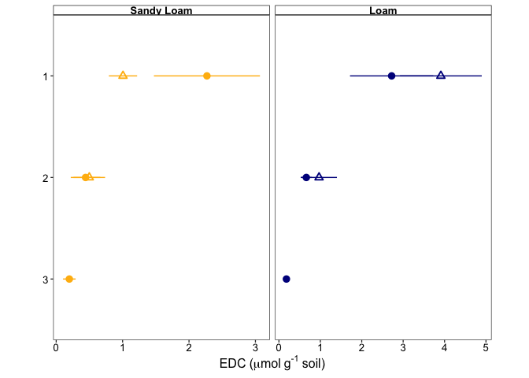<!-- -->
\### Statistics

Sandy Loam, A Horizon

``` r
electro_data %>% 
  filter(site == "R", hzn == "1") %>% 
  group_by(bulk_agg) %>% 
  summarise(
    norm = shapiro.test(edc_umol_g_soil)$p.value
  )
```

    ## # A tibble: 2 × 2
    ##   bulk_agg  norm
    ##   <chr>    <dbl>
    ## 1 Bulk     0.182
    ## 2 In       0.866

``` r
t.test(
  x = electro_data %>% 
    filter(site == "R", hzn == "1", bulk_agg == "Bulk") %>% 
    pull(edc_umol_g_soil),
  y = electro_data %>% 
    filter(site == "R", hzn == "1", bulk_agg == "In") %>% 
    pull(edc_umol_g_soil),
  var.equal = FALSE
)
```

    ## 
    ##  Welch Two Sample t-test
    ## 
    ## data:  electro_data %>% filter(site == "R", hzn == "1", bulk_agg == "Bulk") %>% pull(edc_umol_g_soil) and electro_data %>% filter(site == "R", hzn == "1", bulk_agg == "In") %>% pull(edc_umol_g_soil)
    ## t = 1.5299, df = 2.2828, p-value = 0.2505
    ## alternative hypothesis: true difference in means is not equal to 0
    ## 95 percent confidence interval:
    ##  -1.900180  4.427908
    ## sample estimates:
    ## mean of x mean of y 
    ##  2.269818  1.005954

## EAC to EEC

``` r
eac_to_eec_plot <- 
  electro_data %>% 
  filter(edc_umol_g_soil < 10) %>%
  group_by(site, hzn, bulk_agg) %>% 
  summarise(
    mean_eac_to_eec = mean(eac_to_eec),
    se_eac_to_eec = sd(eac_to_eec) / sqrt(n())
  ) %>%  
  ggplot(
    aes(y = hzn, x = mean_eac_to_eec, shape = bulk_agg, color = site)
  ) +
  geom_pointrange(
    aes(
      xmin = mean_eac_to_eec - se_eac_to_eec, 
      xmax = mean_eac_to_eec + se_eac_to_eec),
    size = 0.5
  ) +
  scale_y_discrete(limits = rev) +
  scale_shape_manual(
    values = agg_shapes,
    labels = agg_names,
    name = NULL,
    guide = FALSE
  ) +
  scale_x_reverse() + #NOTE REVERSE AXIS
  scale_color_manual(
    values = site_colors,
    labels = site_names,
    name = "Texture",
    guide = FALSE
  ) +
  facet_grid(
    cols = vars(site), 
    scales = "free_x", 
    labeller = labeller(site = site_names)
  ) +
  my_theme() + 
  labs(
    x = "EAC/EEC",
    y = element_blank(),
    shape = "Sample"
  )
```

    ## `summarise()` has grouped output by 'site', 'hzn'. You can override using the
    ## `.groups` argument.

``` r
eac_to_eec_plot
```

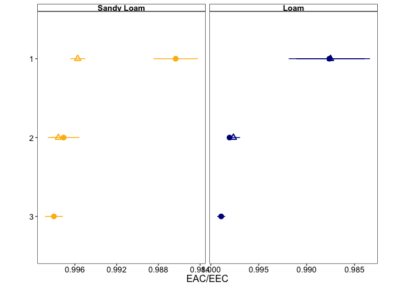<!-- -->

### Statistics

Sandy Loam, A Horizon

``` r
electro_data %>% 
  filter(site == "R", hzn == "1") %>% 
  group_by(bulk_agg) %>% 
  summarise(
    norm = shapiro.test(eac_to_eec)$p.value
  )
```

    ## # A tibble: 2 × 2
    ##   bulk_agg  norm
    ##   <chr>    <dbl>
    ## 1 Bulk     0.623
    ## 2 In       0.165

``` r
t.test(
  x = electro_data %>% 
    filter(site == "R", hzn == "1", bulk_agg == "Bulk") %>% 
    pull(eac_to_eec),
  y = electro_data %>% 
    filter(site == "R", hzn == "1", bulk_agg == "In") %>% 
    pull(eac_to_eec),
  var.equal = FALSE
)
```

    ## 
    ##  Welch Two Sample t-test
    ## 
    ## data:  electro_data %>% filter(site == "R", hzn == "1", bulk_agg == "Bulk") %>% pull(eac_to_eec) and electro_data %>% filter(site == "R", hzn == "1", bulk_agg == "In") %>% pull(eac_to_eec)
    ## t = -4.1769, df = 2.4459, p-value = 0.03687
    ## alternative hypothesis: true difference in means is not equal to 0
    ## 95 percent confidence interval:
    ##  -0.017546732 -0.001224616
    ## sample estimates:
    ## mean of x mean of y 
    ## 0.9863420 0.9957277

# ddPCR

## Gravimetric data

This code:

- Imports the gravimetric data from an Excel sheet
- Calculates moisture content of samples
- Calculates the dry mass of soil extracted in DNA extractions

``` r
grav_raw <- 
  read_xlsx(ddpcr_grav_data_file, sheet = "Grav Data from Meret") %>% 
  separate(Sample, into = c("site", "hzn", "rep", "bulk_agg")) %>% 
  mutate(
    across(rep, as.integer),
    mass_water_per_g_wet_soil = `Mass Water in Soil (g)` / `Mass Wet Soil (g)`,
    across(
      hzn, 
      ~case_when(
        . == "A" ~ "1",
        . == "B" ~ "2", 
        . == "C" ~ "3"
      )
    )
  ) %>% 
  select(site, hzn, rep, mass_water_per_g_wet_soil)


extraction_data <- 
  read_xlsx(ddpcr_grav_data_file, sheet = "DNA Extraction") %>% 
  separate(Sample, into = c("site", "hzn", "rep", "bulk_agg")) %>% 
  mutate(
    across(rep, as.integer),
    across(
      hzn, 
      ~case_when(
        . == "A" ~ "1",
        . == "B" ~ "2", 
        . == "C" ~ "3"
      )
    )
  ) %>% 
  rename(mass_extract_wet_g = `Wet mass sample extracted (g)`) %>% 
  left_join(grav_raw, by = c("site", "hzn", "rep")) %>% 
  mutate(
    across(bulk_agg, ~case_match(., "Bulk" ~ "B", "In" ~ "IN")),
    mass_extract_dry_g =
      mass_extract_wet_g - (mass_extract_wet_g * mass_water_per_g_wet_soil)
  ) %>% 
  select(site, hzn, rep, bulk_agg, mass_extract_dry_g)
```

``` r
grav_raw %>% 
  mutate(
    dry_soil = 1 - mass_water_per_g_wet_soil,
    grav_moist_content = mass_water_per_g_wet_soil / dry_soil

  ) %>% 
  group_by(site, hzn) %>% 
  summarize(
    moist_av = mean(grav_moist_content),
    moist_se = sd(grav_moist_content) / sqrt(n())
  ) %>% 
  ggplot(
    aes(y = hzn, x = moist_av, color = site)
  ) +
  geom_pointrange(
    aes(
      xmin = moist_av - moist_se, 
      xmax = moist_av + moist_se),
    size = 1
  ) +
  scale_x_continuous(n.breaks = 4) +
  scale_y_discrete(limits = rev) + 
  scale_color_manual(
    values = site_colors,
    labels = site_names,
    name = "Texture",
    guide = FALSE
  ) +
  facet_grid(
    cols = vars(site), 
    scales = "free_x", 
    labeller = labeller(site = site_names)
  ) +
  my_theme() + 
  theme(
    strip.text = element_text(size = 16, face = "bold"),
    axis.text = element_text(size = 16),
    axis.text.x = element_text(size = 16),
    axis.title = element_text(size = 18),
    legend.text = element_text(size = 16),
    legend.title = element_text(size = 18),
  ) +
  labs(
    x = "Gravimetric Water Content",
    y = NULL,
    shape = "Sample"
  )
```

    ## `summarise()` has grouped output by 'site'. You can override using the
    ## `.groups` argument.

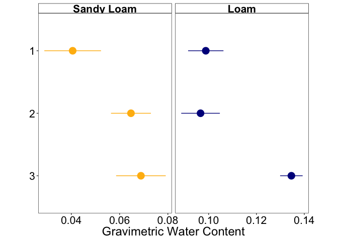<!-- -->

## WFPS

``` r
bds <-
  tibble(
    site = c("T", "T", "T", "R", "R"),
    hzn = c("1", "2", "3", "1", "2"),
    bd = c(1.67, 1.48, 1.40, 1.30, 1.35)
  )

particle_density <- 2.65

grav_raw %>% 
  mutate(
    dry_soil = 1 - mass_water_per_g_wet_soil,
    grav_moist_content = mass_water_per_g_wet_soil / dry_soil
  ) %>% 
  left_join(bds, by = c("site", "hzn")) %>% 
  mutate(
    porosity = 1 - (bd / particle_density),
    vol_water = grav_moist_content * bd,
    wfps = vol_water / porosity
  ) %>% 
  group_by(site, hzn) %>% 
  summarize(
    wfps_av = mean(wfps),
    wfps_se = sd(wfps) / sqrt(n())
  ) %>% 
  ggplot(
    aes(y = hzn, x = wfps_av, color = site)
  ) +
  geom_pointrange(
    aes(
      xmin = wfps_av - wfps_se, 
      xmax = wfps_av + wfps_se),
    size = 1
  ) +
  scale_x_continuous(
    labels = scales::percent_format(accuracy = 1)
  ) +
  scale_y_discrete(limits = rev) + 
  scale_color_manual(
    values = site_colors,
    labels = site_names,
    name = "Texture",
    guide = FALSE
  ) +
  facet_grid(
    cols = vars(site), 
    scales = "free_x", 
    labeller = labeller(site = site_names)
  ) +
  my_theme() + 
  theme(
    strip.text = element_text(size = 16, face = "bold"),
    axis.text = element_text(size = 16),
    axis.text.x = element_text(size = 14),
    axis.title = element_text(size = 18),
    legend.text = element_text(size = 16),
    legend.title = element_text(size = 18),
  ) +
  labs(
    x = "WFPS",
    y = NULL,
    shape = "Sample"
  )
```

    ## `summarise()` has grouped output by 'site'. You can override using the
    ## `.groups` argument.

    ## Warning: Removed 1 row containing missing values or values outside the scale range
    ## (`geom_pointrange()`).

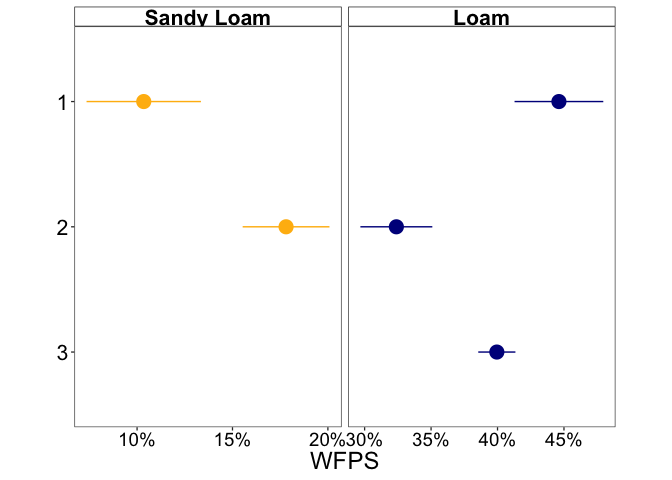<!-- -->

## 16S

NOTE this data is from 2022 (When Emily ran it)

This code:

- Imports the 16S data from a CSV

``` r
sixteenS_df <- 1000 

ddpcr_data_16s <- 
  ddpcr_data_file_16s %>% 
  read_csv() %>% 
  separate(Sample, into = c("samp", "bulk_agg", "dilution")) %>% 
  select(
    samp, 
    bulk_agg, 
    dilution,
    sixteenS_conc = Concentration,
    sixteenS_min = PoissonConfMin,
    sixteenS_max = PoissonConfMax,
    droplets = AcceptedDroplets
  ) %>% 
  filter(
    !(
      is.na(dilution) & 
        samp %in% c("RA3", "RB1", "RB2", "RB3") & 
        bulk_agg == "IN"
      )
  )
```

    ## Warning: One or more parsing issues, call `problems()` on your data frame for details,
    ## e.g.:
    ##   dat <- vroom(...)
    ##   problems(dat)

    ## Rows: 40 Columns: 63
    ## ── Column specification ────────────────────────────────────────────────────────
    ## Delimiter: ","
    ## chr  (9): Well, ExptType, Experiment, Sample, TargetType, Status, Supermix, ...
    ## dbl (30): Target, Concentration, CopiesPer20uLWell, PoissonConfMax, PoissonC...
    ## lgl (24): TotalConfMax, TotalConfMin, CNV, TotalCNVMax, TotalCNVMin, Poisson...
    ## 
    ## ℹ Use `spec()` to retrieve the full column specification for this data.
    ## ℹ Specify the column types or set `show_col_types = FALSE` to quiet this message.

    ## Warning: Expected 3 pieces. Additional pieces discarded in 6 rows [19, 20, 25, 30, 35,
    ## 40].

    ## Warning: Expected 3 pieces. Missing pieces filled with `NA` in 34 rows [1, 2, 3, 4, 5,
    ## 6, 7, 8, 9, 10, 11, 12, 13, 14, 15, 16, 17, 18, 21, 22, ...].

``` r
ddpcr_data_16s
```

    ## # A tibble: 36 × 7
    ##    samp  bulk_agg dilution sixteenS_conc sixteenS_min sixteenS_max droplets
    ##    <chr> <chr>    <chr>            <dbl>        <dbl>        <dbl>    <dbl>
    ##  1 Water <NA>     <NA>              0.59          0.4          1.1    16042
    ##  2 RB1   B        <NA>             29.3          27.9         32.3    15749
    ##  3 RC3   B        <NA>             13            11.9         14.9    15066
    ##  4 TB1   B        <NA>             38.9          37.2         42.1    17266
    ##  5 TC1   B        <NA>             26.4          25           29.1    15878
    ##  6 RA1   B        <NA>            101.           98.6        107      15774
    ##  7 RB2   B        <NA>             11.1          10.1         13      14497
    ##  8 TA1   B        <NA>            129.          126.         135.     15728
    ##  9 TB2   B        <NA>             18.1          16.9         20.3    15950
    ## 10 TC2   B        <NA>             19.8          18.6         22.3    14945
    ## # ℹ 26 more rows

## Adjust conc

This code:

- Subtracts the counts from the blanks
- Corrects for DNA template dilution
- Corrects for reaction volume dilution (reports concentration in copies
  / uL DNA extract)
- Calculates 16S copies per g
- Takes average value for technical replicates

``` r
blank_16s <- 
  ddpcr_data_16s %>% 
  filter(samp == "TE" | samp == "Water") %>% 
  summarise(mean_blank_16s = mean(sixteenS_conc)) %>% 
  pull(mean_blank_16s)


data_16s_adj <- 
  ddpcr_data_16s %>% 
  filter(samp != "TE" & samp != "Water") %>% 
  mutate(
    blank = blank_16s,
    sixteenS_conc_minus_blank =
      case_when(
        dilution == "1" ~ (sixteenS_conc / 10) - blank,
        TRUE ~ sixteenS_conc - blank
      ),
    across(sixteenS_conc_minus_blank, ~ if_else(. < 0, 0, .)),
    sixteenS_conc_adj = 
      #already accounts for 100 vs. 1000 dilution
      sixteenS_conc_minus_blank * sixteenS_df * reaction_volume_df, 
    site = str_extract(samp, ".{1}"),
    hzn = str_extract(samp, ".{1}(?=\\d)"),
    rep = str_extract(samp, ".{1}$"),
    across(
      hzn, 
      ~case_when(
        . == "A" ~ "1",
        . == "B" ~ "2", 
        . == "C" ~ "3"
      )
    )
  ) %>% 
  select(
    site, hzn, rep, bulk_agg, sixteenS_conc_adj, 
    sixteenS_droplets = droplets
  ) %>% 
  mutate(across(rep, as.integer)) %>% 
  group_by(site, hzn, rep, bulk_agg) %>%
  left_join(extraction_data, by = c("site", "hzn", "rep", "bulk_agg")) %>% 
  mutate(
    sixteenS_copies_per_g = 
      sixteenS_conc_adj * dna_elution_volume / mass_extract_dry_g
  ) %>% 
  summarise(
    across(c(sixteenS_conc_adj, sixteenS_copies_per_g), ~mean(.))
  ) 
```

    ## `summarise()` has grouped output by 'site', 'hzn', 'rep'. You can override
    ## using the `.groups` argument.

``` r
data_16s_adj
```

    ## # A tibble: 30 × 6
    ## # Groups:   site, hzn, rep [18]
    ##    site  hzn     rep bulk_agg sixteenS_conc_adj sixteenS_copies_per_g
    ##    <chr> <chr> <int> <chr>                <dbl>                 <dbl>
    ##  1 R     1         1 B                  2577500           1088986926.
    ##  2 R     1         1 IN                  346250            152385113.
    ##  3 R     1         2 B                   291250            118546946.
    ##  4 R     1         2 IN                  231250             87153016.
    ##  5 R     1         3 B                  1033750            433286577.
    ##  6 R     1         3 IN                  366250            159906498.
    ##  7 R     2         1 B                   713750            320340086.
    ##  8 R     2         1 IN                   60250             27040967.
    ##  9 R     2         2 B                   258750            115134528.
    ## 10 R     2         2 IN                  225000             96112302.
    ## # ℹ 20 more rows

# nirK

This code:

- Imports the nirK data from Alex
- Joins the well data with the sample identity
- filters out over-saturated samples

``` r
nirk_sample_key <-
  sample_key_file_nirk %>% 
  read_xlsx(sheet = "Sample Key") %>% 
  rename(sample_name = Sample)

nirk_samples_to_filter_out <- c("RA1-B", "RA2-B", "RA3-B")

nirk_data <-
  ddpcr_data_file_nirK %>% 
  read_csv() %>% 
  inner_join(nirk_sample_key, by = "Well") %>% 
  select(
    sample_name,
    well = Well,
    copies_per_ul = `Conc(copies/µL)`,
    copies_per_ul_min = PoissonConfMin,
    copies_per_ul_max = PoissonConfMax,
    droplets = `Accepted Droplets`
  ) %>% 
  filter(
    !(sample_name %in% nirk_samples_to_filter_out),
    droplets > 10000,
    sample_name != "Water"
  ) %>% 
  separate(sample_name, into = c("samp", "bulk_agg", "dilution")) %>% 
  mutate(
    across(
      dilution, 
           ~case_when(
             . == "1" ~ 10,
             is.na(.) ~ 1
             )
      ),
    across(c(copies_per_ul, copies_per_ul_min, copies_per_ul_max),
           ~if_else(dilution == "1", . * dilution, . * dilution)
             )
  ) %>% 
  separate_wider_position(samp, c(site = 1, hzn = 1, rep = 1)) %>% 
  mutate(
    across(rep, as.integer),
    across(
      hzn, 
      ~case_when(
        . == "A" ~ "1",
        . == "B" ~ "2", 
        . == "C" ~ "3"
      )
    )
  ) %>% 
  left_join(extraction_data, by = c("site", "hzn", "rep", "bulk_agg")) %>% 
  mutate(
    copies_per_g = copies_per_ul * dna_elution_volume / mass_extract_dry_g,
    copies_per_g_min = 
      copies_per_ul_min * dna_elution_volume / mass_extract_dry_g,
    copies_per_g_max = 
      copies_per_ul_max * dna_elution_volume / mass_extract_dry_g,
  )
```

    ## Rows: 40 Columns: 65
    ## ── Column specification ────────────────────────────────────────────────────────
    ## Delimiter: ","
    ## chr  (9): Well, Sample, Target, Status, Experiment, SampleType, TargetType, ...
    ## dbl (17): Conc(copies/µL), Copies/20µLWell, PoissonConfMax, PoissonConfMin, ...
    ## lgl (39): TotalConfMax, TotalConfMin, Linkage, CNV, TotalCNVMax, TotalCNVMin...
    ## 
    ## ℹ Use `spec()` to retrieve the full column specification for this data.
    ## ℹ Specify the column types or set `show_col_types = FALSE` to quiet this message.

    ## Warning: Expected 3 pieces. Additional pieces discarded in 9 rows [3, 7, 11, 15, 21, 25,
    ## 27, 30, 32].

    ## Warning: Expected 3 pieces. Missing pieces filled with `NA` in 24 rows [1, 2, 4, 5, 6,
    ## 8, 9, 10, 12, 13, 14, 16, 17, 18, 19, 20, 22, 23, 24, 26, ...].

``` r
nirk_data_av <- 
  nirk_data %>% 
  group_by(site, hzn, rep, bulk_agg) %>% 
  summarise(
    across(
      c(
        copies_per_ul, 
        copies_per_ul_min, 
        copies_per_ul_max, 
        mass_extract_dry_g, 
        copies_per_g,
        copies_per_g_min,
        copies_per_g_max
      ),
      ~mean(.)
    )
  )
```

    ## `summarise()` has grouped output by 'site', 'hzn', 'rep'. You can override
    ## using the `.groups` argument.

### Horizon Averages

``` r
nirk_abs_plot <-
nirk_data_av %>% 
  mutate(
    across(
      bulk_agg, ~case_match(., "B" ~ "Bulk", "IN" ~ "In")
    )
  ) %>% 
  group_by(site, hzn, bulk_agg) %>% 
  summarize(
    nirk_conc_av = mean(copies_per_g),
    nirk_conc_se = sd(copies_per_g) / sqrt(n())
  ) %>% 
  ggplot(
    aes(y = hzn, x = nirk_conc_av, shape = bulk_agg, color = site)
  ) +
  geom_pointrange(
    aes(
      xmin = nirk_conc_av - nirk_conc_se, 
      xmax = nirk_conc_av + nirk_conc_se),
    size = 0.5
  ) +
  scale_y_discrete(limits = rev) + 
  scale_shape_manual(
    values = agg_shapes,
    labels = agg_names,
    name = NULL,
    guide = FALSE
  ) +
  scale_color_manual(
    values = site_colors,
    labels = site_names,
    name = "Texture",
    guide = FALSE
  ) +
  facet_grid(
    cols = vars(site), 
    scales = "free_x", 
    labeller = labeller(site = site_names)
  ) +
  my_theme() + 
  labs(
    x = expression(paste(nirK~copies~g^`-1`~soil)),
    y = NULL,
    shape = "Sample"
  )
```

    ## `summarise()` has grouped output by 'site', 'hzn'. You can override using the
    ## `.groups` argument.

``` r
nirk_abs_plot
```

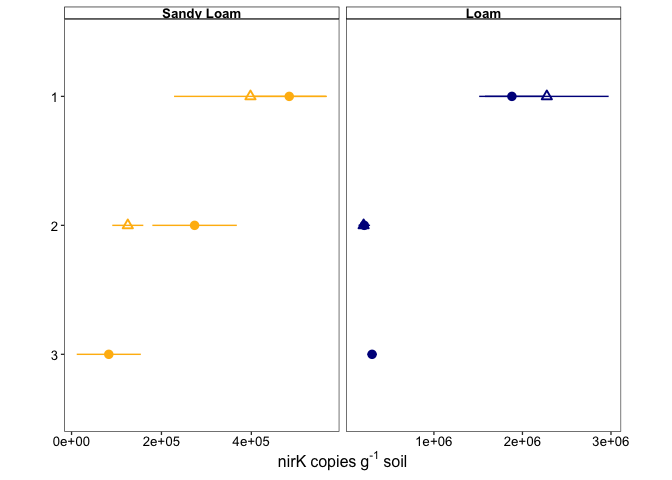<!-- -->

### Statistics

``` r
nirk_data_av %>% 
  filter(site == "R", hzn == "2") %>% 
  group_by(site, hzn, bulk_agg) %>% 
  summarise(
    norm = shapiro.test(copies_per_g)$p.value
  )
```

    ## `summarise()` has grouped output by 'site', 'hzn'. You can override using the
    ## `.groups` argument.

    ## # A tibble: 2 × 4
    ## # Groups:   site, hzn [1]
    ##   site  hzn   bulk_agg   norm
    ##   <chr> <chr> <chr>     <dbl>
    ## 1 R     2     B        0.184 
    ## 2 R     2     IN       0.0149

``` r
# cannot find transformation that works 
```

``` r
wilcox.test(
  x = nirk_data_av %>% 
  filter(site == "R", hzn == "2", bulk_agg == "B") %>% 
  pull(copies_per_g),
  y = nirk_data_av %>% 
  filter(site == "R", hzn == "2", bulk_agg == "IN") %>% 
  pull(copies_per_g)
)
```

    ## 
    ##  Wilcoxon rank sum exact test
    ## 
    ## data:  nirk_data_av %>% filter(site == "R", hzn == "2", bulk_agg == "B") %>% pull(copies_per_g) and nirk_data_av %>% filter(site == "R", hzn == "2", bulk_agg == "IN") %>% pull(copies_per_g)
    ## W = 8, p-value = 0.2
    ## alternative hypothesis: true location shift is not equal to 0

``` r
nirk_data_av %>% 
  filter(site == "R", hzn == "2", bulk_agg == "B") %>% 
  pull(copies_per_g)
```

    ## [1] 460775.8 195855.1 164545.3

# nirS

``` r
nirs_sample_key <-
  sample_key_file_nirs %>% 
  read_xlsx(sheet = "Sample Key") %>% 
  rename(sample_name = Sample)


nirs_data <-
  ddpcr_data_file_nirS %>% 
  read_csv() %>% 
  inner_join(nirs_sample_key, by = "Well") %>% 
  select(
    sample_name,
    well = Well,
    copies_per_ul = `Conc(copies/µL)`,
    copies_per_ul_min = PoissonConfMin,
    copies_per_ul_max = PoissonConfMax,
    droplets = `Accepted Droplets`
  ) %>% 
    filter(
      !(well == "D07"),
      droplets > 10000,
      sample_name != "Water"
    ) %>% 
    separate(sample_name, into = c("samp", "bulk_agg", "dilution")) %>% 
    mutate(
      across(
        dilution, 
        ~case_when(
          . == "1" ~ 10,
          is.na(.) ~ 1
        )
      ),
      across(c(copies_per_ul, copies_per_ul_min, copies_per_ul_max),
             ~if_else(dilution == "1", . * dilution, . * dilution)
      ),
      across(c(copies_per_ul, copies_per_ul_min, copies_per_ul_max),
             ~if_else(copies_per_ul < 0.5, 0, .)
      )
    ) %>% 
  filter(dilution == 1) %>% 
  separate_wider_position(samp, c(site = 1, hzn = 1, rep = 1)) %>% 
  mutate(
    across(rep, as.integer),
    across(
      hzn, 
      ~case_when(
        . == "A" ~ "1",
        . == "B" ~ "2", 
        . == "C" ~ "3"
      )
    )
  ) %>% 
  left_join(extraction_data, by = c("site", "hzn", "rep", "bulk_agg")) %>% 
  mutate(
    copies_per_g = copies_per_ul * dna_elution_volume / mass_extract_dry_g,
    copies_per_g_min = 
      copies_per_ul_min * dna_elution_volume / mass_extract_dry_g,
    copies_per_g_max = 
      copies_per_ul_max * dna_elution_volume / mass_extract_dry_g,
  )
```

    ## Rows: 37 Columns: 65
    ## ── Column specification ────────────────────────────────────────────────────────
    ## Delimiter: ","
    ## chr  (9): Well, Sample, Target, Status, Experiment, SampleType, TargetType, ...
    ## dbl (17): Conc(copies/µL), Copies/20µLWell, PoissonConfMax, PoissonConfMin, ...
    ## lgl (39): TotalConfMax, TotalConfMin, Linkage, CNV, TotalCNVMax, TotalCNVMin...
    ## 
    ## ℹ Use `spec()` to retrieve the full column specification for this data.
    ## ℹ Specify the column types or set `show_col_types = FALSE` to quiet this message.

    ## Warning: Expected 3 pieces. Additional pieces discarded in 4 rows [3, 11, 18,
    ## 28].

    ## Warning: Expected 3 pieces. Missing pieces filled with `NA` in 29 rows [1, 2, 4, 5, 6,
    ## 7, 8, 9, 10, 12, 13, 14, 15, 16, 17, 19, 20, 21, 22, 23, ...].

### Horizon Averaged

``` r
nirs_abs_plot <- 
nirs_data %>% 
  mutate(
    across(
      bulk_agg, ~case_match(., "B" ~ "Bulk", "IN" ~ "In")
    )
  ) %>% 
  group_by(site, hzn, bulk_agg) %>% 
  summarize(
    nirs_conc_av = mean(copies_per_g),
    nirs_conc_se = sd(copies_per_g) / sqrt(n())
  ) %>% 
  ggplot(
    aes(y = hzn, x = nirs_conc_av, shape = bulk_agg, color = site)
  ) +
  geom_pointrange(
    aes(
      xmin = nirs_conc_av - nirs_conc_se, 
      xmax = nirs_conc_av + nirs_conc_se),
    size = 0.5
  ) +
  scale_y_discrete(limits = rev) + 
  scale_x_continuous(
    labels = scales::label_scientific(),
    n.breaks = 3
  ) +
  scale_shape_manual(
    values = agg_shapes,
    labels = agg_names,
    name = NULL,
    guide = FALSE
  ) +
  scale_color_manual(
    values = site_colors,
    labels = site_names,
    name = "Texture",
    guide = FALSE
  ) +
  facet_grid(
    cols = vars(site), 
    scales = "free_x", 
    labeller = labeller(site = site_names)
  ) +
  my_theme() + 
  labs(
    x = expression(paste(nirS~copies~g^`-1`~soil)),
    y = NULL
  )
```

    ## `summarise()` has grouped output by 'site', 'hzn'. You can override using the
    ## `.groups` argument.

``` r
nirs_abs_plot
```

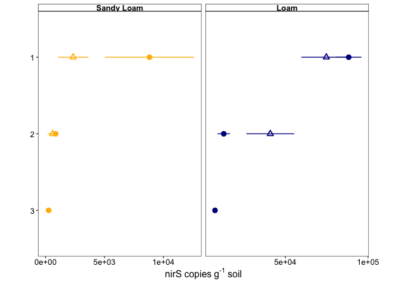<!-- -->

### Statistics

``` r
nirs_data %>% 
  filter(site == "R", hzn == "1") %>% 
  group_by(site, hzn, bulk_agg) %>% 
  summarise(
    norm = shapiro.test(copies_per_g)$p.value
  )
```

    ## `summarise()` has grouped output by 'site', 'hzn'. You can override using the
    ## `.groups` argument.

    ## # A tibble: 2 × 4
    ## # Groups:   site, hzn [1]
    ##   site  hzn   bulk_agg   norm
    ##   <chr> <chr> <chr>     <dbl>
    ## 1 R     1     B        0.0619
    ## 2 R     1     IN       0.803

``` r
nirs_data %>% 
  filter(site == "T", hzn == "2") %>% 
  group_by(site, hzn, bulk_agg) %>% 
  summarise(
    norm = shapiro.test(copies_per_g)$p.value
  )
```

    ## `summarise()` has grouped output by 'site', 'hzn'. You can override using the
    ## `.groups` argument.

    ## # A tibble: 2 × 4
    ## # Groups:   site, hzn [1]
    ##   site  hzn   bulk_agg  norm
    ##   <chr> <chr> <chr>    <dbl>
    ## 1 T     2     B        0.657
    ## 2 T     2     IN       0.680

``` r
t.test(
  x = 
    nirs_data %>% 
    filter(site == "R", hzn == "1", bulk_agg == "B") %>% 
    pull(copies_per_g),
  y = 
    nirs_data %>% 
    filter(site == "R", hzn == "1", bulk_agg == "IN") %>% 
    pull(copies_per_g),
  var.equal = FALSE
)
```

    ## 
    ##  Welch Two Sample t-test
    ## 
    ## data:  nirs_data %>% filter(site == "R", hzn == "1", bulk_agg == "B") %>% pull(copies_per_g) and nirs_data %>% filter(site == "R", hzn == "1", bulk_agg == "IN") %>% pull(copies_per_g)
    ## t = 1.6189, df = 2.4606, p-value = 0.2233
    ## alternative hypothesis: true difference in means is not equal to 0
    ## 95 percent confidence interval:
    ##  -7987.002 20936.642
    ## sample estimates:
    ## mean of x mean of y 
    ##  8816.279  2341.459

``` r
t.test(
  x = 
    nirs_data %>% 
    filter(site == "T", hzn == "2", bulk_agg == "B") %>% 
    pull(copies_per_g),
  y = 
    nirs_data %>% 
    filter(site == "T", hzn == "2", bulk_agg == "IN") %>% 
    pull(copies_per_g),
  var.equal = FALSE
)
```

    ## 
    ##  Welch Two Sample t-test
    ## 
    ## data:  nirs_data %>% filter(site == "T", hzn == "2", bulk_agg == "B") %>% pull(copies_per_g) and nirs_data %>% filter(site == "T", hzn == "2", bulk_agg == "IN") %>% pull(copies_per_g)
    ## t = -1.882, df = 2.2754, p-value = 0.1849
    ## alternative hypothesis: true difference in means is not equal to 0
    ## 95 percent confidence interval:
    ##  -85543.83  29273.32
    ## sample estimates:
    ## mean of x mean of y 
    ##  12772.19  40907.44

# mcrA

``` r
mcra_sample_key <-
  sample_key_file_mcra %>% 
  read_xlsx() %>% 
  rename(sample_name = Sample)


mcrA_data <-
  ddpcr_data_file_mcrA %>% 
  read_csv() %>% 
  inner_join(mcra_sample_key, by = "Well") %>% 
 select(
    sample_name,
    well = Well,
    copies_per_ul = `Conc(copies/µL)`,
    copies_per_ul_min = PoissonConfMin,
    copies_per_ul_max = PoissonConfMax,
    droplets = `Accepted Droplets`
  ) %>% 
    filter(

      droplets > 10000,
      sample_name != "Water",
      sample_name != "Positive"
    ) %>% 
    separate(sample_name, into = c("samp", "bulk_agg")) %>% 
  separate_wider_position(samp, c(site = 1, hzn = 1, rep = 1)) %>% 
  mutate(
    across(rep, as.integer),
    across(
      hzn, 
      ~case_when(
        . == "A" ~ "1",
        . == "B" ~ "2", 
        . == "C" ~ "3"
      )
    ),
    across(c(copies_per_ul, copies_per_ul_min, copies_per_ul_max), as.numeric),
    across(
      c(copies_per_ul, copies_per_ul_min, copies_per_ul_max), 
      ~if_else(. < 0.5, 0, .)
    ) 
  ) %>% 
  left_join(extraction_data, by = c("site", "hzn", "rep", "bulk_agg")) %>% 
  mutate(
    copies_per_g = copies_per_ul * dna_elution_volume / mass_extract_dry_g,
    copies_per_g_min = 
      copies_per_ul_min * dna_elution_volume / mass_extract_dry_g,
    copies_per_g_max = 
      copies_per_ul_max * dna_elution_volume / mass_extract_dry_g,
  )
```

    ## Rows: 40 Columns: 65
    ## ── Column specification ────────────────────────────────────────────────────────
    ## Delimiter: ","
    ## chr  (9): Well, Target, Conc(copies/µL), Status, Experiment, SampleType, Tar...
    ## dbl (16): Copies/20µLWell, PoissonConfMax, PoissonConfMin, Accepted Droplets...
    ## lgl (40): Sample, TotalConfMax, TotalConfMin, Linkage, CNV, TotalCNVMax, Tot...
    ## 
    ## ℹ Use `spec()` to retrieve the full column specification for this data.
    ## ℹ Specify the column types or set `show_col_types = FALSE` to quiet this message.

Average technical replicates:

``` r
mcra_data_av <- 
  mcrA_data %>% 
  group_by(site, hzn, rep, bulk_agg) %>% 
  summarise(
    across(
      c(
        copies_per_ul, 
        copies_per_ul_min, 
        copies_per_ul_max, 
        mass_extract_dry_g, 
        copies_per_g,
        copies_per_g_min,
        copies_per_g_max
      ),
      ~mean(.)
    )
  )
```

    ## `summarise()` has grouped output by 'site', 'hzn', 'rep'. You can override
    ## using the `.groups` argument.

``` r
mcra_data_av
```

    ## # A tibble: 29 × 11
    ## # Groups:   site, hzn, rep [17]
    ##    site  hzn     rep bulk_agg copies_per_ul copies_per_ul_min copies_per_ul_max
    ##    <chr> <chr> <int> <chr>            <dbl>             <dbl>             <dbl>
    ##  1 R     1         1 B                3.63              2.65              4.84 
    ##  2 R     1         1 IN               1.61              0.976             2.48 
    ##  3 R     1         2 B                3.31              2.36              4.48 
    ##  4 R     1         2 IN               2.80              1.92              3.91 
    ##  5 R     1         3 B                2.03              1.31              2.98 
    ##  6 R     1         3 IN               1.06              0.563             1.80 
    ##  7 R     2         1 B                0.882             0                 1.52 
    ##  8 R     2         1 IN               0                 0                 0.764
    ##  9 R     2         2 B                1.79              1.13              2.67 
    ## 10 R     2         2 IN               1.61              1.01              2.40 
    ## # ℹ 19 more rows
    ## # ℹ 4 more variables: mass_extract_dry_g <dbl>, copies_per_g <dbl>,
    ## #   copies_per_g_min <dbl>, copies_per_g_max <dbl>

``` r
mcra_abs_plot <- 
mcra_data_av %>% 
  mutate(
    across(
      bulk_agg, ~case_match(., "B" ~ "Bulk", "IN" ~ "In")
    )
  ) %>% 
  group_by(site, hzn, bulk_agg) %>% 
  summarize(
    mcra_conc_av = mean(copies_per_g),
    mcra_conc_se = sd(copies_per_g) / sqrt(n())
  ) %>% 
  ggplot(
    aes(y = hzn, x = mcra_conc_av, shape = bulk_agg, color = site)
  ) +
  geom_pointrange(
    aes(
      xmin = mcra_conc_av - mcra_conc_se, 
      xmax = mcra_conc_av + mcra_conc_se),
    size = 0.5
  ) +
  scale_y_discrete(limits = rev) + 
  scale_shape_manual(
    values = agg_shapes,
    labels = agg_names,
    name = NULL,
    guide = FALSE
  ) +
  scale_x_continuous(labels = scales::label_scientific()) +
  scale_color_manual(
    values = site_colors,
    labels = site_names,
    name = "Texture",
    guide = FALSE
  ) +
  facet_grid(
    cols = vars(site), 
    scales = "free_x", 
    labeller = labeller(site = site_names)
  ) +
  my_theme() + 
  labs(
    x = expression(paste(mcrA~copies~g^`-1`~soil)),
    y = NULL
  )
```

    ## `summarise()` has grouped output by 'site', 'hzn'. You can override using the
    ## `.groups` argument.

``` r
mcra_abs_plot
```

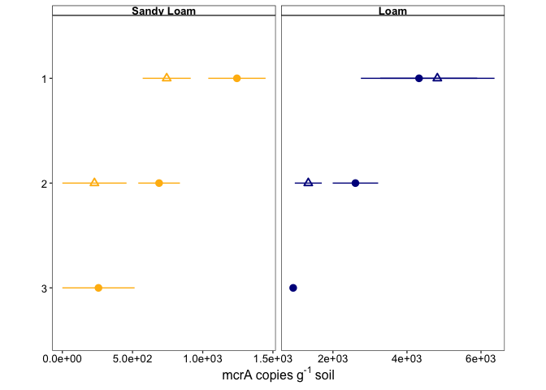<!-- -->

### Statistics

``` r
mcra_data_av %>% 
  group_by(site, hzn, bulk_agg) %>% 
  filter(hzn != "3") %>% 
  summarise(
    norm = shapiro.test(copies_per_g)$p.value
  )
```

    ## `summarise()` has grouped output by 'site', 'hzn'. You can override using the
    ## `.groups` argument.

    ## # A tibble: 8 × 4
    ## # Groups:   site, hzn [4]
    ##   site  hzn   bulk_agg  norm
    ##   <chr> <chr> <chr>    <dbl>
    ## 1 R     1     B        0.511
    ## 2 R     1     IN       0.816
    ## 3 R     2     B        0.299
    ## 4 R     2     IN       0    
    ## 5 T     1     B        0.997
    ## 6 T     1     IN       0.291
    ## 7 T     2     B        0.610
    ## 8 T     2     IN       0.105

R-2-In is NOT normal. The rest are OK for t-tests.

``` r
t.test(
  x = mcra_data_av %>% 
  filter(site == "R", hzn == "1", bulk_agg == "B") %>% 
  pull(copies_per_g),
  y = mcra_data_av %>% 
  filter(site == "R", hzn == "1", bulk_agg == "IN") %>% 
  pull(copies_per_g),
  var.equal = FALSE
)
```

    ## 
    ##  Welch Two Sample t-test
    ## 
    ## data:  mcra_data_av %>% filter(site == "R", hzn == "1", bulk_agg == "B") %>% pull(copies_per_g) and mcra_data_av %>% filter(site == "R", hzn == "1", bulk_agg == "IN") %>% pull(copies_per_g)
    ## t = 1.8794, df = 3.8814, p-value = 0.1356
    ## alternative hypothesis: true difference in means is not equal to 0
    ## 95 percent confidence interval:
    ##  -247.807 1248.468
    ## sample estimates:
    ## mean of x mean of y 
    ##  1243.665   743.334

``` r
wilcox.test(
    x = mcra_data_av %>% 
      filter(site == "R", hzn == "2", bulk_agg == "B") %>% 
      pull(copies_per_g),
    y = mcra_data_av %>% 
      filter(site == "R", hzn == "2", bulk_agg == "IN") %>% 
      pull(copies_per_g)
  )
```

    ## Warning in wilcox.test.default(x = mcra_data_av %>% filter(site == "R", :
    ## cannot compute exact p-value with ties

    ## 
    ##  Wilcoxon rank sum test with continuity correction
    ## 
    ## data:  mcra_data_av %>% filter(site == "R", hzn == "2", bulk_agg == "B") %>% pull(copies_per_g) and mcra_data_av %>% filter(site == "R", hzn == "2", bulk_agg == "IN") %>% pull(copies_per_g)
    ## W = 8, p-value = 0.184
    ## alternative hypothesis: true location shift is not equal to 0

``` r
t.test(
  x = mcra_data_av %>% 
  filter(site == "T", hzn == "2", bulk_agg == "B") %>% 
  pull(copies_per_g),
  y = mcra_data_av %>% 
  filter(site == "T", hzn == "2", bulk_agg == "IN") %>% 
  pull(copies_per_g),
  var.equal = FALSE
)
```

    ## 
    ##  Welch Two Sample t-test
    ## 
    ## data:  mcra_data_av %>% filter(site == "T", hzn == "2", bulk_agg == "B") %>% pull(copies_per_g) and mcra_data_av %>% filter(site == "T", hzn == "2", bulk_agg == "IN") %>% pull(copies_per_g)
    ## t = 1.7835, df = 3.2523, p-value = 0.1653
    ## alternative hypothesis: true difference in means is not equal to 0
    ## 95 percent confidence interval:
    ##  -902.4462 3449.6442
    ## sample estimates:
    ## mean of x mean of y 
    ##  2607.531  1333.932

# Composite - Figure 1

``` r
plot_grid(
  tc_plot, 
  edc_plot, 
  eac_to_eec_plot,
  nirk_abs_plot, 
  nirs_abs_plot, 
  mcra_abs_plot, 
  ncol = 3
)
```

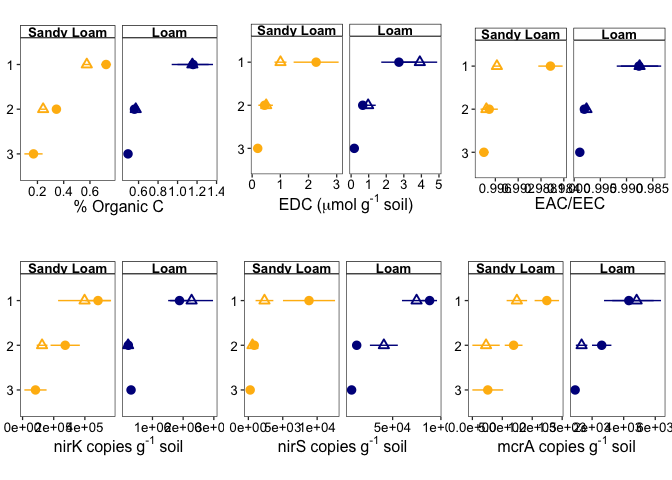<!-- -->

# Supplementary Figures

## Fe 2+

``` r
fe_ii_plot <- 
electro_data %>% 
  group_by(site, hzn, bulk_agg) %>% 
  summarise(
    mean_fe_ii = mean(fe_ii_umol_per_g),
    se_fe_ii = sd(fe_ii_umol_per_g) / sqrt(n())
  ) %>% 
  ggplot(
    aes(y = hzn, x = mean_fe_ii, shape = bulk_agg, color = site)
  ) +
  geom_pointrange(
    aes(
      xmin = mean_fe_ii - se_fe_ii, 
      xmax = mean_fe_ii + se_fe_ii),
    size = 0.5
  ) +
  scale_y_discrete(limits = rev) +
  scale_shape_manual(
    values = agg_shapes,
    labels = agg_names,
    name = NULL,
    #guide = FALSE
  ) +
  scale_color_manual(
    values = site_colors,
    labels = site_names,
    #name = "Texture",
    #guide = FALSE
  ) +
  facet_grid(
    cols = vars(site), 
    scales = "free_x", 
    labeller = labeller(site = site_names)
  ) +
  my_theme() +
  theme(
      strip.text = element_text(size = 12, face = "bold"),
      axis.text = element_text(size = 12),
      axis.text.x = element_text(size = 12),
      axis.title = element_text(size = 14),
      legend.text = element_text(size = 12),
      legend.title = element_text(size = 14),
  ) +
  
  labs(
    x = expression(paste(`0.5M`~HCl,`-`,extractable~Fe,`(II)`~`(`,mu,mol~g^`-1`~soil,`)`)),
    y = element_blank(),
    color = NULL
  )
```

    ## `summarise()` has grouped output by 'site', 'hzn'. You can override using the
    ## `.groups` argument.

``` r
fe_ii_plot
```

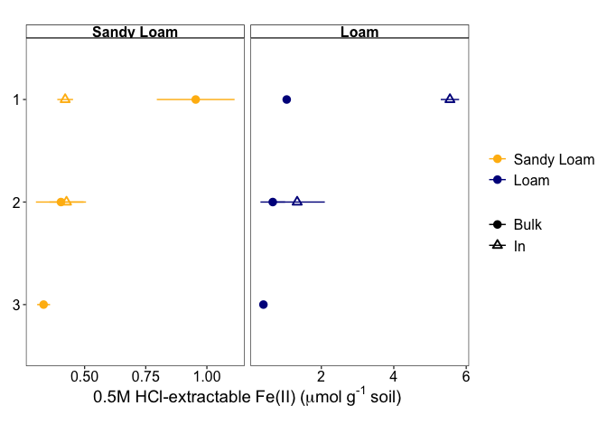<!-- -->

### Statistics

``` r
electro_data %>% 
  group_by(site, hzn, bulk_agg) %>% 
  summarise(
    norm = shapiro.test(fe_ii_umol_per_g)$p.value
  )
```

    ## `summarise()` has grouped output by 'site', 'hzn'. You can override using the
    ## `.groups` argument.

    ## # A tibble: 10 × 4
    ## # Groups:   site, hzn [6]
    ##    site  hzn   bulk_agg   norm
    ##    <chr> <chr> <chr>     <dbl>
    ##  1 R     1     Bulk     0.743 
    ##  2 R     1     In       0.397 
    ##  3 R     2     Bulk     0.0183
    ##  4 R     2     In       0.781 
    ##  5 R     3     Bulk     0.860 
    ##  6 T     1     Bulk     0.846 
    ##  7 T     1     In       0.154 
    ##  8 T     2     Bulk     0.481 
    ##  9 T     2     In       0.431 
    ## 10 T     3     Bulk     0.208

R & A

``` r
var.test(
  x = electro_data %>% 
    filter(site == "R", hzn == "1", bulk_agg == "Bulk") %>% 
    pull(fe_ii_umol_per_g),
  y = electro_data %>% 
    filter(site == "R", hzn == "1", bulk_agg == "In") %>% 
    pull(fe_ii_umol_per_g)
  )
```

    ## 
    ##  F test to compare two variances
    ## 
    ## data:  electro_data %>% filter(site == "R", hzn == "1", bulk_agg == "Bulk") %>% pull(fe_ii_umol_per_g) and electro_data %>% filter(site == "R", hzn == "1", bulk_agg == "In") %>% pull(fe_ii_umol_per_g)
    ## F = 24.388, num df = 2, denom df = 2, p-value = 0.07878
    ## alternative hypothesis: true ratio of variances is not equal to 1
    ## 95 percent confidence interval:
    ##    0.6253218 951.1144931
    ## sample estimates:
    ## ratio of variances 
    ##           24.38755

Equal variances

``` r
t.test(
  x = electro_data %>% 
    filter(site == "R", hzn == "1", bulk_agg == "Bulk") %>% 
    pull(fe_ii_umol_per_g),
  y = electro_data %>% 
    filter(site == "R", hzn == "1", bulk_agg == "In") %>% 
    pull(fe_ii_umol_per_g),
  var.equal = TRUE
)
```

    ## 
    ##  Two Sample t-test
    ## 
    ## data:  electro_data %>% filter(site == "R", hzn == "1", bulk_agg == "Bulk") %>% pull(fe_ii_umol_per_g) and electro_data %>% filter(site == "R", hzn == "1", bulk_agg == "In") %>% pull(fe_ii_umol_per_g)
    ## t = 3.2896, df = 4, p-value = 0.03023
    ## alternative hypothesis: true difference in means is not equal to 0
    ## 95 percent confidence interval:
    ##  0.08324293 0.98406643
    ## sample estimates:
    ## mean of x mean of y 
    ## 0.9542046 0.4205500

T & A

``` r
var.test(
  x = electro_data %>% 
    filter(site == "T", hzn == "1", bulk_agg == "Bulk") %>% 
    pull(fe_ii_umol_per_g),
  y = electro_data %>% 
    filter(site == "T", hzn == "1", bulk_agg == "In") %>% 
    pull(fe_ii_umol_per_g)
  )
```

    ## 
    ##  F test to compare two variances
    ## 
    ## data:  electro_data %>% filter(site == "T", hzn == "1", bulk_agg == "Bulk") %>% pull(fe_ii_umol_per_g) and electro_data %>% filter(site == "T", hzn == "1", bulk_agg == "In") %>% pull(fe_ii_umol_per_g)
    ## F = 0.18362, num df = 2, denom df = 2, p-value = 0.3103
    ## alternative hypothesis: true ratio of variances is not equal to 1
    ## 95 percent confidence interval:
    ##  0.004708309 7.161338230
    ## sample estimates:
    ## ratio of variances 
    ##          0.1836241

``` r
t.test(
  x = electro_data %>% 
    filter(site == "T", hzn == "1", bulk_agg == "Bulk") %>% 
    pull(fe_ii_umol_per_g),
  y = electro_data %>% 
    filter(site == "T", hzn == "1", bulk_agg == "In") %>% 
    pull(fe_ii_umol_per_g),
  var.equal = TRUE
)
```

    ## 
    ##  Two Sample t-test
    ## 
    ## data:  electro_data %>% filter(site == "T", hzn == "1", bulk_agg == "Bulk") %>% pull(fe_ii_umol_per_g) and electro_data %>% filter(site == "T", hzn == "1", bulk_agg == "In") %>% pull(fe_ii_umol_per_g)
    ## t = -16.347, df = 4, p-value = 8.198e-05
    ## alternative hypothesis: true difference in means is not equal to 0
    ## 95 percent confidence interval:
    ##  -5.272240 -3.741301
    ## sample estimates:
    ## mean of x mean of y 
    ##  1.043606  5.550376

## Total Fe (XRF)

``` r
fe_tot_plot <- 
electro_data %>% 
  group_by(site, hzn, bulk_agg) %>%
  summarise(
    mean_fe = mean(fe_tot_xrf_ug_g),
    se_fe = sd(fe_tot_xrf_ug_g) / sqrt(n())
  ) %>% 
  filter(bulk_agg == "Bulk") %>% 
  ggplot(
    aes(y = hzn, x = mean_fe, shape = bulk_agg, color = site)
  ) +
  geom_pointrange(
    aes(
      xmin = mean_fe - se_fe, 
      xmax = mean_fe + se_fe),
    size = 0.5
  ) +
  scale_y_discrete(limits = rev) +
  scale_x_continuous(n.breaks = 4) +
  scale_shape_manual(
    values = agg_shapes,
    labels = agg_names,
    name = NULL,
    #guide = FALSE
  ) +
  scale_color_manual(
    values = site_colors,
    labels = site_names,
    #name = "Texture",
    #guide = FALSE
  ) +
  facet_grid(
    cols = vars(site), 
    scales = "free_x", 
    labeller = labeller(site = site_names)
  ) +
  my_theme() +
  theme(
      strip.text = element_text(size = 12, face = "bold"),
      axis.text = element_text(size = 12),
      axis.text.x = element_text(size = 12),
      axis.title = element_text(size = 14),
      legend.text = element_text(size = 12),
      legend.title = element_text(size = 14),
  ) +
  
  labs(
    x = expression(paste(Total~Fe~`(`,mu,g~g^`-1`~soil,`)`)),
    y = element_blank(),
    color = NULL
  )
```

    ## `summarise()` has grouped output by 'site', 'hzn'. You can override using the
    ## `.groups` argument.

``` r
fe_tot_plot
```

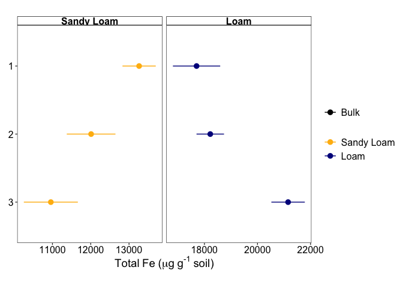<!-- -->

## Acid-extractable Fe(II) normalized to Total Fe (XRF)

``` r
electro_data %>% 
  mutate(
    fe_tot_umol_per_g = fe_tot_xrf_ug_g / molar_mass_fe,
    prop_fe_ii = fe_ii_umol_per_g / fe_tot_umol_per_g
  ) %>% 
  group_by(site, hzn, bulk_agg) %>% 
  summarise(
    mean_prop_fe_ii = mean(prop_fe_ii),
    se_prop_fe_ii = sd(prop_fe_ii) / sqrt(n())
  ) %>% 
  ggplot(
    aes(y = hzn, x = mean_prop_fe_ii, shape = bulk_agg, color = site)
  ) +
  geom_pointrange(
    aes(
      xmin = mean_prop_fe_ii - se_prop_fe_ii, 
      xmax = mean_prop_fe_ii + se_prop_fe_ii),
    size = 0.5
  ) +
  scale_y_discrete(limits = rev) +
  scale_x_continuous(n.breaks = 4) +
  scale_shape_manual(
    values = agg_shapes,
    labels = agg_names,
    name = NULL,
    #guide = FALSE
  ) +
  scale_color_manual(
    values = site_colors,
    labels = site_names,
    #name = "Texture",
    #guide = FALSE
  ) +
  facet_grid(
    cols = vars(site), 
    scales = "free_x", 
    labeller = labeller(site = site_names)
  ) +
  my_theme() +
  theme(
      strip.text = element_text(size = 12, face = "bold"),
      axis.text = element_text(size = 12),
      axis.text.x = element_text(size = 12),
      axis.title = element_text(size = 14),
      legend.text = element_text(size = 12),
      legend.title = element_text(size = 14),
  ) +
  labs(
    x = expression(paste(mu,mol~Fe,`(II)`~per~mu,mol~Fe[XRF])),
    y = element_blank(),
    color = NULL
  )
```

    ## `summarise()` has grouped output by 'site', 'hzn'. You can override using the
    ## `.groups` argument.

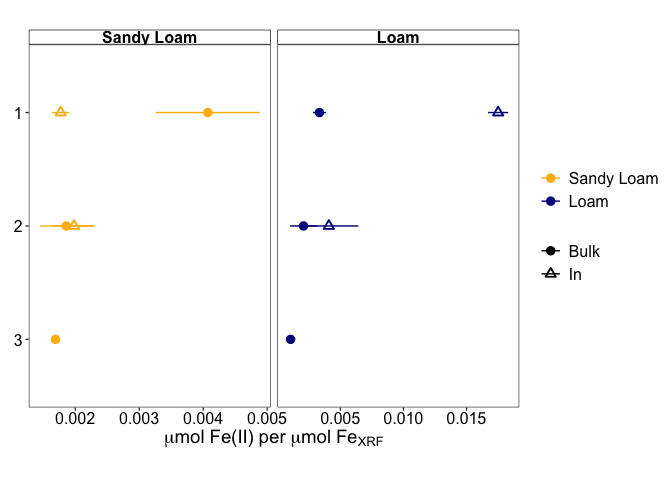<!-- -->

## Total Mn (XRF)

``` r
mn_tot_plot <- 
mn_data %>% 
  group_by(site, hzn, bulk_agg) %>% 
  summarise(
    mean_mn = mean(mn, na.rm = TRUE),
    se_mn = sd(mn, na.rm = TRUE) / sqrt(n())
  ) %>% 
  filter(bulk_agg == "Bulk") %>% 
  ggplot(
    aes(y = hzn, x = mean_mn, shape = bulk_agg, color = site)
  ) +
  geom_pointrange(
    aes(
      xmin = mean_mn - se_mn, 
      xmax = mean_mn + se_mn),
    size = 0.5
  ) +
  scale_y_discrete(limits = rev) +
  scale_x_continuous(n.breaks = 4) +
  scale_shape_manual(
    values = agg_shapes,
    labels = agg_names,
    name = NULL,
    #guide = FALSE
  ) +
  scale_color_manual(
    values = site_colors,
    labels = site_names,
    #name = "Texture",
    #guide = FALSE
  ) +
  facet_grid(
    cols = vars(site), 
    scales = "free_x", 
    labeller = labeller(site = site_names)
  ) +
  my_theme() +
  theme(
      strip.text = element_text(size = 12, face = "bold"),
      axis.text = element_text(size = 12),
      axis.text.x = element_text(size = 12),
      axis.title = element_text(size = 14),
      legend.text = element_text(size = 12),
      legend.title = element_text(size = 14),
  ) +
  
  labs(
    x = expression(paste(Total~Mn~`(`,mu,g~g^`-1`~soil,`)`)),
    y = element_blank(),
    color = NULL
  )
```

    ## `summarise()` has grouped output by 'site', 'hzn'. You can override using the
    ## `.groups` argument.

``` r
mn_tot_plot
```

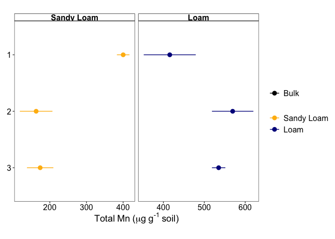<!-- -->

## 16S

``` r
data_16s_adj %>% 
  mutate(
    across(
      bulk_agg, ~case_match(., "B" ~ "Bulk", "IN" ~ "In")
    )
  ) %>% 
  group_by(site, hzn, bulk_agg) %>% 
  summarise(
    mean_16s = mean(sixteenS_copies_per_g, na.rm = TRUE),
    se_16s = sd(sixteenS_copies_per_g) / sqrt(n())
  ) %>% 
  ggplot(
    aes(y = hzn, x = mean_16s, shape = bulk_agg, color = site)
  ) +
  geom_pointrange(
    aes(xmin = mean_16s - se_16s, xmax = mean_16s + se_16s),
    fatten = 4
  ) +
  scale_y_discrete(limits = rev) +
  scale_color_manual(
    values = site_colors,
    labels = site_names
  ) +
  scale_shape_manual(
    values = agg_shapes,
    labels = agg_names,
    name = NULL
  ) +
  facet_grid(
    cols = vars(site), 
    scales = "free_x", 
    labeller = labeller(site = site_names)
  ) +
  my_theme() +
  theme(
      strip.text = element_text(size = 12, face = "bold"),
      axis.text = element_text(size = 12),
      axis.text.x = element_text(size = 12),
      axis.title = element_text(size = 14),
      legend.text = element_text(size = 12),
      legend.title = element_text(size = 14),
  ) +
  labs(
    x = "16S copies per g soil",
    y = "Horizon",
    color = NULL
  )
```

    ## `summarise()` has grouped output by 'site', 'hzn'. You can override using the
    ## `.groups` argument.

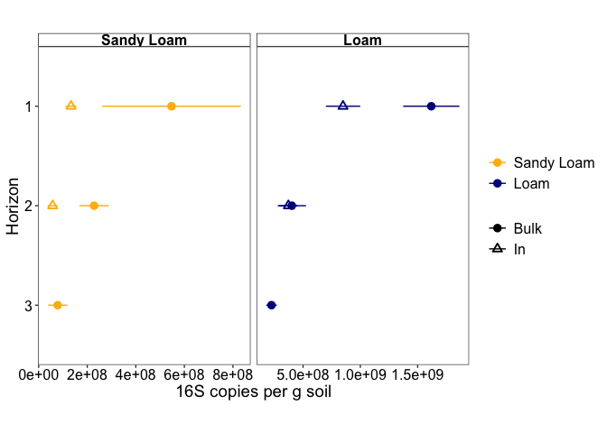<!-- -->

### Statistics

``` r
data_16s_adj %>% 
  group_by(site, hzn, bulk_agg) %>% 
  summarise(
    norm = shapiro.test(sixteenS_copies_per_g)$p.value
  )
```

    ## `summarise()` has grouped output by 'site', 'hzn'. You can override using the
    ## `.groups` argument.

    ## # A tibble: 10 × 4
    ## # Groups:   site, hzn [6]
    ##    site  hzn   bulk_agg   norm
    ##    <chr> <chr> <chr>     <dbl>
    ##  1 R     1     B        0.618 
    ##  2 R     1     IN       0.180 
    ##  3 R     2     B        0.666 
    ##  4 R     2     IN       0.617 
    ##  5 R     3     B        0.339 
    ##  6 T     1     B        0.0910
    ##  7 T     1     IN       0.0243
    ##  8 T     2     B        0.905 
    ##  9 T     2     IN       0.375 
    ## 10 T     3     B        0.820

R & A - Variances unequal

``` r
var.test(
  x = data_16s_adj %>% 
    filter(site == "R", hzn =="1", bulk_agg == "B") %>% 
    pull(sixteenS_copies_per_g),
  y = data_16s_adj %>% 
    filter(site == "R", hzn =="1", bulk_agg == "IN") %>% 
    pull(sixteenS_copies_per_g)
)
```

    ## 
    ##  F test to compare two variances
    ## 
    ## data:  data_16s_adj %>% filter(site == "R", hzn == "1", bulk_agg == "B") %>% pull(sixteenS_copies_per_g) and data_16s_adj %>% filter(site == "R", hzn == "1", bulk_agg == "IN") %>% pull(sixteenS_copies_per_g)
    ## F = 153.13, num df = 2, denom df = 2, p-value = 0.01298
    ## alternative hypothesis: true ratio of variances is not equal to 1
    ## 95 percent confidence interval:
    ##     3.926315 5971.925776
    ## sample estimates:
    ## ratio of variances 
    ##           153.1263

``` r
t.test(
  x = data_16s_adj %>% 
    filter(site == "R", hzn =="1", bulk_agg == "B") %>% 
    pull(sixteenS_copies_per_g),
  y = data_16s_adj %>% 
    filter(site == "R", hzn =="1", bulk_agg == "IN") %>% 
    pull(sixteenS_copies_per_g),
  var.equal = FALSE
)
```

    ## 
    ##  Welch Two Sample t-test
    ## 
    ## data:  data_16s_adj %>% filter(site == "R", hzn == "1", bulk_agg == "B") %>% pull(sixteenS_copies_per_g) and data_16s_adj %>% filter(site == "R", hzn == "1", bulk_agg == "IN") %>% pull(sixteenS_copies_per_g)
    ## t = 1.4429, df = 2.0261, p-value = 0.2843
    ## alternative hypothesis: true difference in means is not equal to 0
    ## 95 percent confidence interval:
    ##  -805000148 1632584029
    ## sample estimates:
    ## mean of x mean of y 
    ## 546940149 133148209

R & B

``` r
var.test(
  x = data_16s_adj %>% 
    filter(site == "R", hzn =="2", bulk_agg == "B") %>% 
    pull(sixteenS_copies_per_g),
  y = data_16s_adj %>% 
    filter(site == "R", hzn =="2", bulk_agg == "IN") %>% 
    pull(sixteenS_copies_per_g)
)
```

    ## 
    ##  F test to compare two variances
    ## 
    ## data:  data_16s_adj %>% filter(site == "R", hzn == "2", bulk_agg == "B") %>% pull(sixteenS_copies_per_g) and data_16s_adj %>% filter(site == "R", hzn == "2", bulk_agg == "IN") %>% pull(sixteenS_copies_per_g)
    ## F = 8.7407, num df = 2, denom df = 2, p-value = 0.2053
    ## alternative hypothesis: true ratio of variances is not equal to 1
    ## 95 percent confidence interval:
    ##    0.2241193 340.8854090
    ## sample estimates:
    ## ratio of variances 
    ##           8.740652

``` r
t.test(
  x = data_16s_adj %>% 
    filter(site == "R", hzn =="2", bulk_agg == "B") %>% 
    pull(sixteenS_copies_per_g),
  y = data_16s_adj %>% 
    filter(site == "R", hzn =="2", bulk_agg == "IN") %>% 
    pull(sixteenS_copies_per_g),
  var.equal = TRUE
)
```

    ## 
    ##  Two Sample t-test
    ## 
    ## data:  data_16s_adj %>% filter(site == "R", hzn == "2", bulk_agg == "B") %>% pull(sixteenS_copies_per_g) and data_16s_adj %>% filter(site == "R", hzn == "2", bulk_agg == "IN") %>% pull(sixteenS_copies_per_g)
    ## t = 2.6878, df = 4, p-value = 0.05478
    ## alternative hypothesis: true difference in means is not equal to 0
    ## 95 percent confidence interval:
    ##   -5628250 347003611
    ## sample estimates:
    ## mean of x mean of y 
    ## 228209068  57521387

T & A

``` r
var.test(
  x = data_16s_adj %>% 
    filter(site == "T", hzn =="1", bulk_agg == "B") %>% 
    pull(sixteenS_copies_per_g),
  y = data_16s_adj %>% 
    filter(site == "T", hzn =="1", bulk_agg == "IN") %>% 
    pull(sixteenS_copies_per_g)
)
```

    ## 
    ##  F test to compare two variances
    ## 
    ## data:  data_16s_adj %>% filter(site == "T", hzn == "1", bulk_agg == "B") %>% pull(sixteenS_copies_per_g) and data_16s_adj %>% filter(site == "T", hzn == "1", bulk_agg == "IN") %>% pull(sixteenS_copies_per_g)
    ## F = 2.6825, num df = 2, denom df = 2, p-value = 0.5431
    ## alternative hypothesis: true ratio of variances is not equal to 1
    ## 95 percent confidence interval:
    ##    0.06878112 104.61608292
    ## sample estimates:
    ## ratio of variances 
    ##           2.682464

``` r
t.test(
  x = data_16s_adj %>% 
    filter(site == "T", hzn =="1", bulk_agg == "B") %>% 
    pull(sixteenS_copies_per_g),
  y = data_16s_adj %>% 
    filter(site == "T", hzn =="1", bulk_agg == "IN") %>% 
    pull(sixteenS_copies_per_g),
  var.equal = TRUE
)
```

    ## 
    ##  Two Sample t-test
    ## 
    ## data:  data_16s_adj %>% filter(site == "T", hzn == "1", bulk_agg == "B") %>% pull(sixteenS_copies_per_g) and data_16s_adj %>% filter(site == "T", hzn == "1", bulk_agg == "IN") %>% pull(sixteenS_copies_per_g)
    ## t = 2.6775, df = 4, p-value = 0.05537
    ## alternative hypothesis: true difference in means is not equal to 0
    ## 95 percent confidence interval:
    ##   -28467628 1568556194
    ## sample estimates:
    ##  mean of x  mean of y 
    ## 1618752881  848708599

## Total Nitrogen

``` r
tctn_data %>% 
 ggplot(
    aes(y = hzn, x = mean_perc_n, shape = bulk_agg, color = site)
  ) +
  geom_pointrange(
    aes(
      xmin = mean_perc_n - se_perc_n, 
      xmax = mean_perc_n + se_perc_n),
    size = 0.5
  ) +
  scale_x_continuous(n.breaks = 4) +
  scale_y_discrete(limits = rev) +
  scale_shape_manual(
    values = agg_shapes,
    labels = agg_names,
    name = NULL,
    #guide = FALSE
  ) +
  scale_color_manual(
    values = site_colors,
    labels = site_names,
    #name = "Texture",
    #guide = FALSE
  ) +
  facet_grid(
    cols = vars(site), 
    scales = "free_x", 
    labeller = labeller(site = site_names)
  ) +
  my_theme() +
  theme(
      strip.text = element_text(size = 12, face = "bold"),
      axis.text = element_text(size = 12),
      axis.text.x = element_text(size = 12),
      axis.title = element_text(size = 14),
      legend.text = element_text(size = 12),
      legend.title = element_text(size = 14),
  ) +
  labs(
    x = "% N",
    y = NULL, 
    shape = "Sample",
    color = NULL
  )
```

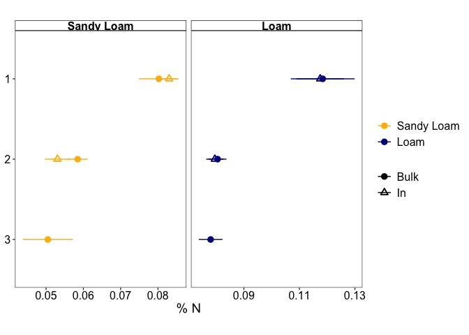<!-- -->

## EAC

``` r
electro_data %>% 
  group_by(site, hzn, bulk_agg) %>% 
  summarise(
    mean_eac = mean(eac_umol_g_soil),
    se_eac = sd(eac_umol_g_soil) / sqrt(n())
  ) %>%  
  ggplot(
    aes(y = hzn, x = mean_eac, shape = bulk_agg, color = site)
  ) +
  geom_pointrange(
    aes(
      xmin = mean_eac - se_eac, 
      xmax = mean_eac + se_eac),
    size = 0.5
  ) +
  scale_y_discrete(limits = rev) +
  scale_shape_manual(
    values = agg_shapes,
    labels = agg_names,
    name = NULL
  ) +
  scale_x_continuous(n.breaks = 4) +
  scale_color_manual(
    values = site_colors,
    labels = site_names
  ) +
  facet_grid(
    cols = vars(site), 
    scales = "free_x", 
    labeller = labeller(site = site_names)
  ) +
  my_theme() +
  theme(
      strip.text = element_text(size = 12, face = "bold"),
      axis.text = element_text(size = 12),
      axis.text.x = element_text(size = 12),
      axis.title = element_text(size = 14),
      legend.text = element_text(size = 12),
      legend.title = element_text(size = 14),
  ) +
  labs(
    x = expression(paste(EAC~`(`,mu,mol~g^`-1`~soil,`)`)),
    y = element_blank(),
    color = NULL
  )
```

    ## `summarise()` has grouped output by 'site', 'hzn'. You can override using the
    ## `.groups` argument.

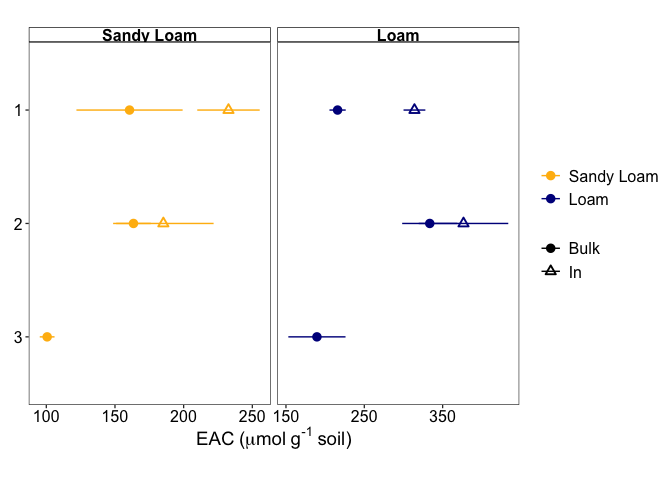<!-- -->

### Statistics

``` r
electro_data %>% 
  group_by(site, hzn, bulk_agg) %>% 
  summarise(
    norm = shapiro.test(eac_umol_g_soil)$p.value
  )
```

    ## `summarise()` has grouped output by 'site', 'hzn'. You can override using the
    ## `.groups` argument.

    ## # A tibble: 10 × 4
    ## # Groups:   site, hzn [6]
    ##    site  hzn   bulk_agg  norm
    ##    <chr> <chr> <chr>    <dbl>
    ##  1 R     1     Bulk     0.882
    ##  2 R     1     In       0.392
    ##  3 R     2     Bulk     0.405
    ##  4 R     2     In       0.290
    ##  5 R     3     Bulk     0.621
    ##  6 T     1     Bulk     0.151
    ##  7 T     1     In       0.953
    ##  8 T     2     Bulk     0.108
    ##  9 T     2     In       0.184
    ## 10 T     3     Bulk     0.930

R & A

``` r
var.test(
  x = electro_data %>% 
    filter(site == "R", hzn == "1", bulk_agg == "Bulk") %>% 
    pull(eac_umol_g_soil),
  y = electro_data %>% 
    filter(site == "R", hzn == "1", bulk_agg == "In") %>% 
    pull(eac_umol_g_soil)
  )
```

    ## 
    ##  F test to compare two variances
    ## 
    ## data:  electro_data %>% filter(site == "R", hzn == "1", bulk_agg == "Bulk") %>% pull(eac_umol_g_soil) and electro_data %>% filter(site == "R", hzn == "1", bulk_agg == "In") %>% pull(eac_umol_g_soil)
    ## F = 2.8916, num df = 2, denom df = 2, p-value = 0.5139
    ## alternative hypothesis: true ratio of variances is not equal to 1
    ## 95 percent confidence interval:
    ##    0.07414394 112.77293071
    ## sample estimates:
    ## ratio of variances 
    ##           2.891614

``` r
t.test(
  x = electro_data %>% 
    filter(site == "R", hzn == "1", bulk_agg == "Bulk") %>% 
    pull(eac_umol_g_soil),
  y = electro_data %>% 
    filter(site == "R", hzn == "1", bulk_agg == "In") %>% 
    pull(eac_umol_g_soil),
  var.equal = TRUE
  )
```

    ## 
    ##  Two Sample t-test
    ## 
    ## data:  electro_data %>% filter(site == "R", hzn == "1", bulk_agg == "Bulk") %>% pull(eac_umol_g_soil) and electro_data %>% filter(site == "R", hzn == "1", bulk_agg == "In") %>% pull(eac_umol_g_soil)
    ## t = -1.6064, df = 4, p-value = 0.1835
    ## alternative hypothesis: true difference in means is not equal to 0
    ## 95 percent confidence interval:
    ##  -196.57257   52.47929
    ## sample estimates:
    ## mean of x mean of y 
    ##  160.5941  232.6408

T & A

``` r
var.test(
  x = electro_data %>% 
    filter(site == "T", hzn == "1", bulk_agg == "Bulk") %>% 
    pull(eac_umol_g_soil),
  y = electro_data %>% 
    filter(site == "T", hzn == "1", bulk_agg == "In") %>% 
    pull(eac_umol_g_soil)
  )
```

    ## 
    ##  F test to compare two variances
    ## 
    ## data:  electro_data %>% filter(site == "T", hzn == "1", bulk_agg == "Bulk") %>% pull(eac_umol_g_soil) and electro_data %>% filter(site == "T", hzn == "1", bulk_agg == "In") %>% pull(eac_umol_g_soil)
    ## F = 0.55444, num df = 2, denom df = 2, p-value = 0.7134
    ## alternative hypothesis: true ratio of variances is not equal to 1
    ## 95 percent confidence interval:
    ##   0.01421647 21.62325606
    ## sample estimates:
    ## ratio of variances 
    ##          0.5544425
