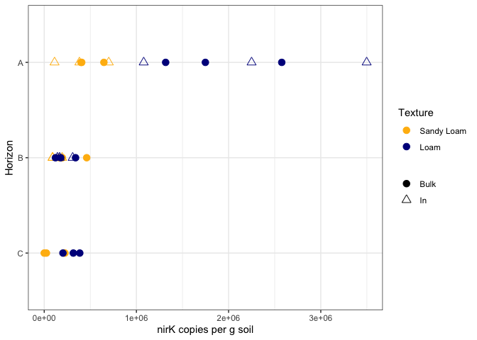
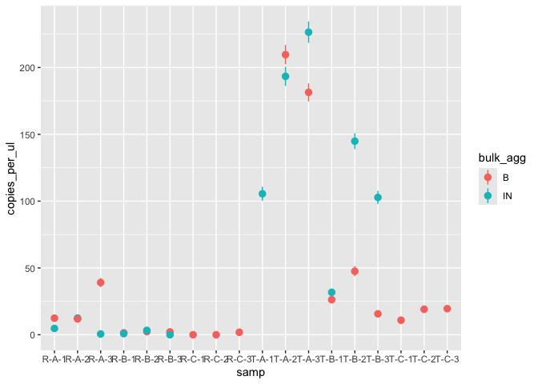
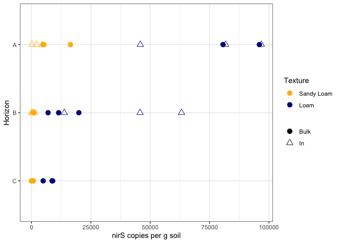

ddPCR - all genes
================
2025-JAN-09

- [Set-up](#set-up)
  - [Libraries](#libraries)
  - [Files](#files)
  - [Constants](#constants)
- [Gravimetric data](#gravimetric-data)
- [16S](#16s)
  - [Check Technical replicates](#check-technical-replicates)
  - [Adjust conc](#adjust-conc)
  - [Copies per g](#copies-per-g)
    - [Individual Points](#individual-points)
- [nirK](#nirk)
  - [Check technical replicates](#check-technical-replicates-1)
  - [Copies per g](#copies-per-g-1)
    - [Individual Points](#individual-points-1)
- [nirS](#nirs)
  - [Technical replicates](#technical-replicates)
  - [Copies per g](#copies-per-g-2)
    - [Individual Points](#individual-points-2)
- [mcrA](#mcra)
  - [Technical Replicates](#technical-replicates-1)
  - [Copies per g](#copies-per-g-3)
    - [Individual Points](#individual-points-3)
- [Compilation](#compilation)

# Set-up

## Libraries

``` r
library(ggpattern)
library(tidyverse)
library(readxl)
library(car)
```

## Files

``` r
ddpcr_data_file_16s <- "EML_16s_09sep2022-manual.csv"

ddpcr_data_file_nirK <- "ASH_nirk_MANUAL.csv"

ddpcr_data_file_nirS <- "ASH_nirS.manual.integration.csv"

ddpcr_data_file_mcrA <- "KRH_mcrA_04032024-manualthreshold.csv"

sample_key_file_nirk <- "nirK plate map 6_22_23 ASH.xlsx"

sample_key_file_nirs <- "mcrA nirS plate prep.xlsx"

sample_key_file_mcra <- "mcra-plate-map-Huy-APR2024.xlsx"

ddpcr_grav_data_file <- "/Users/elacroi3/Documents/Research/Aggregate-dish/Data/ddPCR-grav-data.xlsx"

write_file <- "/Users/elacroi3/Documents/Research/Aggregate-dish/Data/compiled_ddpcr.csv"
```

## Constants

``` r
reaction_volume_df <- 25 #NEED TO INCORPORATE INTO MEASUREMENTS

dna_elution_volume <- 100 #uL

site_colors <- c("R" = "darkgoldenrod1", "T" = "darkblue")

site_names <- c("R" = "Sandy Loam", "T" = "Loam")

agg_names <- c("B" = "Bulk", "IN" = "In")

agg_shapes <- c("B" = 19, "IN" = 2)

agg_alpha <- c("B" = 1, "IN" = 0.5)
```

``` r
my_theme <- function(base_size = 12, base_family = ""){ ## Control base font face and size. use `rel()` for relative font size.
  theme_bw(base_size = base_size, base_family = base_family) %+replace%
    theme(
      strip.text = element_text(size = 14, face = "bold"),
      axis.text = element_text(size = 14),
      axis.title = element_text(size = 16),
      legend.text = element_text(size = 14),
      legend.title = element_text(size = 16),
      strip.background = element_rect(fill = "transparent"),

      panel.grid.major = element_blank(),
      panel.grid.minor = element_blank(),
      aspect.ratio = 2
    )
}
```

# Gravimetric data

This code:

- Imports the gravimetric data from an Excel sheet
- Calculates moisture content of samples
- Calculates the dry mass of soil extracted in DNA extractions

``` r
grav_raw <- 
  read_xlsx(ddpcr_grav_data_file, sheet = "Grav Data from Meret") %>% 
  separate(Sample, into = c("site", "hzn", "rep", "bulk_agg")) %>% 
  mutate(
    across(rep, as.integer),
    mass_water_per_g_wet_soil = `Mass Water in Soil (g)` / `Mass Wet Soil (g)`
  ) %>% 
  select(site, hzn, rep, mass_water_per_g_wet_soil)

extraction_data <- 
  read_xlsx(ddpcr_grav_data_file, sheet = "DNA Extraction") %>% 
  separate(Sample, into = c("site", "hzn", "rep", "bulk_agg")) %>% 
  mutate(across(rep, as.integer)) %>% 
  rename(mass_extract_wet_g = `Wet mass sample extracted (g)`) %>% 
  left_join(grav_raw, by = c("site", "hzn", "rep")) %>% 
  mutate(
    across(bulk_agg, ~case_match(., "Bulk" ~ "B", "In" ~ "IN")),
    mass_extract_dry_g =
      mass_extract_wet_g - (mass_extract_wet_g * mass_water_per_g_wet_soil)
  ) %>% 
  select(site, hzn, rep, bulk_agg, mass_extract_dry_g)
```

# 16S

NOTE this data is from 2022 (When Emily ran it)

This code:

- Imports the 16S data from a CSV

``` r
sixteenS_df <- 1000 

ddpcr_data_16s <- 
  ddpcr_data_file_16s %>% 
  read_csv() %>% 
  separate(Sample, into = c("samp", "bulk_agg", "dilution")) %>% 
  select(
    samp, 
    bulk_agg, 
    dilution,
    sixteenS_conc = Concentration,
    sixteenS_min = PoissonConfMin,
    sixteenS_max = PoissonConfMax,
    droplets = AcceptedDroplets
  ) %>% 
  filter(
    !(
      is.na(dilution) & 
        samp %in% c("RA3", "RB1", "RB2", "RB3") & 
        bulk_agg == "IN"
      )
  )
```

    ## Warning: One or more parsing issues, call `problems()` on your data frame for details,
    ## e.g.:
    ##   dat <- vroom(...)
    ##   problems(dat)

    ## Rows: 40 Columns: 63
    ## ── Column specification ────────────────────────────────────────────────────────
    ## Delimiter: ","
    ## chr  (9): Well, ExptType, Experiment, Sample, TargetType, Status, Supermix, ...
    ## dbl (30): Target, Concentration, CopiesPer20uLWell, PoissonConfMax, PoissonC...
    ## lgl (24): TotalConfMax, TotalConfMin, CNV, TotalCNVMax, TotalCNVMin, Poisson...
    ## 
    ## ℹ Use `spec()` to retrieve the full column specification for this data.
    ## ℹ Specify the column types or set `show_col_types = FALSE` to quiet this message.

    ## Warning: Expected 3 pieces. Additional pieces discarded in 6 rows [19, 20, 25, 30, 35,
    ## 40].

    ## Warning: Expected 3 pieces. Missing pieces filled with `NA` in 34 rows [1, 2, 3, 4, 5,
    ## 6, 7, 8, 9, 10, 11, 12, 13, 14, 15, 16, 17, 18, 21, 22, ...].

## Check Technical replicates

``` r
ddpcr_data_16s %>% 
  ggplot(
    aes(x = samp, y = sixteenS_conc, color = bulk_agg)
  ) +
  geom_pointrange(aes(ymin = sixteenS_min, ymax = sixteenS_max))
```

<!-- -->

Technical replicate for TA1 does not look great. Other ones look good
though.

## Adjust conc

This code:

- Subtracts the counts from the blanks
- Corrects for DNA template dilution
- Corrects for reaction volume dilution (reports concentration in copies
  / uL DNA extract)
- Calculates 16S copies per g
- Takes average value for technical replicates

``` r
blank_16s <- 
  ddpcr_data_16s %>% 
  filter(samp == "TE" | samp == "Water") %>% 
  summarise(mean_blank_16s = mean(sixteenS_conc)) %>% 
  pull(mean_blank_16s)


data_16s_adj <- 
  ddpcr_data_16s %>% 
  filter(samp != "TE" & samp != "Water") %>% 
  mutate(
    blank = blank_16s,
    sixteenS_conc_minus_blank =
      case_when(
        dilution == "1" ~ (sixteenS_conc / 10) - blank,
        TRUE ~ sixteenS_conc - blank
      ),
    across(sixteenS_conc_minus_blank, ~ if_else(. < 0, 0, .)),
    sixteenS_conc_adj = 
      #already accounts for 100 vs. 1000 dilution
      sixteenS_conc_minus_blank * sixteenS_df * reaction_volume_df, 
    site = str_extract(samp, ".{1}"),
    hzn = str_extract(samp, ".{1}(?=\\d)"),
    rep = str_extract(samp, ".{1}$")
  ) %>% 
  select(
    site, hzn, rep, bulk_agg, sixteenS_conc_adj, 
    sixteenS_droplets = droplets
  ) %>% 
  mutate(across(rep, as.integer)) %>% 
  group_by(site, hzn, rep, bulk_agg) %>%
  left_join(extraction_data, by = c("site", "hzn", "rep", "bulk_agg")) %>% 
  mutate(
    sixteenS_copies_per_g = 
      sixteenS_conc_adj * dna_elution_volume / mass_extract_dry_g
  ) %>% 
  summarise(
    across(c(sixteenS_conc_adj, sixteenS_copies_per_g), ~mean(.))
  ) 
```

    ## `summarise()` has grouped output by 'site', 'hzn', 'rep'. You can override
    ## using the `.groups` argument.

``` r
data_16s_adj
```

    ## # A tibble: 30 × 6
    ## # Groups:   site, hzn, rep [18]
    ##    site  hzn     rep bulk_agg sixteenS_conc_adj sixteenS_copies_per_g
    ##    <chr> <chr> <int> <chr>                <dbl>                 <dbl>
    ##  1 R     A         1 B                  2577500           1088986926.
    ##  2 R     A         1 IN                  346250            152385113.
    ##  3 R     A         2 B                   291250            118546946.
    ##  4 R     A         2 IN                  231250             87153016.
    ##  5 R     A         3 B                  1033750            433286577.
    ##  6 R     A         3 IN                  366250            159906498.
    ##  7 R     B         1 B                   713750            320340086.
    ##  8 R     B         1 IN                   60250             27040967.
    ##  9 R     B         2 B                   258750            115134528.
    ## 10 R     B         2 IN                  225000             96112302.
    ## # ℹ 20 more rows

It appears we got no positive amplification (beyond contamination) from
RC1-Bulk. I think we’ll need to try again or omit from dataset.

## Copies per g

### Individual Points

``` r
data_16s_adj %>% 
  ggplot(
    aes(y = hzn, x = sixteenS_copies_per_g, shape = bulk_agg, color = site)
  ) +
  geom_point(size = 3) +
  scale_y_discrete(limits = rev) + 
  scale_color_manual(
    values = site_colors,
    labels = site_names,
    name = "Texture"
  ) +
  scale_shape_manual(
    values = agg_shapes,
    labels = agg_names,
    name = NULL
  ) +
  theme_bw() + 
  labs(
    x = "16S copies per g soil",
    y = "Horizon"
  )
```

<!-- -->

# nirK

This code:

- Imports the nirK data from Alex
- Joins the well data with the sample identity
- filters out over-saturated samples

``` r
nirk_sample_key <-
  sample_key_file_nirk %>% 
  read_xlsx(sheet = "Sample Key") %>% 
  rename(sample_name = Sample)

nirk_samples_to_filter_out <- c("RA1-B", "RA2-B", "RA3-B")

nirk_data <-
  ddpcr_data_file_nirK %>% 
  read_csv() %>% 
  inner_join(nirk_sample_key, by = "Well") %>% 
  select(
    sample_name,
    well = Well,
    copies_per_ul = `Conc(copies/µL)`,
    copies_per_ul_min = PoissonConfMin,
    copies_per_ul_max = PoissonConfMax,
    droplets = `Accepted Droplets`
  ) %>% 
  filter(
    !(sample_name %in% nirk_samples_to_filter_out),
    droplets > 10000,
    sample_name != "Water"
  ) %>% 
  separate(sample_name, into = c("samp", "bulk_agg", "dilution")) %>% 
  mutate(
    across(
      dilution, 
           ~case_when(
             . == "1" ~ 10,
             is.na(.) ~ 1
             )
      ),
    across(c(copies_per_ul, copies_per_ul_min, copies_per_ul_max),
           ~if_else(dilution == "1", . * dilution, . * dilution)
             )
  ) %>% 
  separate_wider_position(samp, c(site = 1, hzn = 1, rep = 1)) %>% 
  mutate(across(rep, as.integer)) %>% 
  left_join(extraction_data, by = c("site", "hzn", "rep", "bulk_agg")) %>% 
  mutate(
    copies_per_g = copies_per_ul * dna_elution_volume / mass_extract_dry_g,
    copies_per_g_min = 
      copies_per_ul_min * dna_elution_volume / mass_extract_dry_g,
    copies_per_g_max = 
      copies_per_ul_max * dna_elution_volume / mass_extract_dry_g,
  )
```

    ## Rows: 40 Columns: 65
    ## ── Column specification ────────────────────────────────────────────────────────
    ## Delimiter: ","
    ## chr  (9): Well, Sample, Target, Status, Experiment, SampleType, TargetType, ...
    ## dbl (17): Conc(copies/µL), Copies/20µLWell, PoissonConfMax, PoissonConfMin, ...
    ## lgl (39): TotalConfMax, TotalConfMin, Linkage, CNV, TotalCNVMax, TotalCNVMin...
    ## 
    ## ℹ Use `spec()` to retrieve the full column specification for this data.
    ## ℹ Specify the column types or set `show_col_types = FALSE` to quiet this message.

    ## Warning: Expected 3 pieces. Additional pieces discarded in 9 rows [3, 7, 11, 15, 21, 25,
    ## 27, 30, 32].

    ## Warning: Expected 3 pieces. Missing pieces filled with `NA` in 24 rows [1, 2, 4, 5, 6,
    ## 8, 9, 10, 12, 13, 14, 16, 17, 18, 19, 20, 22, 23, 24, 26, ...].

## Check technical replicates

``` r
nirk_data %>% 
  filter(
    (site == "R" & hzn == "B" & rep == 3 & bulk_agg == "B") |
    (site == "T" & hzn == "B" & rep == 1 & bulk_agg == "IN") |
    (site == "T" & hzn == "B" & rep == 2 & bulk_agg == "B")
  ) %>% 
  mutate(
    samp = str_c(site, hzn, rep, bulk_agg, sep = "-")
  ) %>% 
  ggplot(aes(x = samp, y = copies_per_ul)) + 
  geom_pointrange(
    aes(ymin = copies_per_ul_min, ymax = copies_per_ul_max)
  )
```

<!-- -->

Technical reps are OK. About 25% error on TB1-IN….which is not great.
Others w/in 10% or effectively the same, so that’s OK

``` r
nirk_data_av <- 
  nirk_data %>% 
  group_by(site, hzn, rep, bulk_agg) %>% 
  summarise(
    across(
      c(
        copies_per_ul, 
        copies_per_ul_min, 
        copies_per_ul_max, 
        mass_extract_dry_g, 
        copies_per_g,
        copies_per_g_min,
        copies_per_g_max
      ),
      ~mean(.)
    )
  )
```

    ## `summarise()` has grouped output by 'site', 'hzn', 'rep'. You can override
    ## using the `.groups` argument.

## Copies per g

### Individual Points

``` r
nirk_data_av %>% 
  ggplot(
    aes(y = hzn, x = copies_per_g, shape = bulk_agg, color = site)
  ) +
  geom_point(size = 3) +
  scale_y_discrete(limits = rev) + 
  scale_color_manual(
    values = site_colors,
    labels = site_names,
    name = "Texture"
  ) +
  scale_shape_manual(
    values = agg_shapes,
    labels = agg_names,
    name = NULL
  ) +
  theme_bw() + 
  labs(
    x = "nirK copies per g soil",
    y = "Horizon"
  )
```

<!-- -->

# nirS

``` r
nirs_sample_key <-
  sample_key_file_nirs %>% 
  read_xlsx(sheet = "Sample Key") %>% 
  rename(sample_name = Sample)


nirs_data <-
  ddpcr_data_file_nirS %>% 
  read_csv() %>% 
  inner_join(nirs_sample_key, by = "Well") %>% 
  select(
    sample_name,
    well = Well,
    copies_per_ul = `Conc(copies/µL)`,
    copies_per_ul_min = PoissonConfMin,
    copies_per_ul_max = PoissonConfMax,
    droplets = `Accepted Droplets`
  ) %>% 
    filter(
      !(well == "D07"),
      droplets > 10000,
      sample_name != "Water"
    ) %>% 
    separate(sample_name, into = c("samp", "bulk_agg", "dilution")) %>% 
    mutate(
      across(
        dilution, 
        ~case_when(
          . == "1" ~ 10,
          is.na(.) ~ 1
        )
      ),
      across(c(copies_per_ul, copies_per_ul_min, copies_per_ul_max),
             ~if_else(dilution == "1", . * dilution, . * dilution)
      ),
      across(c(copies_per_ul, copies_per_ul_min, copies_per_ul_max),
             ~if_else(copies_per_ul < 0.5, 0, .)
      )
    ) %>% 
  filter(dilution == 1) %>% 
  separate_wider_position(samp, c(site = 1, hzn = 1, rep = 1)) %>% 
  mutate(across(rep, as.integer)) %>% 
  left_join(extraction_data, by = c("site", "hzn", "rep", "bulk_agg")) %>% 
  mutate(
    copies_per_g = copies_per_ul * dna_elution_volume / mass_extract_dry_g,
    copies_per_g_min = 
      copies_per_ul_min * dna_elution_volume / mass_extract_dry_g,
    copies_per_g_max = 
      copies_per_ul_max * dna_elution_volume / mass_extract_dry_g,
  )
```

    ## Rows: 37 Columns: 65
    ## ── Column specification ────────────────────────────────────────────────────────
    ## Delimiter: ","
    ## chr  (9): Well, Sample, Target, Status, Experiment, SampleType, TargetType, ...
    ## dbl (17): Conc(copies/µL), Copies/20µLWell, PoissonConfMax, PoissonConfMin, ...
    ## lgl (39): TotalConfMax, TotalConfMin, Linkage, CNV, TotalCNVMax, TotalCNVMin...
    ## 
    ## ℹ Use `spec()` to retrieve the full column specification for this data.
    ## ℹ Specify the column types or set `show_col_types = FALSE` to quiet this message.

    ## Warning: Expected 3 pieces. Additional pieces discarded in 4 rows [3, 11, 18,
    ## 28].

    ## Warning: Expected 3 pieces. Missing pieces filled with `NA` in 29 rows [1, 2, 4, 5, 6,
    ## 7, 8, 9, 10, 12, 13, 14, 15, 16, 17, 19, 20, 21, 22, 23, ...].

## Technical replicates

``` r
nirs_data %>% 
  mutate(
    samp = paste(site, hzn, rep, sep = "-")
  ) %>% 
  ggplot(
    aes(x = samp, y = copies_per_ul, color = bulk_agg)
  ) +
  geom_pointrange(aes(ymin = copies_per_ul_min, ymax = copies_per_ul_max))
```

<!-- -->

I’m not sure that there are any technical replicates here….

## Copies per g

### Individual Points

``` r
nirs_data %>% 
  ggplot(
    aes(y = hzn, x = copies_per_g, shape = bulk_agg, color = site)
  ) +
  geom_point(size = 3) +
  scale_y_discrete(limits = rev) + 
  scale_color_manual(
    values = site_colors,
    labels = site_names,
    name = "Texture"
  ) +
  scale_shape_manual(
    values = agg_shapes,
    labels = agg_names,
    name = NULL
  ) +
  theme_bw() + 
  labs(
    x = "nirS copies per g soil",
    y = "Horizon"
  )
```

<!-- -->

# mcrA

``` r
mcra_sample_key <-
  sample_key_file_mcra %>% 
  read_xlsx() %>% 
  rename(sample_name = Sample)


mcrA_data <-
  ddpcr_data_file_mcrA %>% 
  read_csv() %>% 
  inner_join(mcra_sample_key, by = "Well") %>% 
 select(
    sample_name,
    well = Well,
    copies_per_ul = `Conc(copies/µL)`,
    copies_per_ul_min = PoissonConfMin,
    copies_per_ul_max = PoissonConfMax,
    droplets = `Accepted Droplets`
  ) %>% 
    filter(
      droplets > 10000,
      sample_name != "Water",
      sample_name != "Positive"
    ) %>% 
    separate(sample_name, into = c("samp", "bulk_agg")) %>% 
  separate_wider_position(samp, c(site = 1, hzn = 1, rep = 1)) %>% 
  mutate(
    across(rep, as.integer),
    across(c(copies_per_ul, copies_per_ul_min, copies_per_ul_max), as.numeric),
    across(
      c(copies_per_ul, copies_per_ul_min, copies_per_ul_max), 
      ~if_else(. < 0.5, 0, .)
    ) 
  ) %>% 
  left_join(extraction_data, by = c("site", "hzn", "rep", "bulk_agg")) %>% 
  mutate(
    copies_per_g = copies_per_ul * dna_elution_volume / mass_extract_dry_g,
    copies_per_g_min = 
      copies_per_ul_min * dna_elution_volume / mass_extract_dry_g,
    copies_per_g_max = 
      copies_per_ul_max * dna_elution_volume / mass_extract_dry_g,
  )
```

    ## Rows: 40 Columns: 65
    ## ── Column specification ────────────────────────────────────────────────────────
    ## Delimiter: ","
    ## chr  (9): Well, Target, Conc(copies/µL), Status, Experiment, SampleType, Tar...
    ## dbl (16): Copies/20µLWell, PoissonConfMax, PoissonConfMin, Accepted Droplets...
    ## lgl (40): Sample, TotalConfMax, TotalConfMin, Linkage, CNV, TotalCNVMax, Tot...
    ## 
    ## ℹ Use `spec()` to retrieve the full column specification for this data.
    ## ℹ Specify the column types or set `show_col_types = FALSE` to quiet this message.

## Technical Replicates

``` r
mcrA_data %>% 
  mutate(
    samp = paste(site, hzn, rep, sep = "-")
  ) %>% 
  ggplot(
    aes(x = samp, y = copies_per_ul, color = bulk_agg)
  ) +
  geom_pointrange(aes(ymin = copies_per_ul_min, ymax = copies_per_ul_max))
```

<!-- -->

The technical replicate for TA2-Bulk is not great… The rest are OK.

Average technical replicates:

``` r
mcra_data_av <- 
  mcrA_data %>% 
  group_by(site, hzn, rep, bulk_agg) %>% 
  summarise(
    across(
      c(
        copies_per_ul, 
        copies_per_ul_min, 
        copies_per_ul_max, 
        mass_extract_dry_g, 
        copies_per_g,
        copies_per_g_min,
        copies_per_g_max
      ),
      ~mean(.)
    )
  )
```

    ## `summarise()` has grouped output by 'site', 'hzn', 'rep'. You can override
    ## using the `.groups` argument.

## Copies per g

### Individual Points

``` r
mcra_data_av %>% 
  ggplot(
    aes(y = hzn, x = copies_per_g, shape = bulk_agg, color = site)
  ) +
  geom_point(size = 3) +
  scale_y_discrete(limits = rev) + 
  scale_color_manual(
    values = site_colors,
    labels = site_names,
    name = "Texture"
  ) +
  scale_shape_manual(
    values = agg_shapes,
    labels = agg_names,
    name = NULL
  ) +
  theme_bw() + 
  labs(
    x = "mcrA copies per g soil",
    y = "Horizon"
  )
```

<!-- -->

# Compilation

``` r
ddpcr_compiled <- 
  data_16s_adj %>% 
  left_join(
    nirk_data_av %>% 
      rename(
        nirk_copies_per_ul = copies_per_ul,
        nirk_copies_per_ul_min = copies_per_ul_min,
        nirk_copies_per_ul_max = copies_per_ul_max,
        nirk_copies_per_g = copies_per_g,
        nirk_copies_per_g_min = copies_per_g_min,
        nirk_copies_per_g_max = copies_per_g_max
      ),
    by = c("site", "hzn", "rep", "bulk_agg")
  ) %>% 
  left_join(
    nirs_data %>% 
      select(-c(well, dilution, droplets, mass_extract_dry_g)) %>% 
      rename(
        nirs_copies_per_ul = copies_per_ul,
        nirs_copies_per_ul_min = copies_per_ul_min,
        nirs_copies_per_ul_max = copies_per_ul_max,
        nirs_copies_per_g = copies_per_g,
        nirs_copies_per_g_min = copies_per_g_min,
        nirs_copies_per_g_max = copies_per_g_max
      ),
    by = c("site", "hzn", "rep", "bulk_agg")  
  ) %>% 
  left_join(
    mcra_data_av %>% 
      select(-c(mass_extract_dry_g)) %>% 
      rename(
        mcra_copies_per_ul = copies_per_ul,
        mcra_copies_per_ul_min = copies_per_ul_min,
        mcra_copies_per_ul_max = copies_per_ul_max,
        mcra_copies_per_g = copies_per_g,
        mcra_copies_per_g_min = copies_per_g_min,
        mcra_copies_per_g_max = copies_per_g_max
      ),
    by = c("site", "hzn", "rep", "bulk_agg")   
  )
```

``` r
ddpcr_compiled %>% write_csv(write_file)
```
