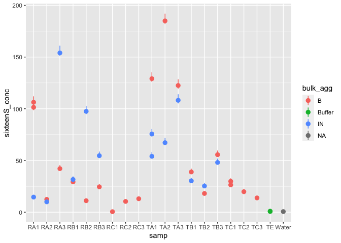
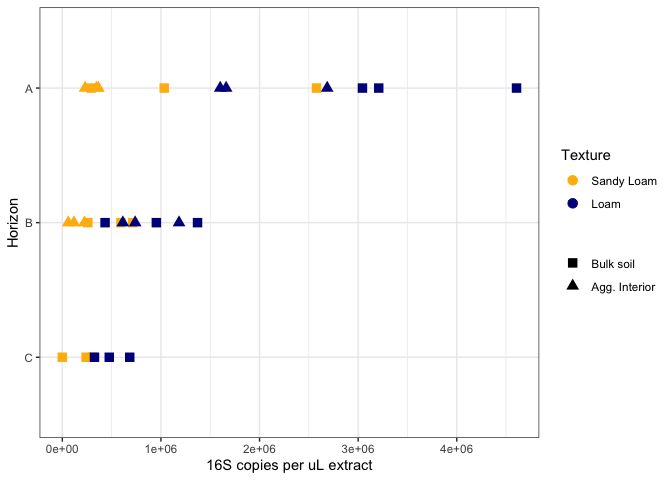
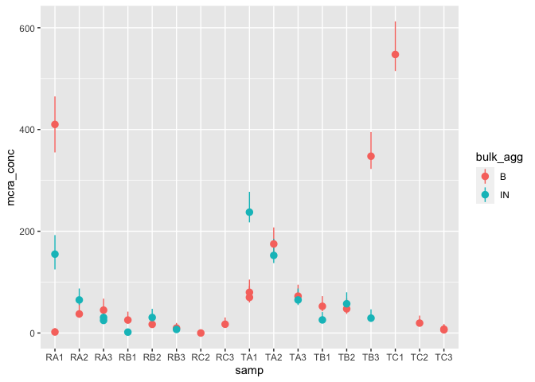
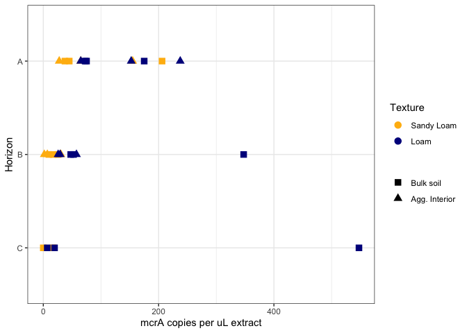
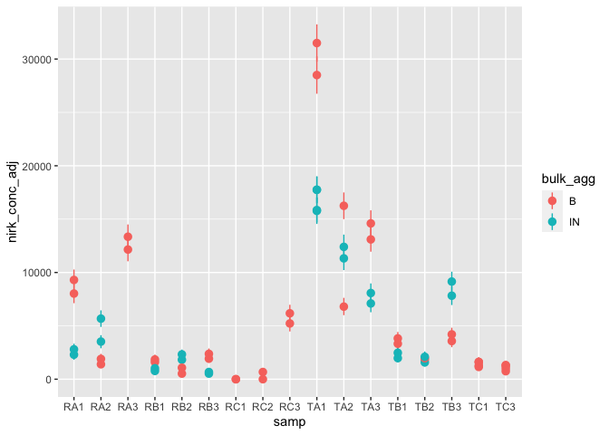
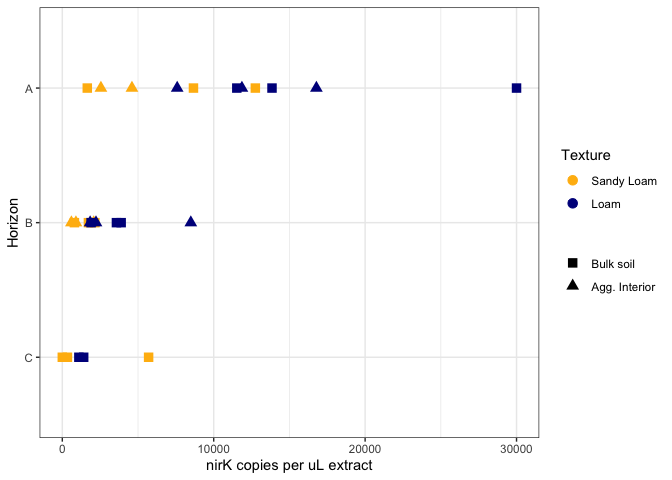

ddpcr-16s
================
Emily Lacroix
2022-10-26

- <a href="#set-up" id="toc-set-up">Set-up</a>
  - <a href="#libraries" id="toc-libraries">Libraries</a>
  - <a href="#files" id="toc-files">Files</a>
  - <a href="#constants" id="toc-constants">Constants</a>
- <a href="#16s" id="toc-16s">16S</a>
  - <a href="#check-technical-replicates"
    id="toc-check-technical-replicates">Check Technical replicates</a>
  - <a href="#adjust-conc" id="toc-adjust-conc">Adjust conc</a>
  - <a href="#copies-per-g" id="toc-copies-per-g">Copies per g</a>
    - <a href="#technical-replicates-averaged"
      id="toc-technical-replicates-averaged">technical replicates averaged</a>
    - <a href="#texture-bulk-hzn-averaged"
      id="toc-texture-bulk-hzn-averaged">texture-bulk-hzn averaged</a>
    - <a href="#key-take-aways-16s" id="toc-key-take-aways-16s">Key take-aways
      (16S)</a>
- <a href="#mcra" id="toc-mcra">mcrA</a>
  - <a href="#inspect-techincal-replicates"
    id="toc-inspect-techincal-replicates">Inspect techincal replicates</a>
  - <a href="#copies-per-g-1" id="toc-copies-per-g-1">Copies per g</a>
    - <a href="#technical-replicates-averaged-1"
      id="toc-technical-replicates-averaged-1">technical replicates
      averaged</a>
    - <a href="#texture-bulk-hzn-averaged-1"
      id="toc-texture-bulk-hzn-averaged-1">texture-bulk-hzn averaged</a>
    - <a href="#key-take-aways-mcra-raw-counts"
      id="toc-key-take-aways-mcra-raw-counts">Key take-aways (mcrA raw
      counts)</a>
  - <a href="#copies-mcra-normalized-to-16s-copies"
    id="toc-copies-mcra-normalized-to-16s-copies">Copies mcrA normalized to
    16S copies</a>
    - <a href="#technical-replicates-averaged-2"
      id="toc-technical-replicates-averaged-2">technical replicates
      averaged</a>
    - <a href="#texture-bulk-hzn-averaged-2"
      id="toc-texture-bulk-hzn-averaged-2">texture-bulk-hzn averaged</a>
    - <a href="#key-take-aways-mcra-normalized"
      id="toc-key-take-aways-mcra-normalized">Key take-aways (mcrA
      normalized)</a>
- <a href="#glta" id="toc-glta">gltA</a>
- <a href="#nirk" id="toc-nirk">nirK</a>
  - <a href="#inspect-technical-replicates"
    id="toc-inspect-technical-replicates">Inspect technical replicates</a>
  - <a href="#copies-per-g-2" id="toc-copies-per-g-2">Copies per g</a>
    - <a href="#technical-replicates-averaged-3"
      id="toc-technical-replicates-averaged-3">Technical replicates
      averaged</a>
    - <a href="#texture-bulk-hzn-averaged-3"
      id="toc-texture-bulk-hzn-averaged-3">texture-bulk-hzn averaged</a>
    - <a href="#key-take-aways-nirk-raw-counts"
      id="toc-key-take-aways-nirk-raw-counts">Key take-aways (nirK raw
      counts)</a>
  - <a href="#copies-per-16s-copy" id="toc-copies-per-16s-copy">Copies per
    16S copy</a>
    - <a href="#technical-replicates-averaged-4"
      id="toc-technical-replicates-averaged-4">technical replicates
      averaged</a>
    - <a href="#texture-bulk-hzn-averaged-4"
      id="toc-texture-bulk-hzn-averaged-4">texture-bulk-hzn averaged</a>
    - <a href="#key-take-aways-nirk-normalized"
      id="toc-key-take-aways-nirk-normalized">Key take-aways (nirK
      normalized)</a>

# Set-up

## Libraries

``` r
library(tidyverse)
```

    ## ── Attaching packages ─────────────────────────────────────── tidyverse 1.3.2 ──
    ## ✔ ggplot2 3.4.0      ✔ purrr   0.3.5 
    ## ✔ tibble  3.1.8      ✔ dplyr   1.0.10
    ## ✔ tidyr   1.2.1      ✔ stringr 1.4.1 
    ## ✔ readr   2.1.3      ✔ forcats 0.5.2 
    ## ── Conflicts ────────────────────────────────────────── tidyverse_conflicts() ──
    ## ✖ dplyr::filter() masks stats::filter()
    ## ✖ dplyr::lag()    masks stats::lag()

``` r
library(readxl)
```

## Files

``` r
ddpcr_data_file_16s <- "/Users/emily/Documents/Research/Aggregates-Meret/Data/ddPCR/EML_16s_09sep2022-manual.csv" 

ddpcr_data_file_mcra <- 
  "/Users/emily/Documents/Research/Aggregates-Meret/Data/ddPCR/EML_mcrA_01sep2022-manual.csv"

ddpcr_data_file_glta <- 
  "/Users/emily/Documents/Research/Aggregates-Meret/Data/ddPCR/22Oct22_gltA/AMG_glta_22oct2022_all_manual.csv"

ddpcr_data_file_nirk <- "/Users/emily/Documents/Research/Aggregates-Meret/Data/ddPCR/AG_nirK_1_12_23.csv"

#dna_extraction_file <- 
```

## Constants

``` r
reaction_volume_df <- 25 #NEED TO INCORPORATE INTO MEASUREMENTS

site_colors <- c("R" = "darkgoldenrod1", "T" = "darkblue")

site_names <- c("R" = "Sandy Loam", "T" = "Loam")

agg_names <- c("B" = "Bulk soil", "IN" = "Agg. Interior")

agg_shapes <- c("B" = 15, "IN" = 17)


# g_h2o = mass_g / (1 / avg_gwc + 1),
# mass_dry_soil = mass_g - g_h2o,
# prop = conc / sixteenS_conc,
# copies_per_g_sixteenS = sixteenS_conc * 100 / mass_dry_soil,
# copies_per_g = conc * 100 / mass_dry_soil
```

# 16S

This code:

- Imports the 16S data from a CSV

``` r
sixteenS_df <- 1000 #NEED TO DOUBLE CHECK WITH DDPCR BINDER

ddpcr_data_16s <- 
  ddpcr_data_file_16s %>% 
  read_csv() %>% 
  separate(Sample, into = c("samp", "bulk_agg", "dilution")) %>% 
  select(
    samp, 
    bulk_agg, 
    dilution,
    sixteenS_conc = Concentration,
    sixteenS_min = PoissonConfMin,
    sixteenS_max = PoissonConfMax,
    droplets = AcceptedDroplets
  ) %>% 
  filter(
    !(
      is.na(dilution) & 
        samp %in% c("RA3", "RB1", "RB2", "RB3") & 
        bulk_agg == "IN"
      )
  )
```

    ## Warning: One or more parsing issues, call `problems()` on your data frame for details,
    ## e.g.:
    ##   dat <- vroom(...)
    ##   problems(dat)

    ## Rows: 40 Columns: 63
    ## ── Column specification ────────────────────────────────────────────────────────
    ## Delimiter: ","
    ## chr  (9): Well, ExptType, Experiment, Sample, TargetType, Status, Supermix, ...
    ## dbl (30): Target, Concentration, CopiesPer20uLWell, PoissonConfMax, PoissonC...
    ## lgl (24): TotalConfMax, TotalConfMin, CNV, TotalCNVMax, TotalCNVMin, Poisson...
    ## 
    ## ℹ Use `spec()` to retrieve the full column specification for this data.
    ## ℹ Specify the column types or set `show_col_types = FALSE` to quiet this message.

    ## Warning: Expected 3 pieces. Additional pieces discarded in 6 rows [19, 20, 25,
    ## 30, 35, 40].

    ## Warning: Expected 3 pieces. Missing pieces filled with `NA` in 34 rows [1, 2, 3,
    ## 4, 5, 6, 7, 8, 9, 10, 11, 12, 13, 14, 15, 16, 17, 18, 21, 22, ...].

## Check Technical replicates

``` r
ddpcr_data_16s %>% 
  ggplot(
    aes(x = samp, y = sixteenS_conc, color = bulk_agg)
  ) +
  geom_pointrange(aes(ymin = sixteenS_min, ymax = sixteenS_max))
```

<!-- -->

Technical replicate for TA1 does not look great. Other ones look good
though.

## Adjust conc

This code:

- Subtracts the counts from the blanks
- Corrects for DNA template dilution
- Corrects for reaction volume dilution (reports concentration in copies
  / uL DNA extract)
- Takes average value for technical replicates

``` r
blank_16s <- 
  ddpcr_data_16s %>% 
  filter(samp == "TE" | samp == "Water") %>% 
  summarise(mean_blank_16s = mean(sixteenS_conc)) %>% 
  pull(mean_blank_16s)


data_16s_adj <- 
  ddpcr_data_16s %>% 
  filter(samp != "TE" & samp != "Water") %>% 
  mutate(
    blank = blank_16s,
    sixteenS_conc_minus_blank =
      case_when(
        dilution == "1" ~ (sixteenS_conc / 10) - blank,
        TRUE ~ sixteenS_conc - blank
      ),
    across(sixteenS_conc_minus_blank, ~ if_else(. < 0, 0, .)),
    sixteenS_conc_adj = 
      #already accounts for 100 vs. 1000 dilution
      sixteenS_conc_minus_blank * sixteenS_df * reaction_volume_df, 
    site = str_extract(samp, ".{1}"),
    hzn = str_extract(samp, ".{1}(?=\\d)"),
    rep = str_extract(samp, ".{1}$")
  ) %>% 
  select(
    site, hzn, rep, bulk_agg, sixteenS_conc_adj, 
    sixteenS_droplets = droplets
  ) %>% 
  mutate(across(rep, as.integer)) %>% 
  group_by(site, hzn, rep, bulk_agg) %>%
  summarise(
    across(sixteenS_conc_adj, ~mean(.))
  )
```

    ## `summarise()` has grouped output by 'site', 'hzn', 'rep'. You can override
    ## using the `.groups` argument.

It appears we got no positive amplification (beyond contamination) from
RC1-Bulk. I think we’ll need to try again or omit from dataset.

## Copies per g

### technical replicates averaged

``` r
data_16s_adj %>% 
  ggplot(
    aes(y = hzn, x = sixteenS_conc_adj, shape = bulk_agg, color = site)
  ) +
  geom_point(size = 3) +
  scale_y_discrete(limits = rev) + 
  scale_color_manual(
    values = site_colors,
    labels = site_names,
    name = "Texture"
  ) +
  scale_shape_manual(
    values = agg_shapes,
    labels = agg_names,
    name = NULL
  ) +
  theme_bw() + 
  labs(
    x = "16S copies per uL extract",
    y = "Horizon"
  )
```

<!-- -->

### texture-bulk-hzn averaged

``` r
data_16s_adj %>% 
  group_by(site, hzn, bulk_agg) %>% 
  summarise(
    mean_16s = mean(sixteenS_conc_adj, na.rm = TRUE),
    se_16s = sd(sixteenS_conc_adj) / sqrt(n())
  ) %>% 
  ggplot(
    aes(y = hzn, x = mean_16s, shape = bulk_agg, color = site)
  ) +
  geom_pointrange(
    aes(xmin = mean_16s - se_16s, xmax = mean_16s + se_16s),
    fatten = 4
  ) +
  scale_y_discrete(limits = rev) +
  scale_color_manual(
    values = site_colors,
    labels = site_names,
    name = "Texture"
  ) +
  scale_shape_manual(
    values = agg_shapes,
    labels = agg_names,
    name = NULL
  ) +
  theme_bw() + 
  labs(
    x = "16S copies per uL extract",
    y = "Horizon"
  )
```

    ## `summarise()` has grouped output by 'site', 'hzn'. You can override using the
    ## `.groups` argument.

<!-- -->

### Key take-aways (16S)

- More 16S copies in Loam vs. Sandy Loam soil
- More 16S copies in surface soil & decreases with depth
- Aggregate interiors yield less 16S copies, unclear if this is due to
  extraction mass or efficiency….

# mcrA

This code:

- Imports the mcrA data from a CSV
- Corrects for reaction volume dilution (reports concentration in copies
  / uL DNA extract)

NOTE - one of my technical replicates is really high….need to look at
notes from the ddPCR run

``` r
ddpcr_data_mcra <- 
  ddpcr_data_file_mcra %>% 
  read_csv() %>% 
  separate(Sample, into = c("samp", "bulk_agg")) %>% 
  select(
    samp, 
    bulk_agg, 
    mcra_conc = Concentration,
    mcra_min = PoissonConfMin,
    mcra_max = PoissonConfMax,
    droplets = AcceptedDroplets
  ) %>% 
  filter(
    !(samp %in% c("Water", "PositiveControl", "buffer")),
    droplets > 10000
  ) %>% 
  mutate(
    site = str_extract(samp, ".{1}"),
    hzn = str_extract(samp, ".{1}(?=\\d)"),
    rep = as.integer(str_extract(samp, ".{1}$")),
    mcra_droplets = droplets,
    across(mcra_conc, as.numeric),
    across(c(mcra_conc, mcra_min, mcra_max), ~ . * reaction_volume_df)
  ) 
```

    ## Warning: One or more parsing issues, call `problems()` on your data frame for details,
    ## e.g.:
    ##   dat <- vroom(...)
    ##   problems(dat)

    ## Rows: 40 Columns: 63
    ## ── Column specification ────────────────────────────────────────────────────────
    ## Delimiter: ","
    ## chr (11): Well, ExptType, Experiment, Sample, TargetType, Target, Status, Co...
    ## dbl (28): CopiesPer20uLWell, PoissonConfMax, PoissonConfMin, Positives, Nega...
    ## lgl (24): TotalConfMax, TotalConfMin, CNV, TotalCNVMax, TotalCNVMin, Poisson...
    ## 
    ## ℹ Use `spec()` to retrieve the full column specification for this data.
    ## ℹ Specify the column types or set `show_col_types = FALSE` to quiet this message.

    ## Warning: Expected 2 pieces. Missing pieces filled with `NA` in 7 rows [1, 15,
    ## 20, 25, 30, 35, 40].

``` r
ddpcr_data_mcra 
```

    ## # A tibble: 33 × 10
    ##    samp  bulk_agg mcra_conc mcra_min mcra_max droplets site  hzn     rep mcra_…¹
    ##    <chr> <chr>        <dbl>    <dbl>    <dbl>    <dbl> <chr> <chr> <int>   <dbl>
    ##  1 RB1   B            25.5     19        42      15051 R     B         1   15051
    ##  2 RC3   B            17.2     12.5      30.5    16948 R     C         3   16948
    ##  3 TB1   B            52.5     42.5      72.5    17345 T     B         1   17345
    ##  4 TC3   B             6.25     3.25     16.5    14205 T     C         3   14205
    ##  5 RA1   B           410      355       465      15399 R     A         1   15399
    ##  6 RB2   B            17       12.2      30      17346 R     B         2   17346
    ##  7 TA1   B            80       67.5     105      16340 T     A         1   16340
    ##  8 TB2   B            47.5     37.5      67.5    16270 T     B         2   16270
    ##  9 TC3   B             7.5      4.25     17.5    15753 T     C         3   15753
    ## 10 RA2   B            37.5     30        57.5    16860 R     A         2   16860
    ## # … with 23 more rows, and abbreviated variable name ¹​mcra_droplets

## Inspect techincal replicates

``` r
ddpcr_data_mcra %>% 
  ggplot(
    aes(x = samp, y = mcra_conc, color = bulk_agg)
  ) +
  geom_pointrange(aes(ymin = mcra_min, ymax = mcra_max))
```

<!-- -->

RC1-Bulk is seemingly missing….. and the technical replicates for RA1
look horrible. Need to look at ddPCR folder.

For now, let’s average the technical replicates

This code

- Takes average value for technical replicates

``` r
ddpcr_data_mcra_av <- 
  ddpcr_data_mcra %>% 
  group_by(site, hzn, rep, bulk_agg) %>%
  summarise(
    across(mcra_conc, ~mean(.))
  )
```

    ## `summarise()` has grouped output by 'site', 'hzn', 'rep'. You can override
    ## using the `.groups` argument.

## Copies per g

### technical replicates averaged

``` r
ddpcr_data_mcra_av %>% 
  ggplot(
    aes(y = hzn, x = mcra_conc, shape = bulk_agg, color = site)
  ) +
  geom_point(size = 3) +
  scale_y_discrete(limits = rev) + 
  #facet_grid(rows = vars(site)) + 
  scale_color_manual(
    values = site_colors,
    labels = site_names,
    name = "Texture"
  ) +
  scale_shape_manual(
    values = agg_shapes,
    labels = agg_names,
    name = NULL
  ) +
  theme_bw() + 
  labs(
    x = "mcrA copies per uL extract",
    y = "Horizon"
  )
```

<!-- -->

### texture-bulk-hzn averaged

``` r
ddpcr_data_mcra_av %>% 
  group_by(site, hzn, bulk_agg) %>% 
  summarize(
    mcra_conc_av = mean(mcra_conc),
    mcra_conc_se = sd(mcra_conc) / sqrt(n())
  ) %>% 
  ggplot(
    aes(y = hzn, x = mcra_conc_av, shape = bulk_agg, color = site)
  ) +
  geom_pointrange(
    aes(
      xmin = mcra_conc_av - mcra_conc_se, 
      xmax = mcra_conc_av + mcra_conc_se)
  ) +
  scale_y_discrete(limits = rev) + 
  scale_color_manual(
    values = site_colors,
    labels = site_names,
    name = "Texture"
  ) +
  scale_shape_manual(
    values = agg_shapes,
    labels = agg_names,
    name = NULL
  ) +
  theme_bw() + 
  labs(
    x = "mcrA copies per uL extract",
    y = "Horizon"
  )
```

    ## `summarise()` has grouped output by 'site', 'hzn'. You can override using the
    ## `.groups` argument.

<!-- -->

### Key take-aways (mcrA raw counts)

- Likely contamination in 2 of the samples, will need to re-run
- Obfuscates results for the B and C horizons

## Copies mcrA normalized to 16S copies

### technical replicates averaged

``` r
ddpcr_data_mcra_av %>% 
  #filter(!(samp %in% c("TC1", "RA1", "TB3") & bulk_agg == "B")) %>% 
  left_join(data_16s_adj, by = c("site", "hzn", "rep", "bulk_agg")) %>% 
  mutate(
    prop_mcra = mcra_conc / sixteenS_conc_adj
  ) %>% 
  ggplot(
    aes(y = hzn, x = prop_mcra, shape = bulk_agg, color = site)
  ) +
  geom_point(size = 3) +
  scale_y_discrete(limits = rev) + 
  scale_color_manual(
    values = site_colors,
    labels = site_names,
    name = "Texture"
  ) +
  scale_shape_manual(
    values = agg_shapes,
    labels = agg_names,
    name = NULL
  ) +
  theme_bw() + 
  labs(
    x = "mcrA copies per 16S copy",
    y = "Horizon"
  )
```

<!-- -->

### texture-bulk-hzn averaged

``` r
ddpcr_data_mcra_av %>% 
  left_join(data_16s_adj, by = c("site", "hzn", "rep", "bulk_agg")) %>% 
  mutate(
    prop_mcra = mcra_conc / sixteenS_conc_adj
  ) %>% 
  group_by(site, hzn, bulk_agg) %>% 
  summarise(
    mean_prop_mcra = mean(prop_mcra, na.rm = TRUE),
    se_prop_mcra = sd(prop_mcra) / sqrt(n())
  ) %>% 
  ggplot(
    aes(y = hzn, x = mean_prop_mcra, shape = bulk_agg, color = site)
  ) +
  geom_pointrange(
    aes(
      xmin = mean_prop_mcra - se_prop_mcra, 
      xmax = mean_prop_mcra + se_prop_mcra
    )
  ) + 
  scale_y_discrete(limits = rev) + 
  scale_color_manual(
    values = site_colors,
    labels = site_names,
    name = "Texture"
  ) +
  scale_shape_manual(
    values = agg_shapes,
    labels = agg_names,
    name = NULL
  ) +
  theme_bw() + 
  labs(
    x = "mcrA copies per 16S copy",
    y = "Horizon"
  )
```

    ## `summarise()` has grouped output by 'site', 'hzn'. You can override using the
    ## `.groups` argument.

<!-- -->

### Key take-aways (mcrA normalized)

- In general, higher relative abundance of mcrA in surface horizons (if
  we ignore what is presumably an outlier)
- In A horizon: \*\* interior of aggregates has higher relative
  abundance of mcrA copies \*\* Loam has higher relative abundance of
  mcrA copies

# gltA

NOTE - we got like no positive amplification for gltA….probably because
the droplets sat for like 8 days

# nirK

This code:

- Imports the nirK data from a CSV
- Excludes 1:100 dilutions (which were too dilute)
- Corrects for DNA template dilution (1:10)
- Corrects for reaction volume dilution (reports concentration in copies
  / uL DNA extract)

``` r
#nirk_df <- 10

ddpcr_data_nirk <- 
  ddpcr_data_file_nirk %>% 
  read_csv() %>% 
  separate(Sample, into = c("samp", "bulk_agg"), remove = FALSE) %>% 
  filter(!(samp %in% c("Water", "PositiveControl", "buffer"))) %>% 
  mutate(dilution = as.numeric(str_extract(Sample, "(?<=:)\\d+"))) %>% 
  filter(dilution == 10) %>% 
  select(
    samp, 
    bulk_agg, 
    dilution,
    nirk_conc_unadj = Concentration,
    nirk_droplets = AcceptedDroplets,
    nirk_min = PoissonConfMin,
    nirk_max = PoissonConfMax
  ) %>% 
  filter(nirk_droplets > 10000) %>% 
  mutate( #need to CONFIRM and switch out RC No Calls as Zeroes (no amplification)
    across(nirk_conc_unadj, ~if_else(. == "No Call", "0", .)),
    site = str_extract(samp, ".{1}"),
    hzn = str_extract(samp, ".{1}(?=\\d)"),
    rep = as.integer(str_extract(samp, ".{1}$")),
    across(c(nirk_conc_unadj, dilution), as.numeric),
    nirk_conc_adj = nirk_conc_unadj * dilution * reaction_volume_df,
    across(c(nirk_min, nirk_max), ~. * dilution * reaction_volume_df)
  ) 
```

    ## Rows: 80 Columns: 63
    ## ── Column specification ────────────────────────────────────────────────────────
    ## Delimiter: ","
    ## chr  (9): Well, ExptType, Experiment, Sample, TargetType, Target, Status, Co...
    ## dbl (29): CopiesPer20uLWell, PoissonConfMax, PoissonConfMin, Positives, Nega...
    ## lgl (25): TotalConfMax, TotalConfMin, CNV, TotalCNVMax, TotalCNVMin, Poisson...
    ## 
    ## ℹ Use `spec()` to retrieve the full column specification for this data.
    ## ℹ Specify the column types or set `show_col_types = FALSE` to quiet this message.

    ## Warning: Expected 2 pieces. Additional pieces discarded in 76 rows [2, 3, 4, 5,
    ## 6, 7, 8, 9, 10, 11, 12, 13, 14, 15, 16, 17, 18, 19, 21, 22, ...].

    ## Warning: Expected 2 pieces. Missing pieces filled with `NA` in 4 rows [1, 20,
    ## 41, 60].

``` r
ddpcr_data_nirk %>% arrange(nirk_conc_unadj)
```

    ## # A tibble: 62 × 11
    ##    samp  bulk_agg dilution nirk_conc…¹ nirk_…² nirk_…³ nirk_…⁴ site  hzn     rep
    ##    <chr> <chr>       <dbl>       <dbl>   <dbl>   <dbl>   <dbl> <chr> <chr> <int>
    ##  1 RC1   B              10         0     12678      NA      NA R     C         1
    ##  2 RC1   B              10         0     12678      NA      NA R     C         1
    ##  3 RC2   B              10         0     11523      NA      NA R     C         2
    ##  4 RB2   B              10         2.1   13578     350     750 R     B         2
    ##  5 RB3   IN             10         2.1   12184     350     775 R     B         3
    ##  6 RC2   B              10         2.7   11523     450     950 R     C         2
    ##  7 RB3   IN             10         2.7   12184     450     950 R     B         3
    ##  8 TC3   B              10         3     12036     525    1050 T     C         3
    ##  9 RB1   IN             10         3.1   12357     550    1100 R     B         1
    ## 10 TC3   B              10         4.1   12996     750    1350 T     C         3
    ## # … with 52 more rows, 1 more variable: nirk_conc_adj <dbl>, and abbreviated
    ## #   variable names ¹​nirk_conc_unadj, ²​nirk_droplets, ³​nirk_min, ⁴​nirk_max

``` r
#need to select appropriate dilution
```

## Inspect technical replicates

``` r
ddpcr_data_nirk %>% 
  ggplot(
    aes(x = samp, y = nirk_conc_adj, color = bulk_agg)
  ) +
  geom_pointrange(aes(ymin = nirk_min, ymax = nirk_max))
```

    ## Warning: Removed 3 rows containing missing values (`geom_segment()`).

<!-- -->

Technical replicates look good. RA2-IN is maybe a little funky,

``` r
ddpcr_data_nirk_av <- 
  ddpcr_data_nirk %>% 
  group_by(site, hzn, rep, bulk_agg) %>%
  summarise(
    across(nirk_conc_adj, ~mean(.))
  )
```

    ## `summarise()` has grouped output by 'site', 'hzn', 'rep'. You can override
    ## using the `.groups` argument.

``` r
ddpcr_data_nirk_av
```

    ## # A tibble: 28 × 5
    ## # Groups:   site, hzn, rep [17]
    ##    site  hzn     rep bulk_agg nirk_conc_adj
    ##    <chr> <chr> <int> <chr>            <dbl>
    ##  1 R     A         1 B                8662.
    ##  2 R     A         1 IN               2550 
    ##  3 R     A         2 B                1650 
    ##  4 R     A         2 IN               4600 
    ##  5 R     A         3 B               12750 
    ##  6 R     B         1 B                1725 
    ##  7 R     B         1 IN                900 
    ##  8 R     B         2 B                 800 
    ##  9 R     B         2 IN               2075 
    ## 10 R     B         3 B                2150 
    ## # … with 18 more rows

## Copies per g

### Technical replicates averaged

``` r
ddpcr_data_nirk_av %>% 
  ggplot(
    aes(y = hzn, x = nirk_conc_adj, shape = bulk_agg, color = site)
  ) +
  geom_point(size = 3) +
    scale_color_manual(
    values = site_colors,
    labels = site_names,
    name = "Texture"
  ) +
  scale_shape_manual(
    values = agg_shapes,
    labels = agg_names,
    name = NULL
  ) +
  scale_y_discrete(limits = rev) +
  theme_bw() + 
  labs(
    x = "nirK copies per uL extract",
    y = "Horizon"
  )
```

<!-- -->

### texture-bulk-hzn averaged

``` r
ddpcr_data_nirk_av %>% 
  group_by(site, hzn, bulk_agg) %>% 
  summarize(
    nirk_conc_av = mean(nirk_conc_adj),
    nirk_conc_se = sd(nirk_conc_adj) / sqrt(n())
  ) %>% 
  ggplot(
    aes(y = hzn, x = nirk_conc_av, shape = bulk_agg, color = site)
  ) +
  geom_pointrange(
    aes(
      xmin = nirk_conc_av - nirk_conc_se, 
      xmax = nirk_conc_av + nirk_conc_se)
  ) +
  scale_y_discrete(limits = rev) + 
  scale_color_manual(
    values = site_colors,
    labels = site_names,
    name = "Texture"
  ) +
  scale_shape_manual(
    values = agg_shapes,
    labels = agg_names,
    name = NULL
  ) +
  theme_bw() + 
  labs(
    x = "nirK copies per uL extract",
    y = "Horizon"
  )
```

    ## `summarise()` has grouped output by 'site', 'hzn'. You can override using the
    ## `.groups` argument.

<!-- -->

### Key take-aways (nirK raw counts)

- No difference between interior/exterior for nirK abundance
- nirK abundance decreases with depth
- typically higher in Loam soils

## Copies per 16S copy

### technical replicates averaged

``` r
ddpcr_data_nirk_av %>% 
  left_join(data_16s_adj, by = c("site", "hzn", "rep", "bulk_agg")) %>% 
  mutate(
    prop_nirk = nirk_conc_adj / sixteenS_conc_adj
  ) %>% 
  ggplot(
    aes(y = hzn, x = prop_nirk, shape = bulk_agg, color = site)
  ) +
  geom_point(size = 3) +
  scale_y_discrete(limits = rev) + 
  scale_color_manual(
    values = site_colors,
    labels = site_names,
    name = "Texture"
  ) +
  scale_shape_manual(
    values = agg_shapes,
    labels = agg_names,
    name = NULL
  ) +
  theme_bw() + 
  labs(
    x = "nirK copies per 16S copy",
    y = "Horizon"
  )
```

    ## Warning: Removed 1 rows containing missing values (`geom_point()`).

<!-- -->

### texture-bulk-hzn averaged

``` r
ddpcr_data_nirk_av %>% 
  left_join(data_16s_adj, by = c("site", "hzn", "rep", "bulk_agg")) %>% 
  mutate(
    prop_nirk = nirk_conc_adj / sixteenS_conc_adj
  ) %>% 
  group_by(site, hzn, bulk_agg) %>% 
  summarise(
    mean_prop_nirk = mean(prop_nirk, na.rm = TRUE),
    se_prop_nirk = sd(prop_nirk) / sqrt(n())
  ) %>% 
  ggplot(
    aes(y = hzn, x = mean_prop_nirk, shape = bulk_agg, color = site)
  ) +
  geom_pointrange(
    aes(
      xmin = mean_prop_nirk - se_prop_nirk, 
      xmax = mean_prop_nirk + se_prop_nirk
    )
  ) + 
  scale_y_discrete(limits = rev) + 
  scale_color_manual(
    values = site_colors,
    labels = site_names,
    name = "Texture"
  ) +
  scale_shape_manual(
    values = agg_shapes,
    labels = agg_names,
    name = NULL
  ) +
  theme_bw() + 
  labs(
    x = "nirK copies per 16S copy",
    y = "Horizon"
  )
```

    ## `summarise()` has grouped output by 'site', 'hzn'. You can override using the
    ## `.groups` argument.

    ## Warning: Removed 1 rows containing missing values (`geom_segment()`).

<!-- -->

### Key take-aways (nirK normalized)

- Higher relative abundance in Sandy Loam soil than Loam soil
- Interior of aggregates seemingly has higher relative abundance
- No difference between interior/exterior for Loam soils
