ddpcr-16s
================
Emily Lacroix
2022-10-26

- <a href="#set-up" id="toc-set-up">Set-up</a>
  - <a href="#libraries" id="toc-libraries">Libraries</a>
  - <a href="#files" id="toc-files">Files</a>
  - <a href="#constants" id="toc-constants">Constants</a>
- <a href="#gravimetric-data" id="toc-gravimetric-data">Gravimetric
  data</a>
- <a href="#16s" id="toc-16s">16S</a>
  - <a href="#check-technical-replicates"
    id="toc-check-technical-replicates">Check Technical replicates</a>
  - <a href="#adjust-conc" id="toc-adjust-conc">Adjust conc</a>
  - <a href="#copies-per-g" id="toc-copies-per-g">Copies per g</a>
    - <a href="#technical-replicates-averaged"
      id="toc-technical-replicates-averaged">technical replicates averaged</a>
    - <a href="#texture-bulk-hzn-averaged"
      id="toc-texture-bulk-hzn-averaged">texture-bulk-hzn averaged</a>
    - <a href="#key-take-aways-16s" id="toc-key-take-aways-16s">Key take-aways
      (16S)</a>
- <a href="#mcra" id="toc-mcra">mcrA</a>
  - <a href="#inspect-techincal-replicates"
    id="toc-inspect-techincal-replicates">Inspect techincal replicates</a>
  - <a href="#copies-per-g-1" id="toc-copies-per-g-1">Copies per g</a>
    - <a href="#technical-replicates-averaged-1"
      id="toc-technical-replicates-averaged-1">technical replicates
      averaged</a>
    - <a href="#texture-bulk-hzn-averaged-1"
      id="toc-texture-bulk-hzn-averaged-1">texture-bulk-hzn averaged</a>
    - <a href="#key-take-aways-mcra-raw-counts"
      id="toc-key-take-aways-mcra-raw-counts">Key take-aways (mcrA raw
      counts)</a>
  - <a href="#copies-mcra-normalized-to-16s-copies"
    id="toc-copies-mcra-normalized-to-16s-copies">Copies mcrA normalized to
    16S copies</a>
    - <a href="#technical-replicates-averaged-2"
      id="toc-technical-replicates-averaged-2">technical replicates
      averaged</a>
    - <a href="#texture-bulk-hzn-averaged-2"
      id="toc-texture-bulk-hzn-averaged-2">texture-bulk-hzn averaged</a>
    - <a href="#key-take-aways-mcra-normalized"
      id="toc-key-take-aways-mcra-normalized">Key take-aways (mcrA
      normalized)</a>
- <a href="#glta" id="toc-glta">gltA</a>
  - <a href="#inspect-technical-replicates"
    id="toc-inspect-technical-replicates">Inspect technical replicates</a>
  - <a href="#copies-per-g-2" id="toc-copies-per-g-2">Copies per g</a>
    - <a href="#technical-replicates-averaged-3"
      id="toc-technical-replicates-averaged-3">Technical replicates
      averaged</a>
    - <a href="#texture-bulk-hzn-averaged-3"
      id="toc-texture-bulk-hzn-averaged-3">texture-bulk-hzn averaged</a>
  - <a href="#copies-per-16s-copy" id="toc-copies-per-16s-copy">Copies per
    16S copy</a>
    - <a href="#technical-replicates-averaged-4"
      id="toc-technical-replicates-averaged-4">technical replicates
      averaged</a>
    - <a href="#texture-bulk-hzn-averaged-4"
      id="toc-texture-bulk-hzn-averaged-4">texture-bulk-hzn averaged</a>
- <a href="#nirk" id="toc-nirk">nirK</a>
  - <a href="#inspect-technical-replicates-1"
    id="toc-inspect-technical-replicates-1">Inspect technical replicates</a>
  - <a href="#copies-per-g-3" id="toc-copies-per-g-3">Copies per g</a>
    - <a href="#technical-replicates-averaged-5"
      id="toc-technical-replicates-averaged-5">Technical replicates
      averaged</a>
    - <a href="#texture-bulk-hzn-averaged-5"
      id="toc-texture-bulk-hzn-averaged-5">texture-bulk-hzn averaged</a>
    - <a href="#key-take-aways-nirk-raw-counts"
      id="toc-key-take-aways-nirk-raw-counts">Key take-aways (nirK raw
      counts)</a>
  - <a href="#copies-per-16s-copy-1" id="toc-copies-per-16s-copy-1">Copies
    per 16S copy</a>
    - <a href="#technical-replicates-averaged-6"
      id="toc-technical-replicates-averaged-6">technical replicates
      averaged</a>
    - <a href="#texture-bulk-hzn-averaged-6"
      id="toc-texture-bulk-hzn-averaged-6">texture-bulk-hzn averaged</a>
    - <a href="#key-take-aways-nirk-normalized"
      id="toc-key-take-aways-nirk-normalized">Key take-aways (nirK
      normalized)</a>
- <a href="#nirs" id="toc-nirs">nirS</a>
  - <a href="#inspect-technical-replicates-2"
    id="toc-inspect-technical-replicates-2">Inspect technical replicates</a>
  - <a href="#copies-per-16s-copy-2" id="toc-copies-per-16s-copy-2">Copies
    per 16S copy</a>
    - <a href="#technical-replicates-averaged-7"
      id="toc-technical-replicates-averaged-7">technical replicates
      averaged</a>
    - <a href="#texture-bulk-hzn-averaged-7"
      id="toc-texture-bulk-hzn-averaged-7">texture-bulk-hzn averaged</a>
  - <a href="#combine-data" id="toc-combine-data">Combine data</a>
- <a href="#stacked-bar-charts" id="toc-stacked-bar-charts">Stacked Bar
  Charts</a>
  - <a href="#copies-per-g-soil" id="toc-copies-per-g-soil">Copies per g
    soil</a>
    - <a href="#16s-1" id="toc-16s-1">16S</a>
    - <a href="#nirs-1" id="toc-nirs-1">nirS</a>
    - <a href="#nirk-1" id="toc-nirk-1">nirK</a>
    - <a href="#glta-1" id="toc-glta-1">gltA</a>
    - <a href="#mcra-1" id="toc-mcra-1">mcrA</a>
  - <a href="#copies-normalized-to-16s"
    id="toc-copies-normalized-to-16s">Copies normalized to 16S</a>
    - <a href="#nirs-2" id="toc-nirs-2">nirS</a>
    - <a href="#nirk-2" id="toc-nirk-2">nirK</a>
    - <a href="#glta-2" id="toc-glta-2">gltA</a>
    - <a href="#mcra-2" id="toc-mcra-2">mcrA</a>
    - <a href="#totals" id="toc-totals">Totals</a>

# Set-up

## Libraries

``` r
library(ggpattern)
library(tidyverse)
```

    ## ── Attaching core tidyverse packages ──────────────────────── tidyverse 2.0.0 ──
    ## ✔ dplyr     1.1.0     ✔ readr     2.1.4
    ## ✔ forcats   1.0.0     ✔ stringr   1.5.0
    ## ✔ ggplot2   3.4.1     ✔ tibble    3.2.0
    ## ✔ lubridate 1.9.2     ✔ tidyr     1.3.0
    ## ✔ purrr     1.0.1     
    ## ── Conflicts ────────────────────────────────────────── tidyverse_conflicts() ──
    ## ✖ dplyr::filter() masks stats::filter()
    ## ✖ dplyr::lag()    masks stats::lag()
    ## ℹ Use the ]8;;http://conflicted.r-lib.org/conflicted package]8;; to force all conflicts to become errors

``` r
library(readxl)
```

## Files

``` r
ddpcr_data_file_16s <- "/Users/elacroi3/Documents/Research/Aggregate-dish/Aggregates (copied from GDrive)/ddPCR/Data/EML_16s_09sep2022-manual.csv"

ddpcr_data_file_mcra <- 
  "/Users/elacroi3/Documents/Research/Aggregate-dish/Aggregates (copied from GDrive)/ddPCR/Data/EML_mcrA_01sep2022-manual.csv"

ddpcr_data_file_glta <- 
  "/Users/elacroi3/Documents/Research/Aggregate-dish/Aggregates (copied from GDrive)/ddPCR/Data/gltA_Feb 27/AMG_gltA_27feb2023.csv"
  
ddpcr_data_file_nirk <-
  "/Users/elacroi3/Documents/Research/Aggregate-dish/Aggregates (copied from GDrive)/ddPCR/Data/nirk_1_12_23/AG_nirK_1_12_23.csv"

ddpcr_data_file_nirs <-
"/Users/elacroi3/Documents/Research/Aggregate-dish/Aggregates (copied from GDrive)/ddPCR/Data/nirS_2_10_23/AG_nirS_2-10-23.csv"


ddpcr_grav_data_file <- "/Users/elacroi3/Documents/Research/Aggregate-dish/Data/ddPCR-grav-data.xlsx"

#dna_extraction_file <- 
```

## Constants

``` r
reaction_volume_df <- 25 #NEED TO INCORPORATE INTO MEASUREMENTS

dna_elution_volume <- 100 #uL

site_colors <- c("R" = "darkgoldenrod1", "T" = "darkblue")

site_names <- c("R" = "Sandy Loam", "T" = "Loam")

agg_names <- c("B" = "Bulk soil", "IN" = "Agg. Interior")

agg_shapes <- c("B" = 15, "IN" = 17)

agg_alpha <- c("B" = 1, "IN" = 0.5)


# g_h2o = mass_g / (1 / avg_gwc + 1),
# mass_dry_soil = mass_g - g_h2o,
# prop = conc / sixteenS_conc,
# copies_per_g_sixteenS = sixteenS_conc * 100 / mass_dry_soil,
# copies_per_g = conc * 100 / mass_dry_soil
```

# Gravimetric data

This code:

- Imports the gravimetric data from an Excel sheet
- Calculates moisture content of samples
- Calculates the dry mass of soil extracted in DNA extractions

``` r
grav_raw <- 
  read_xlsx(ddpcr_grav_data_file, sheet = "Grav Data from Meret") %>% 
  separate(Sample, into = c("site", "hzn", "rep", "bulk_agg")) %>% 
  mutate(
    across(rep, as.integer),
    mass_water_per_g_wet_soil = `Mass Water in Soil (g)` / `Mass Wet Soil (g)`
  ) %>% 
  select(site, hzn, rep, mass_water_per_g_wet_soil)


extraction_data <- 
  read_xlsx(ddpcr_grav_data_file, sheet = "DNA Extraction") %>% 
  separate(Sample, into = c("site", "hzn", "rep", "bulk_agg")) %>% 
  mutate(across(rep, as.integer)) %>% 
  rename(mass_extract_wet_g = `Wet mass sample extracted (g)`) %>% 
  left_join(grav_raw, by = c("site", "hzn", "rep")) %>% 
  mutate(
    across(bulk_agg, ~case_match(., "Bulk" ~ "B", "In" ~ "IN")),
    mass_extract_dry_g =
      mass_extract_wet_g - (mass_extract_wet_g * mass_water_per_g_wet_soil)
  ) %>% 
  select(site, hzn, rep, bulk_agg, mass_extract_dry_g)

extraction_data
```

    ## # A tibble: 30 × 5
    ##    site  hzn     rep bulk_agg mass_extract_dry_g
    ##    <chr> <chr> <int> <chr>                 <dbl>
    ##  1 T     A         1 IN                    0.230
    ##  2 T     A         2 IN                    0.237
    ##  3 T     A         3 IN                    0.234
    ##  4 T     B         1 IN                    0.230
    ##  5 T     B         2 IN                    0.229
    ##  6 T     B         3 IN                    0.225
    ##  7 R     A         1 IN                    0.227
    ##  8 R     A         2 IN                    0.265
    ##  9 R     A         3 IN                    0.229
    ## 10 R     B         1 IN                    0.223
    ## # … with 20 more rows

# 16S

This code:

- Imports the 16S data from a CSV

``` r
sixteenS_df <- 1000 #NEED TO DOUBLE CHECK WITH DDPCR BINDER

ddpcr_data_16s <- 
  ddpcr_data_file_16s %>% 
  read_csv() %>% 
  separate(Sample, into = c("samp", "bulk_agg", "dilution")) %>% 
  select(
    samp, 
    bulk_agg, 
    dilution,
    sixteenS_conc = Concentration,
    sixteenS_min = PoissonConfMin,
    sixteenS_max = PoissonConfMax,
    droplets = AcceptedDroplets
  ) %>% 
  filter(
    !(
      is.na(dilution) & 
        samp %in% c("RA3", "RB1", "RB2", "RB3") & 
        bulk_agg == "IN"
      )
  )
```

    ## Warning: One or more parsing issues, call `problems()` on your data frame for details,
    ## e.g.:
    ##   dat <- vroom(...)
    ##   problems(dat)

    ## Rows: 40 Columns: 63
    ## ── Column specification ────────────────────────────────────────────────────────
    ## Delimiter: ","
    ## chr  (9): Well, ExptType, Experiment, Sample, TargetType, Status, Supermix, ...
    ## dbl (30): Target, Concentration, CopiesPer20uLWell, PoissonConfMax, PoissonC...
    ## lgl (24): TotalConfMax, TotalConfMin, CNV, TotalCNVMax, TotalCNVMin, Poisson...
    ## 
    ## ℹ Use `spec()` to retrieve the full column specification for this data.
    ## ℹ Specify the column types or set `show_col_types = FALSE` to quiet this message.

    ## Warning: Expected 3 pieces. Additional pieces discarded in 6 rows [19, 20, 25, 30, 35,
    ## 40].

    ## Warning: Expected 3 pieces. Missing pieces filled with `NA` in 34 rows [1, 2, 3, 4, 5,
    ## 6, 7, 8, 9, 10, 11, 12, 13, 14, 15, 16, 17, 18, 21, 22, ...].

``` r
ddpcr_data_16s
```

    ## # A tibble: 36 × 7
    ##    samp  bulk_agg dilution sixteenS_conc sixteenS_min sixteenS_max droplets
    ##    <chr> <chr>    <chr>            <dbl>        <dbl>        <dbl>    <dbl>
    ##  1 Water <NA>     <NA>              0.59          0.4          1.1    16042
    ##  2 RB1   B        <NA>             29.3          27.9         32.3    15749
    ##  3 RC3   B        <NA>             13            11.9         14.9    15066
    ##  4 TB1   B        <NA>             38.9          37.2         42.1    17266
    ##  5 TC1   B        <NA>             26.4          25           29.1    15878
    ##  6 RA1   B        <NA>            101.           98.6        107      15774
    ##  7 RB2   B        <NA>             11.1          10.1         13      14497
    ##  8 TA1   B        <NA>            129.          126.         135.     15728
    ##  9 TB2   B        <NA>             18.1          16.9         20.3    15950
    ## 10 TC2   B        <NA>             19.8          18.6         22.3    14945
    ## # … with 26 more rows

## Check Technical replicates

``` r
ddpcr_data_16s %>% 
  ggplot(
    aes(x = samp, y = sixteenS_conc, color = bulk_agg)
  ) +
  geom_pointrange(aes(ymin = sixteenS_min, ymax = sixteenS_max))
```

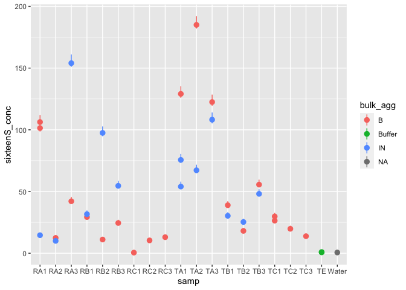<!-- -->

Technical replicate for TA1 does not look great. Other ones look good
though.

## Adjust conc

This code:

- Subtracts the counts from the blanks
- Corrects for DNA template dilution
- Corrects for reaction volume dilution (reports concentration in copies
  / uL DNA extract)
- Calculates 16S copies per g
- Takes average value for technical replicates

``` r
blank_16s <- 
  ddpcr_data_16s %>% 
  filter(samp == "TE" | samp == "Water") %>% 
  summarise(mean_blank_16s = mean(sixteenS_conc)) %>% 
  pull(mean_blank_16s)


data_16s_adj <- 
  ddpcr_data_16s %>% 
  filter(samp != "TE" & samp != "Water") %>% 
  mutate(
    blank = blank_16s,
    sixteenS_conc_minus_blank =
      case_when(
        dilution == "1" ~ (sixteenS_conc / 10) - blank,
        TRUE ~ sixteenS_conc - blank
      ),
    across(sixteenS_conc_minus_blank, ~ if_else(. < 0, 0, .)),
    sixteenS_conc_adj = 
      #already accounts for 100 vs. 1000 dilution
      sixteenS_conc_minus_blank * sixteenS_df * reaction_volume_df, 
    site = str_extract(samp, ".{1}"),
    hzn = str_extract(samp, ".{1}(?=\\d)"),
    rep = str_extract(samp, ".{1}$")
  ) %>% 
  select(
    site, hzn, rep, bulk_agg, sixteenS_conc_adj, 
    sixteenS_droplets = droplets
  ) %>% 
  mutate(across(rep, as.integer)) %>% 
  group_by(site, hzn, rep, bulk_agg) %>%
  left_join(extraction_data, by = c("site", "hzn", "rep", "bulk_agg")) %>% 
  mutate(
    sixteenS_copies_per_g = 
      sixteenS_conc_adj * dna_elution_volume / mass_extract_dry_g
  ) %>% 
  summarise(
    across(c(sixteenS_conc_adj, sixteenS_copies_per_g), ~mean(.))
  ) 
```

    ## `summarise()` has grouped output by 'site', 'hzn', 'rep'. You can override
    ## using the `.groups` argument.

``` r
data_16s_adj
```

    ## # A tibble: 30 × 6
    ## # Groups:   site, hzn, rep [18]
    ##    site  hzn     rep bulk_agg sixteenS_conc_adj sixteenS_copies_per_g
    ##    <chr> <chr> <int> <chr>                <dbl>                 <dbl>
    ##  1 R     A         1 B                  2577500           1088986926.
    ##  2 R     A         1 IN                  346250            152385113.
    ##  3 R     A         2 B                   291250            118546946.
    ##  4 R     A         2 IN                  231250             87153016.
    ##  5 R     A         3 B                  1033750            433286577.
    ##  6 R     A         3 IN                  366250            159906498.
    ##  7 R     B         1 B                   713750            320340086.
    ##  8 R     B         1 IN                   60250             27040967.
    ##  9 R     B         2 B                   258750            115134528.
    ## 10 R     B         2 IN                  225000             96112302.
    ## # … with 20 more rows

It appears we got no positive amplification (beyond contamination) from
RC1-Bulk. I think we’ll need to try again or omit from dataset.

## Copies per g

### technical replicates averaged

``` r
data_16s_adj %>% 
  ggplot(
    aes(y = hzn, x = sixteenS_copies_per_g, shape = bulk_agg, color = site)
  ) +
  geom_point(size = 3) +
  scale_y_discrete(limits = rev) + 
  scale_color_manual(
    values = site_colors,
    labels = site_names,
    name = "Texture"
  ) +
  scale_shape_manual(
    values = agg_shapes,
    labels = agg_names,
    name = NULL
  ) +
  theme_bw() + 
  labs(
    x = "16S copies per g soil",
    y = "Horizon"
  )
```

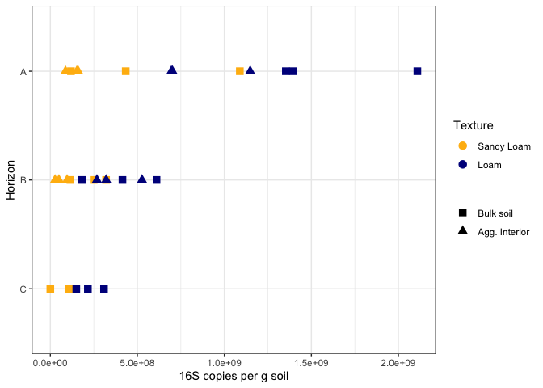<!-- -->

### texture-bulk-hzn averaged

``` r
data_16s_adj %>% 
  group_by(site, hzn, bulk_agg) %>% 
  summarise(
    mean_16s = mean(sixteenS_copies_per_g, na.rm = TRUE),
    se_16s = sd(sixteenS_copies_per_g) / sqrt(n())
  ) %>% 
  ggplot(
    aes(y = hzn, x = mean_16s, shape = bulk_agg, color = site)
  ) +
  geom_pointrange(
    aes(xmin = mean_16s - se_16s, xmax = mean_16s + se_16s),
    fatten = 4
  ) +
  scale_y_discrete(limits = rev) +
  scale_color_manual(
    values = site_colors,
    labels = site_names,
    name = "Texture"
  ) +
  scale_shape_manual(
    values = agg_shapes,
    labels = agg_names,
    name = NULL
  ) +
  theme_bw() + 
  labs(
    x = "16S copies per g soil",
    y = "Horizon"
  )
```

    ## `summarise()` has grouped output by 'site', 'hzn'. You can override using the
    ## `.groups` argument.

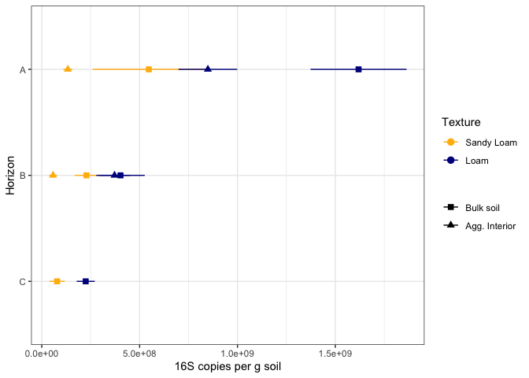<!-- -->

### Key take-aways (16S)

- More 16S copies in Loam vs. Sandy Loam soil
- More 16S copies in surface soil & decreases with depth
- Aggregate interiors yield less 16S copies, unclear if this is due to
  extraction mass or efficiency….

# mcrA

This code:

- Imports the mcrA data from a CSV
- Corrects for reaction volume dilution (reports concentration in copies
  / uL DNA extract)

NOTE - one of my technical replicates is really high….need to look at
notes from the ddPCR run

``` r
ddpcr_data_mcra <- 
  ddpcr_data_file_mcra %>% 
  read_csv() %>% 
  separate(Sample, into = c("samp", "bulk_agg")) %>% 
  select(
    samp, 
    bulk_agg, 
    mcra_conc = Concentration,
    mcra_min = PoissonConfMin,
    mcra_max = PoissonConfMax,
    droplets = AcceptedDroplets
  ) %>% 
  filter(
    !(samp %in% c("Water", "PositiveControl", "buffer")),
    droplets > 10000
  ) %>% 
  mutate(
    site = str_extract(samp, ".{1}"),
    hzn = str_extract(samp, ".{1}(?=\\d)"),
    rep = as.integer(str_extract(samp, ".{1}$")),
    mcra_droplets = droplets,
    across(mcra_conc, as.numeric),
    across(c(mcra_conc, mcra_min, mcra_max), ~ . * reaction_volume_df)
  ) 
```

    ## Warning: One or more parsing issues, call `problems()` on your data frame for details,
    ## e.g.:
    ##   dat <- vroom(...)
    ##   problems(dat)

    ## Rows: 40 Columns: 63
    ## ── Column specification ────────────────────────────────────────────────────────
    ## Delimiter: ","
    ## chr (11): Well, ExptType, Experiment, Sample, TargetType, Target, Status, Co...
    ## dbl (28): CopiesPer20uLWell, PoissonConfMax, PoissonConfMin, Positives, Nega...
    ## lgl (24): TotalConfMax, TotalConfMin, CNV, TotalCNVMax, TotalCNVMin, Poisson...
    ## 
    ## ℹ Use `spec()` to retrieve the full column specification for this data.
    ## ℹ Specify the column types or set `show_col_types = FALSE` to quiet this message.

    ## Warning: Expected 2 pieces. Missing pieces filled with `NA` in 7 rows [1, 15, 20, 25,
    ## 30, 35, 40].

``` r
ddpcr_data_mcra 
```

    ## # A tibble: 33 × 10
    ##    samp  bulk_agg mcra_conc mcra_min mcra_max droplets site  hzn     rep mcra_…¹
    ##    <chr> <chr>        <dbl>    <dbl>    <dbl>    <dbl> <chr> <chr> <int>   <dbl>
    ##  1 RB1   B            25.5     19        42      15051 R     B         1   15051
    ##  2 RC3   B            17.2     12.5      30.5    16948 R     C         3   16948
    ##  3 TB1   B            52.5     42.5      72.5    17345 T     B         1   17345
    ##  4 TC3   B             6.25     3.25     16.5    14205 T     C         3   14205
    ##  5 RA1   B           410      355       465      15399 R     A         1   15399
    ##  6 RB2   B            17       12.2      30      17346 R     B         2   17346
    ##  7 TA1   B            80       67.5     105      16340 T     A         1   16340
    ##  8 TB2   B            47.5     37.5      67.5    16270 T     B         2   16270
    ##  9 TC3   B             7.5      4.25     17.5    15753 T     C         3   15753
    ## 10 RA2   B            37.5     30        57.5    16860 R     A         2   16860
    ## # … with 23 more rows, and abbreviated variable name ¹​mcra_droplets

## Inspect techincal replicates

``` r
ddpcr_data_mcra %>% 
  ggplot(
    aes(x = samp, y = mcra_conc, color = bulk_agg)
  ) +
  geom_pointrange(aes(ymin = mcra_min, ymax = mcra_max))
```

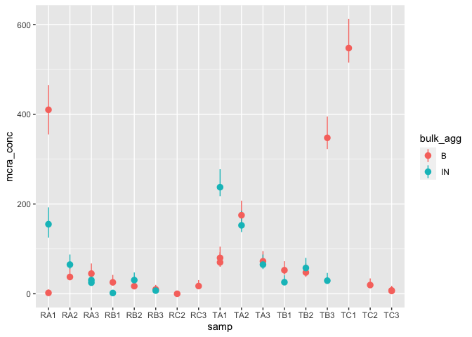<!-- -->

RC1-Bulk is seemingly missing….. and the technical replicates for RA1
look horrible. Need to look at ddPCR folder. I would assume that RA1 was
failure to generate droplets or something….

For now, let’s average the technical replicates

This code

- Takes average value for technical replicates

``` r
ddpcr_data_mcra_av <- 
  ddpcr_data_mcra %>% 
  group_by(site, hzn, rep, bulk_agg) %>%
  left_join(extraction_data, by = c("site", "hzn", "rep", "bulk_agg")) %>% 
  mutate(
    mcra_copies_per_g =
      mcra_conc * dna_elution_volume / mass_extract_dry_g
  ) %>% 
  summarise(
    across(c(mcra_conc, mcra_copies_per_g), ~mean(.))
  ) 
```

    ## `summarise()` has grouped output by 'site', 'hzn', 'rep'. You can override
    ## using the `.groups` argument.

``` r
ddpcr_data_mcra_av
```

    ## # A tibble: 29 × 6
    ## # Groups:   site, hzn, rep [17]
    ##    site  hzn     rep bulk_agg mcra_conc mcra_copies_per_g
    ##    <chr> <chr> <int> <chr>        <dbl>             <dbl>
    ##  1 R     A         1 B           206               87034.
    ##  2 R     A         1 IN          155               68216.
    ##  3 R     A         2 B            37.5             15264.
    ##  4 R     A         2 IN           65               24497.
    ##  5 R     A         3 B            45               18861.
    ##  6 R     A         3 IN           27.6             12061.
    ##  7 R     B         1 B            25.5             11445.
    ##  8 R     B         1 IN            1.75              785.
    ##  9 R     B         2 B            17                7564.
    ## 10 R     B         2 IN           30.5             13029.
    ## # … with 19 more rows

## Copies per g

### technical replicates averaged

``` r
ddpcr_data_mcra_av %>% 
  ggplot(
    aes(y = hzn, x = mcra_copies_per_g, shape = bulk_agg, color = site)
  ) +
  geom_point(size = 3) +
  scale_y_discrete(limits = rev) + 
  #facet_grid(rows = vars(site)) + 
  scale_color_manual(
    values = site_colors,
    labels = site_names,
    name = "Texture"
  ) +
  scale_shape_manual(
    values = agg_shapes,
    labels = agg_names,
    name = NULL
  ) +
  theme_bw() + 
  labs(
    x = "mcrA copies per g soil",
    y = "Horizon"
  )
```

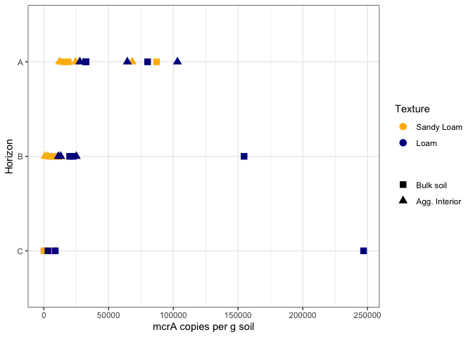<!-- -->

### texture-bulk-hzn averaged

``` r
ddpcr_data_mcra_av %>% 
  group_by(site, hzn, bulk_agg) %>% 
  summarize(
    mcra_conc_av = mean(mcra_copies_per_g),
    mcra_conc_se = sd(mcra_copies_per_g) / sqrt(n())
  ) %>% 
  ggplot(
    aes(y = hzn, x = mcra_conc_av, shape = bulk_agg, color = site)
  ) +
  geom_pointrange(
    aes(
      xmin = mcra_conc_av - mcra_conc_se, 
      xmax = mcra_conc_av + mcra_conc_se)
  ) +
  scale_y_discrete(limits = rev) + 
  scale_color_manual(
    values = site_colors,
    labels = site_names,
    name = "Texture"
  ) +
  scale_shape_manual(
    values = agg_shapes,
    labels = agg_names,
    name = NULL
  ) +
  theme_bw() + 
  labs(
    x = "mcrA copies per g soil",
    y = "Horizon"
  )
```

    ## `summarise()` has grouped output by 'site', 'hzn'. You can override using the
    ## `.groups` argument.

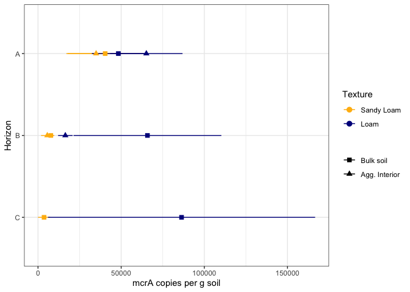<!-- -->

### Key take-aways (mcrA raw counts)

- Likely contamination in 2 of the samples, will need to re-run
- Obfuscates results for the B and C horizons

## Copies mcrA normalized to 16S copies

### technical replicates averaged

``` r
ddpcr_data_mcra_av %>% 
  #filter(!(samp %in% c("TC1", "RA1", "TB3") & bulk_agg == "B")) %>% 
  left_join(data_16s_adj, by = c("site", "hzn", "rep", "bulk_agg")) %>% 
  mutate(
    prop_mcra = mcra_copies_per_g / sixteenS_copies_per_g
  ) %>% 
  ggplot(
    aes(y = hzn, x = prop_mcra, shape = bulk_agg, color = site)
  ) +
  geom_point(size = 3) +
  scale_y_discrete(limits = rev) + 
  scale_color_manual(
    values = site_colors,
    labels = site_names,
    name = "Texture"
  ) +
  scale_shape_manual(
    values = agg_shapes,
    labels = agg_names,
    name = NULL
  ) +
  theme_bw() + 
  labs(
    x = "mcrA copies per 16S copy",
    y = "Horizon"
  )
```

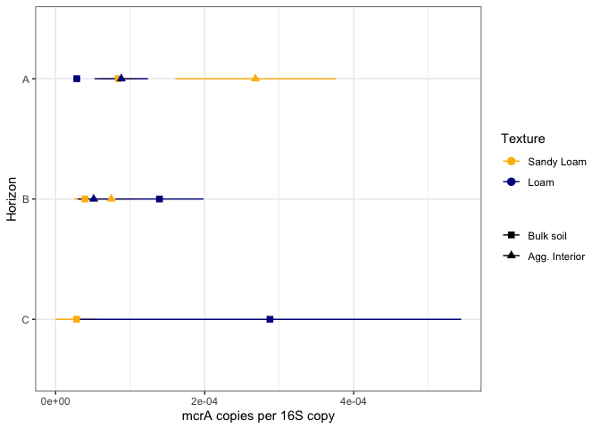<!-- -->

### texture-bulk-hzn averaged

``` r
ddpcr_data_mcra_av %>% 
  left_join(data_16s_adj, by = c("site", "hzn", "rep", "bulk_agg")) %>% 
  mutate(
    prop_mcra = mcra_copies_per_g / sixteenS_copies_per_g
  ) %>% 
  group_by(site, hzn, bulk_agg) %>% 
  summarise(
    mean_prop_mcra = mean(prop_mcra, na.rm = TRUE),
    se_prop_mcra = sd(prop_mcra) / sqrt(n())
  ) %>% 
  ggplot(
    aes(y = hzn, x = mean_prop_mcra, shape = bulk_agg, color = site)
  ) +
  geom_pointrange(
    aes(
      xmin = mean_prop_mcra - se_prop_mcra, 
      xmax = mean_prop_mcra + se_prop_mcra
    )
  ) + 
  scale_y_discrete(limits = rev) + 
  scale_color_manual(
    values = site_colors,
    labels = site_names,
    name = "Texture"
  ) +
  scale_shape_manual(
    values = agg_shapes,
    labels = agg_names,
    name = NULL
  ) +
  theme_bw() + 
  labs(
    x = "mcrA copies per 16S copy",
    y = "Horizon"
  )
```

    ## `summarise()` has grouped output by 'site', 'hzn'. You can override using the
    ## `.groups` argument.

<!-- -->

### Key take-aways (mcrA normalized)

- In general, higher relative abundance of mcrA in surface horizons (if
  we ignore what is presumably an outlier)
- In A horizon: \*\* interior of aggregates has higher relative
  abundance of mcrA copies \*\* Loam has higher relative abundance of
  mcrA copies

# gltA

``` r
ddpcr_data_glta <- 
  ddpcr_data_file_glta %>% 
  read_csv() %>% 
  filter(str_detect(TargetType, "Ch1")) %>% 
  separate(Sample, into = c("samp", "bulk_agg"), remove = FALSE) %>%
  filter(!(samp %in% c("Water", "PositiveControl", "buffer"))) %>% 
  mutate(dilution = as.numeric(str_extract(Sample, "(?<=:)\\d+"))) %>% 
  select(
    samp, 
    bulk_agg, 
    dilution,
    glta_conc_unadj = Concentration,
    glta_droplets = AcceptedDroplets,
    glta_min = PoissonConfMin,
    glta_max = PoissonConfMax
  ) %>% 
  filter(glta_droplets > 10000) %>% 
  mutate(
    site = str_extract(samp, ".{1}"),
    hzn = str_extract(samp, ".{1}(?=\\d)"),
    rep = as.integer(str_extract(samp, ".{1}$")),
    across(c(glta_conc_unadj, dilution), as.numeric),
    glta_conc_adj = glta_conc_unadj * dilution * reaction_volume_df,
    across(c(glta_min, glta_max), ~. * dilution * reaction_volume_df)
  ) 
```

    ## Warning: One or more parsing issues, call `problems()` on your data frame for details,
    ## e.g.:
    ##   dat <- vroom(...)
    ##   problems(dat)

    ## Rows: 80 Columns: 63
    ## ── Column specification ────────────────────────────────────────────────────────
    ## Delimiter: ","
    ## chr (11): Well, ExptType, Experiment, Sample, TargetType, Target, Status, Co...
    ## dbl (28): CopiesPer20uLWell, PoissonConfMax, PoissonConfMin, Positives, Nega...
    ## lgl (24): TotalConfMax, TotalConfMin, CNV, TotalCNVMax, TotalCNVMin, Poisson...
    ## 
    ## ℹ Use `spec()` to retrieve the full column specification for this data.
    ## ℹ Specify the column types or set `show_col_types = FALSE` to quiet this message.

    ## Warning: Expected 2 pieces. Additional pieces discarded in 33 rows [2, 3, 4, 6, 7, 8, 9,
    ## 11, 12, 13, 14, 15, 16, 17, 18, 19, 20, 21, 22, 23, ...].

    ## Warning: Expected 2 pieces. Missing pieces filled with `NA` in 7 rows [1, 5, 10, 25, 30,
    ## 35, 40].

    ## Warning: There was 1 warning in `mutate()`.
    ## ℹ In argument: `across(c(glta_conc_unadj, dilution), as.numeric)`.
    ## Caused by warning:
    ## ! NAs introduced by coercion

## Inspect technical replicates

``` r
ddpcr_data_glta %>% 
  ggplot(
    aes(x = samp, y = glta_conc_adj, color = bulk_agg)
  ) +
  geom_pointrange(aes(ymin = glta_min, ymax = glta_max))
```

    ## Warning: Removed 3 rows containing missing values (`geom_pointrange()`).

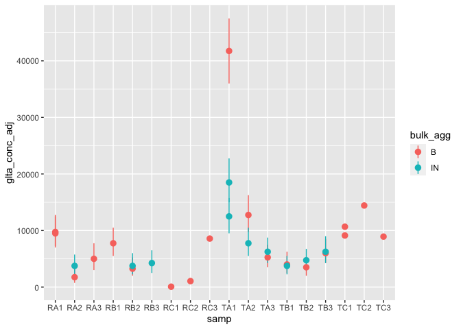<!-- --> Technical
replicates look good.

``` r
ddpcr_data_glta_av <- 
  ddpcr_data_glta %>% 
  left_join(extraction_data, by = c("site", "hzn", "rep", "bulk_agg")) %>% 
  mutate(
    glta_copies_per_g =
      glta_conc_adj * dna_elution_volume / mass_extract_dry_g
  ) %>%   
  group_by(site, hzn, rep, bulk_agg) %>%
  summarise(
    across(c(glta_conc_adj, glta_copies_per_g), ~mean(., na.rm = TRUE))
  )
```

    ## `summarise()` has grouped output by 'site', 'hzn', 'rep'. You can override
    ## using the `.groups` argument.

``` r
ddpcr_data_glta_av
```

    ## # A tibble: 29 × 6
    ## # Groups:   site, hzn, rep [18]
    ##    site  hzn     rep bulk_agg glta_conc_adj glta_copies_per_g
    ##    <chr> <chr> <int> <chr>            <dbl>             <dbl>
    ##  1 R     A         1 B                 9625          4066537.
    ##  2 R     A         1 IN                 NaN              NaN 
    ##  3 R     A         2 B                 1750           712299.
    ##  4 R     A         2 IN                3750          1413292.
    ##  5 R     A         3 B                 5000          2095703.
    ##  6 R     B         1 B                 7750          3478299.
    ##  7 R     B         1 IN                 NaN              NaN 
    ##  8 R     B         2 B                 3250          1446134.
    ##  9 R     B         2 IN                3750          1601872.
    ## 10 R     B         3 B                  NaN              NaN 
    ## # … with 19 more rows

## Copies per g

### Technical replicates averaged

``` r
ddpcr_data_glta_av %>% 
  ggplot(
    aes(y = hzn, x = glta_copies_per_g, shape = bulk_agg, color = site)
  ) +
  geom_point(size = 3) +
    scale_color_manual(
    values = site_colors,
    labels = site_names,
    name = "Texture"
  ) +
  scale_shape_manual(
    values = agg_shapes,
    labels = agg_names,
    name = NULL
  ) +
  scale_y_discrete(limits = rev) +
  theme_bw() + 
  labs(
    x = "gltA copies per g soil",
    y = "Horizon"
  )
```

    ## Warning: Removed 3 rows containing missing values (`geom_point()`).

<!-- -->

### texture-bulk-hzn averaged

``` r
ddpcr_data_glta_av %>% 
  group_by(site, hzn, bulk_agg) %>% 
  summarize(
    glta_conc_av = mean(glta_copies_per_g, na.rm = TRUE),
    glta_conc_se = sd(glta_copies_per_g, na.rm = TRUE) / sqrt(n())
  ) %>% 
  ggplot(
    aes(y = hzn, x = glta_conc_av, shape = bulk_agg, color = site)
  ) +
  geom_pointrange(
    aes(
      xmin = glta_conc_av - glta_conc_se, 
      xmax = glta_conc_av + glta_conc_se)
  ) +
  scale_y_discrete(limits = rev) + 
  scale_color_manual(
    values = site_colors,
    labels = site_names,
    name = "Texture"
  ) +
  scale_shape_manual(
    values = agg_shapes,
    labels = agg_names,
    name = NULL
  ) +
  theme_bw() + 
  labs(
    x = "gltA copies per g soil",
    y = "Horizon"
  )
```

    ## `summarise()` has grouped output by 'site', 'hzn'. You can override using the
    ## `.groups` argument.

    ## Warning: Removed 1 rows containing missing values (`geom_segment()`).

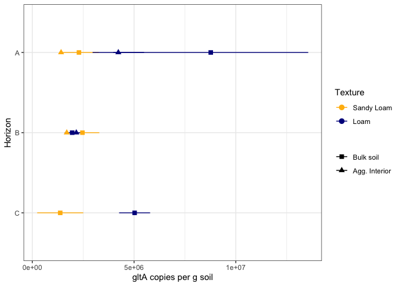<!-- -->

## Copies per 16S copy

### technical replicates averaged

``` r
ddpcr_data_glta_av %>% 
  left_join(data_16s_adj, by = c("site", "hzn", "rep", "bulk_agg")) %>% 
  mutate(
    prop_glta = glta_copies_per_g / sixteenS_copies_per_g
  ) %>% 
  ggplot(
    aes(y = hzn, x = prop_glta, shape = bulk_agg, color = site)
  ) +
  geom_point(size = 3) +
  scale_y_discrete(limits = rev) + 
  scale_color_manual(
    values = site_colors,
    labels = site_names,
    name = "Texture"
  ) +
  scale_shape_manual(
    values = agg_shapes,
    labels = agg_names,
    name = NULL
  ) +
  theme_bw() + 
  labs(
    x = "gltA copies per 16S copy",
    y = "Horizon"
  )
```

    ## Warning: Removed 3 rows containing missing values (`geom_point()`).

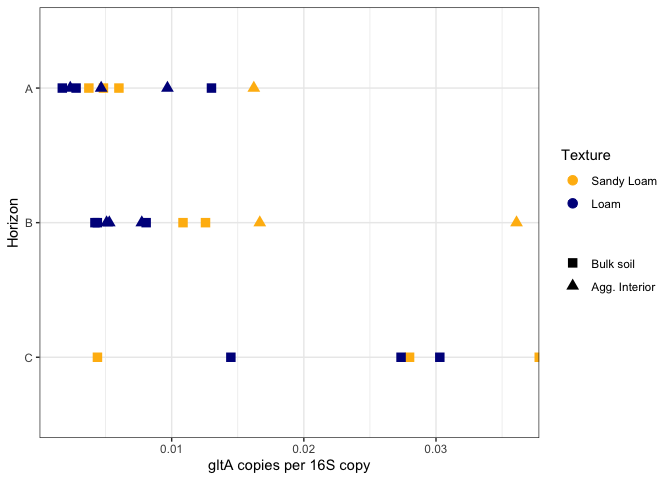<!-- -->

### texture-bulk-hzn averaged

``` r
ddpcr_data_glta_av %>% 
  left_join(data_16s_adj, by = c("site", "hzn", "rep", "bulk_agg")) %>% 
  filter(sixteenS_copies_per_g > 0) %>% 
  mutate(
    prop_glta = glta_copies_per_g / sixteenS_copies_per_g
  ) %>% 
  group_by(site, hzn, bulk_agg) %>% 
  summarise(
    mean_prop_glta = mean(prop_glta, na.rm = TRUE),
    se_prop_glta = sd(prop_glta, na.rm = TRUE) / sqrt(n())
  ) %>% 
  ggplot(
    aes(y = hzn, x = mean_prop_glta, shape = bulk_agg, color = site)
  ) +
  geom_pointrange(
    aes(
      xmin = mean_prop_glta - se_prop_glta, 
      xmax = mean_prop_glta + se_prop_glta
    )
  ) + 
  scale_y_discrete(limits = rev) + 
  scale_color_manual(
    values = site_colors,
    labels = site_names,
    name = "Texture"
  ) +
  scale_shape_manual(
    values = agg_shapes,
    labels = agg_names,
    name = NULL
  ) +
  theme_bw() + 
  labs(
    x = "gltA copies per 16S copy",
    y = "Horizon"
  )
```

    ## `summarise()` has grouped output by 'site', 'hzn'. You can override using the
    ## `.groups` argument.

    ## Warning: Removed 1 rows containing missing values (`geom_segment()`).

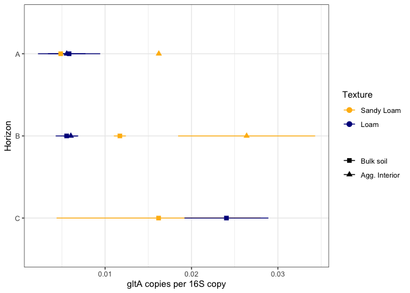<!-- -->

# nirK

This code:

- Imports the nirK data from a CSV
- Excludes 1:100 dilutions (which were too dilute)
- Corrects for DNA template dilution (1:10)
- Corrects for reaction volume dilution (reports concentration in copies
  / uL DNA extract)

``` r
ddpcr_data_nirk <- 
  ddpcr_data_file_nirk %>% 
  read_csv() %>% 
  separate(Sample, into = c("samp", "bulk_agg"), remove = FALSE) %>% 
  filter(!(samp %in% c("Water", "PositiveControl", "buffer"))) %>% 
  mutate(dilution = as.numeric(str_extract(Sample, "(?<=:)\\d+"))) %>% 
  filter(dilution == 10) %>% 
  select(
    samp, 
    bulk_agg, 
    dilution,
    nirk_conc_unadj = Concentration,
    nirk_droplets = AcceptedDroplets,
    nirk_min = PoissonConfMin,
    nirk_max = PoissonConfMax
  ) %>% 
  filter(nirk_droplets > 10000) %>% 
  mutate( #need to CONFIRM and switch out RC No Calls as Zeroes (no amplification)
    across(nirk_conc_unadj, ~if_else(. == "No Call", "0", .)),
    site = str_extract(samp, ".{1}"),
    hzn = str_extract(samp, ".{1}(?=\\d)"),
    rep = as.integer(str_extract(samp, ".{1}$")),
    across(c(nirk_conc_unadj, dilution), as.numeric),
    nirk_conc_adj = nirk_conc_unadj * dilution * reaction_volume_df,
    across(c(nirk_min, nirk_max), ~. * dilution * reaction_volume_df)
  ) 
```

    ## Warning: One or more parsing issues, call `problems()` on your data frame for details,
    ## e.g.:
    ##   dat <- vroom(...)
    ##   problems(dat)

    ## Rows: 80 Columns: 63
    ## ── Column specification ────────────────────────────────────────────────────────
    ## Delimiter: ","
    ## chr (10): Well, ExptType, Experiment, Sample, TargetType, Target, Status, Co...
    ## dbl (28): CopiesPer20uLWell, PoissonConfMax, PoissonConfMin, Positives, Nega...
    ## lgl (25): TotalConfMax, TotalConfMin, CNV, TotalCNVMax, TotalCNVMin, Poisson...
    ## 
    ## ℹ Use `spec()` to retrieve the full column specification for this data.
    ## ℹ Specify the column types or set `show_col_types = FALSE` to quiet this message.

    ## Warning: Expected 2 pieces. Additional pieces discarded in 76 rows [2, 3, 4, 5, 6, 7, 8,
    ## 9, 10, 11, 12, 13, 14, 15, 16, 17, 18, 19, 21, 22, ...].

    ## Warning: Expected 2 pieces. Missing pieces filled with `NA` in 4 rows [1, 20,
    ## 41, 60].

``` r
ddpcr_data_nirk %>% arrange(nirk_conc_unadj)
```

    ## # A tibble: 62 × 11
    ##    samp  bulk_agg dilution nirk_conc…¹ nirk_…² nirk_…³ nirk_…⁴ site  hzn     rep
    ##    <chr> <chr>       <dbl>       <dbl>   <dbl>   <dbl>   <dbl> <chr> <chr> <int>
    ##  1 RC1   B              10         0     12678      NA      NA R     C         1
    ##  2 RC1   B              10         0     12678      NA      NA R     C         1
    ##  3 RC2   B              10         0     11523      NA      NA R     C         2
    ##  4 RB2   B              10         2.1   13578     350     750 R     B         2
    ##  5 RB3   IN             10         2.1   12184     350     775 R     B         3
    ##  6 RC2   B              10         2.7   11523     450     950 R     C         2
    ##  7 RB3   IN             10         2.7   12184     450     950 R     B         3
    ##  8 TC3   B              10         3     12036     525    1050 T     C         3
    ##  9 RB1   IN             10         3.1   12357     550    1100 R     B         1
    ## 10 TC3   B              10         4.1   12996     750    1350 T     C         3
    ## # … with 52 more rows, 1 more variable: nirk_conc_adj <dbl>, and abbreviated
    ## #   variable names ¹​nirk_conc_unadj, ²​nirk_droplets, ³​nirk_min, ⁴​nirk_max

``` r
#need to select appropriate dilution
```

## Inspect technical replicates

``` r
ddpcr_data_nirk %>% 
  ggplot(
    aes(x = samp, y = nirk_conc_adj, color = bulk_agg)
  ) +
  geom_pointrange(aes(ymin = nirk_min, ymax = nirk_max))
```

    ## Warning: Removed 3 rows containing missing values (`geom_segment()`).

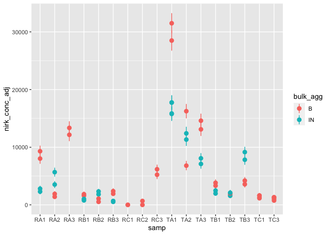<!-- -->

Technical replicates look good. RA2-IN is maybe a little funky,

``` r
ddpcr_data_nirk_av <- 
  ddpcr_data_nirk %>% 
  left_join(extraction_data, by = c("site", "hzn", "rep", "bulk_agg")) %>% 
  mutate(
    nirk_copies_per_g =
      nirk_conc_adj * dna_elution_volume / mass_extract_dry_g
  ) %>%   
  group_by(site, hzn, rep, bulk_agg) %>%
  summarise(
    across(c(nirk_conc_adj, nirk_copies_per_g), ~mean(.))
  )
```

    ## `summarise()` has grouped output by 'site', 'hzn', 'rep'. You can override
    ## using the `.groups` argument.

``` r
ddpcr_data_nirk_av
```

    ## # A tibble: 28 × 6
    ## # Groups:   site, hzn, rep [17]
    ##    site  hzn     rep bulk_agg nirk_conc_adj nirk_copies_per_g
    ##    <chr> <chr> <int> <chr>            <dbl>             <dbl>
    ##  1 R     A         1 B                8662.          3659883.
    ##  2 R     A         1 IN               2550           1122259.
    ##  3 R     A         2 B                1650            671596.
    ##  4 R     A         2 IN               4600           1733638.
    ##  5 R     A         3 B               12750           5344042.
    ##  6 R     B         1 B                1725            774202.
    ##  7 R     B         1 IN                900            403931.
    ##  8 R     B         2 B                 800            355971.
    ##  9 R     B         2 IN               2075            886369.
    ## 10 R     B         3 B                2150            902195.
    ## # … with 18 more rows

## Copies per g

### Technical replicates averaged

``` r
ddpcr_data_nirk_av %>% 
  ggplot(
    aes(y = hzn, x = nirk_copies_per_g, shape = bulk_agg, color = site)
  ) +
  geom_point(size = 3) +
    scale_color_manual(
    values = site_colors,
    labels = site_names,
    name = "Texture"
  ) +
  scale_shape_manual(
    values = agg_shapes,
    labels = agg_names,
    name = NULL
  ) +
  scale_y_discrete(limits = rev) +
  theme_bw() + 
  labs(
    x = "nirK copies per g soil",
    y = "Horizon"
  )
```

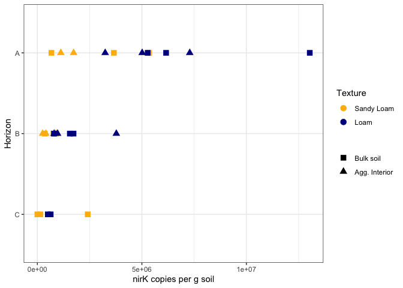<!-- -->

### texture-bulk-hzn averaged

``` r
ddpcr_data_nirk_av %>% 
  group_by(site, hzn, bulk_agg) %>% 
  summarize(
    nirk_conc_av = mean(nirk_copies_per_g),
    nirk_conc_se = sd(nirk_copies_per_g) / sqrt(n())
  ) %>% 
  ggplot(
    aes(y = hzn, x = nirk_conc_av, shape = bulk_agg, color = site)
  ) +
  geom_pointrange(
    aes(
      xmin = nirk_conc_av - nirk_conc_se, 
      xmax = nirk_conc_av + nirk_conc_se)
  ) +
  scale_y_discrete(limits = rev) + 
  scale_color_manual(
    values = site_colors,
    labels = site_names,
    name = "Texture"
  ) +
  scale_shape_manual(
    values = agg_shapes,
    labels = agg_names,
    name = NULL
  ) +
  theme_bw() + 
  labs(
    x = "nirK copies per g soil",
    y = "Horizon"
  )
```

    ## `summarise()` has grouped output by 'site', 'hzn'. You can override using the
    ## `.groups` argument.

<!-- -->

### Key take-aways (nirK raw counts)

- No difference between interior/exterior for nirK abundance
- nirK abundance decreases with depth
- typically higher in Loam soils

## Copies per 16S copy

### technical replicates averaged

``` r
ddpcr_data_nirk_av %>% 
  left_join(data_16s_adj, by = c("site", "hzn", "rep", "bulk_agg")) %>% 
  mutate(
    prop_nirk = nirk_copies_per_g / sixteenS_copies_per_g
  ) %>% 
  ggplot(
    aes(y = hzn, x = prop_nirk, shape = bulk_agg, color = site)
  ) +
  geom_point(size = 3) +
  scale_y_discrete(limits = rev) + 
  scale_color_manual(
    values = site_colors,
    labels = site_names,
    name = "Texture"
  ) +
  scale_shape_manual(
    values = agg_shapes,
    labels = agg_names,
    name = NULL
  ) +
  theme_bw() + 
  labs(
    x = "nirK copies per 16S copy",
    y = "Horizon"
  )
```

    ## Warning: Removed 1 rows containing missing values (`geom_point()`).

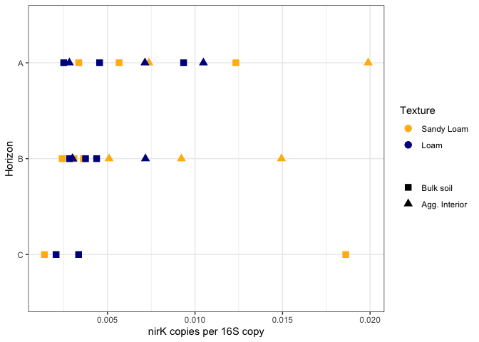<!-- -->

### texture-bulk-hzn averaged

``` r
ddpcr_data_nirk_av %>% 
  left_join(data_16s_adj, by = c("site", "hzn", "rep", "bulk_agg")) %>% 
  mutate(
    prop_nirk = nirk_copies_per_g / sixteenS_copies_per_g
  ) %>% 
  group_by(site, hzn, bulk_agg) %>% 
  summarise(
    mean_prop_nirk = mean(prop_nirk, na.rm = TRUE),
    se_prop_nirk = sd(prop_nirk) / sqrt(n())
  ) %>% 
  ggplot(
    aes(y = hzn, x = mean_prop_nirk, shape = bulk_agg, color = site)
  ) +
  geom_pointrange(
    aes(
      xmin = mean_prop_nirk - se_prop_nirk, 
      xmax = mean_prop_nirk + se_prop_nirk
    )
  ) + 
  scale_y_discrete(limits = rev) + 
  scale_color_manual(
    values = site_colors,
    labels = site_names,
    name = "Texture"
  ) +
  scale_shape_manual(
    values = agg_shapes,
    labels = agg_names,
    name = NULL
  ) +
  theme_bw() + 
  labs(
    x = "nirK copies per 16S copy",
    y = "Horizon"
  )
```

    ## `summarise()` has grouped output by 'site', 'hzn'. You can override using the
    ## `.groups` argument.

    ## Warning: Removed 1 rows containing missing values (`geom_segment()`).

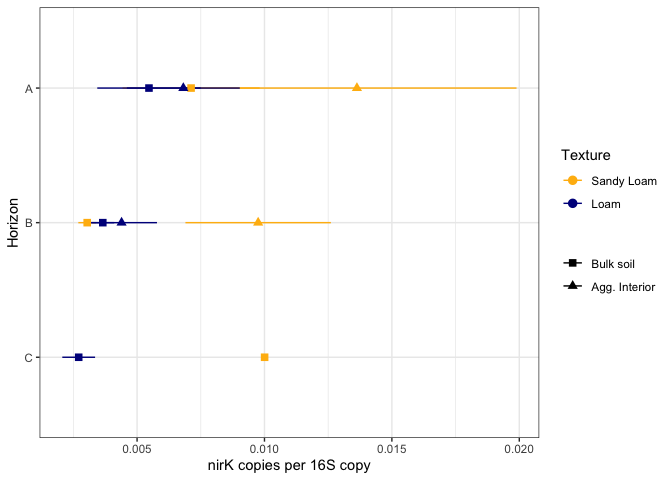<!-- -->

### Key take-aways (nirK normalized)

- Higher relative abundance in Sandy Loam soil than Loam soil
- Interior of aggregates seemingly has higher relative abundance
- No difference between interior/exterior for Loam soils

# nirS

This code:

- Imports the nirS data from a CSV
- Corrects for reaction volume dilution (reports concentration in copies
  / uL DNA extract)

``` r
ddpcr_data_nirs <- 
  ddpcr_data_file_nirs %>% 
  read_csv() %>% 
  separate(Sample, into = c("samp", "bulk_agg"), remove = FALSE) %>% 
  filter(!(samp %in% c("Water", "PositiveControl", "buffer"))) %>% 
  mutate(dilution = as.numeric(str_extract(Sample, "(?<=:)\\d+"))) %>% 
  filter(str_detect(TargetType, "Ch1")) %>% 
  select(
    samp, 
    bulk_agg, 
    dilution,
    nirs_conc_unadj = Concentration,
    nirs_droplets = AcceptedDroplets,
    nirs_min = PoissonConfMin,
    nirs_max = PoissonConfMax
  ) %>% 
  filter(nirs_droplets > 10000, samp != "SF") %>% 
  mutate(
    across(nirs_conc_unadj, ~if_else(. == "No Call", "0", .)),
    site = str_extract(samp, ".{1}"),
    hzn = str_extract(samp, ".{1}(?=\\d)"),
    rep = as.integer(str_extract(samp, ".{1}$")),
    across(c(nirs_conc_unadj, dilution), as.numeric),
    nirs_conc_adj = nirs_conc_unadj * dilution * reaction_volume_df,
    across(c(nirs_min, nirs_max), ~. * dilution * reaction_volume_df)
  ) 
```

    ## Warning: One or more parsing issues, call `problems()` on your data frame for details,
    ## e.g.:
    ##   dat <- vroom(...)
    ##   problems(dat)

    ## Rows: 80 Columns: 63
    ## ── Column specification ────────────────────────────────────────────────────────
    ## Delimiter: ","
    ## chr (10): Well, ExptType, Experiment, Sample, TargetType, Target, Status, Co...
    ## dbl (28): CopiesPer20uLWell, PoissonConfMax, PoissonConfMin, Positives, Nega...
    ## lgl (25): TotalConfMax, TotalConfMin, CNV, TotalCNVMax, TotalCNVMin, Poisson...
    ## 
    ## ℹ Use `spec()` to retrieve the full column specification for this data.
    ## ℹ Specify the column types or set `show_col_types = FALSE` to quiet this message.

    ## Warning: Expected 2 pieces. Additional pieces discarded in 76 rows [2, 3, 4, 5, 6, 7, 8,
    ## 9, 10, 11, 12, 13, 14, 16, 17, 18, 19, 20, 21, 22, ...].

    ## Warning: Expected 2 pieces. Missing pieces filled with `NA` in 4 rows [1, 15,
    ## 41, 55].

## Inspect technical replicates

``` r
ddpcr_data_nirs %>% 
  filter(site == "T") %>% 
  mutate(across(dilution, as.factor)) %>% 
  ggplot(
    aes(x = samp, y = nirs_conc_adj, color = bulk_agg, shape = dilution)
  ) +
  geom_pointrange(aes(ymin = nirs_min, ymax = nirs_max)) 
```

    ## Warning: Removed 1 rows containing missing values (`geom_segment()`).

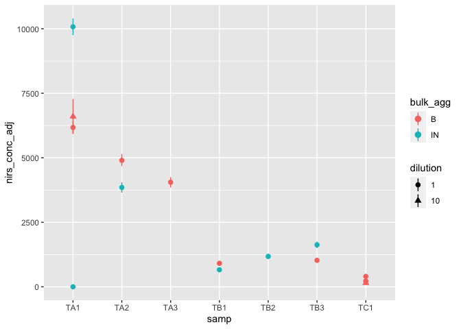<!-- -->

``` r
ddpcr_data_nirs %>% 
  mutate(across(dilution, as.factor)) %>% 
  filter(site == "R") %>% 
  ggplot(
    aes(x = samp, y = nirs_conc_adj, color = bulk_agg, shape = dilution)
  ) +
  geom_pointrange(aes(ymin = nirs_min, ymax = nirs_max)) 
```

    ## Warning: Removed 1 rows containing missing values (`geom_segment()`).

<!-- -->

The technical replicates are at least relatively close even compared to
the dilutions. Going to retain the un-diluted samples for this run.

``` r
ddpcr_data_nirs_av <- 
  ddpcr_data_nirs %>% 
  filter(dilution != 10) %>% 
  left_join(extraction_data, by = c("site", "hzn", "rep", "bulk_agg")) %>% 
  mutate(
    nirs_copies_per_g =
      nirs_conc_adj * dna_elution_volume / mass_extract_dry_g
  ) %>% 
  group_by(site, hzn, rep, bulk_agg) %>%
  summarise(
    across(c(nirs_conc_adj, nirs_copies_per_g), ~mean(., na.rm = TRUE))
  )
```

    ## `summarise()` has grouped output by 'site', 'hzn', 'rep'. You can override
    ## using the `.groups` argument.

``` r
ddpcr_data_nirs_av
```

    ## # A tibble: 24 × 6
    ## # Groups:   site, hzn, rep [15]
    ##    site  hzn     rep bulk_agg nirs_conc_adj nirs_copies_per_g
    ##    <chr> <chr> <int> <chr>            <dbl>             <dbl>
    ##  1 R     A         1 B                388.            163718.
    ##  2 R     A         1 IN               140              61614.
    ##  3 R     A         2 B                 55              22387.
    ##  4 R     A         2 IN               240              90451.
    ##  5 R     A         3 B                235              98498.
    ##  6 R     A         3 IN               105              45844.
    ##  7 R     B         1 B                 52.5            23563.
    ##  8 R     B         1 IN                55              24685.
    ##  9 R     B         2 IN                70              29902.
    ## 10 R     B         3 B                 70              29374.
    ## # … with 14 more rows

``` r
ddpcr_data_nirs_av %>% 
  ggplot(
    aes(y = hzn, x = nirs_copies_per_g, shape = bulk_agg, color = site)
  ) +
  geom_point(size = 3) +
    scale_color_manual(
    values = site_colors,
    labels = site_names,
    name = "Texture"
  ) +
  scale_shape_manual(
    values = agg_shapes,
    labels = agg_names,
    name = NULL
  ) +
  scale_y_discrete(limits = rev) +
  theme_bw() + 
  labs(
    x = "nirS copies per g soil",
    y = "Horizon"
  )
```

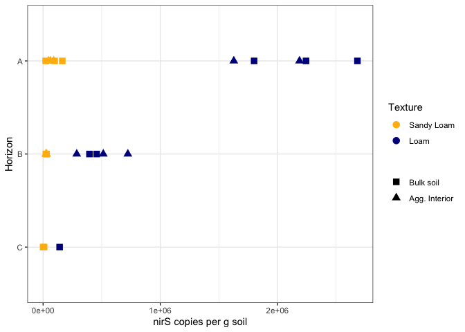<!-- -->

``` r
ddpcr_data_nirs_av %>% 
  group_by(site, hzn, bulk_agg) %>% 
  summarize(
    nirs_conc_av = mean(nirs_copies_per_g),
    nirs_conc_se = sd(nirs_copies_per_g) / sqrt(n())
  ) %>% 
  ggplot(
    aes(y = hzn, x = nirs_conc_av, shape = bulk_agg, color = site)
  ) +
  geom_pointrange(
    aes(
      xmin = nirs_conc_av - nirs_conc_se, 
      xmax = nirs_conc_av + nirs_conc_se)
  ) +
  scale_y_discrete(limits = rev) + 
  scale_color_manual(
    values = site_colors,
    labels = site_names,
    name = "Texture"
  ) +
  scale_shape_manual(
    values = agg_shapes,
    labels = agg_names,
    name = NULL
  ) +
  theme_bw() + 
  labs(
    x = "nirK copies per g soil",
    y = "Horizon"
  )
```

    ## `summarise()` has grouped output by 'site', 'hzn'. You can override using the
    ## `.groups` argument.

    ## Warning: Removed 1 rows containing missing values (`geom_segment()`).

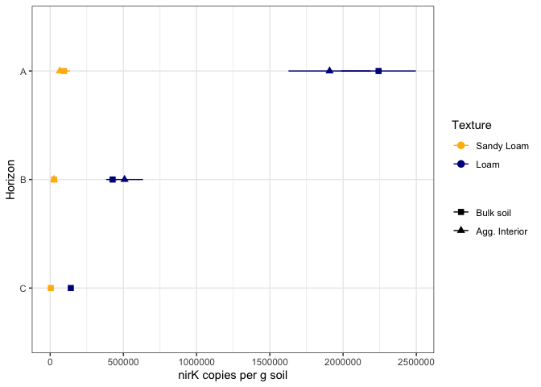<!-- -->

## Copies per 16S copy

### technical replicates averaged

``` r
ddpcr_data_nirs_av %>% 
  left_join(data_16s_adj, by = c("site", "hzn", "rep", "bulk_agg")) %>% 
  mutate(
    prop_nirs = nirs_copies_per_g / sixteenS_copies_per_g
  ) %>% 
  ggplot(
    aes(y = hzn, x = prop_nirs, shape = bulk_agg, color = site)
  ) +
  geom_point(size = 3) +
  scale_y_discrete(limits = rev) + 
  scale_color_manual(
    values = site_colors,
    labels = site_names,
    name = "Texture"
  ) +
  scale_shape_manual(
    values = agg_shapes,
    labels = agg_names,
    name = NULL
  ) +
  theme_bw() + 
  labs(
    x = "nirS copies per 16S copy",
    y = "Horizon"
  )
```

    ## Warning: Removed 1 rows containing missing values (`geom_point()`).

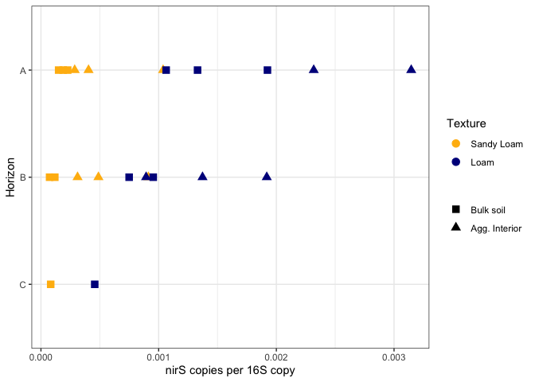<!-- -->

### texture-bulk-hzn averaged

``` r
ddpcr_data_nirs_av %>% 
  left_join(data_16s_adj, by = c("site", "hzn", "rep", "bulk_agg")) %>% 
  mutate(
    prop_nirs = nirs_copies_per_g / sixteenS_copies_per_g
  ) %>% 
  group_by(site, hzn, bulk_agg) %>% 
  summarise(
    mean_prop_nirs = mean(prop_nirs, na.rm = TRUE),
    se_prop_nirs = sd(prop_nirs) / sqrt(n())
  ) %>% 
  ggplot(
    aes(y = hzn, x = mean_prop_nirs, shape = bulk_agg, color = site)
  ) +
  geom_pointrange(
    aes(
      xmin = mean_prop_nirs - se_prop_nirs, 
      xmax = mean_prop_nirs + se_prop_nirs
    )
  ) + 
  scale_y_discrete(limits = rev) + 
  scale_color_manual(
    values = site_colors,
    labels = site_names,
    name = "Texture"
  ) +
  scale_shape_manual(
    values = agg_shapes,
    labels = agg_names,
    name = NULL
  ) +
  theme_bw() + 
  labs(
    x = "nirS copies per 16S copy",
    y = "Horizon"
  )
```

    ## `summarise()` has grouped output by 'site', 'hzn'. You can override using the
    ## `.groups` argument.

    ## Warning: Removed 2 rows containing missing values (`geom_segment()`).

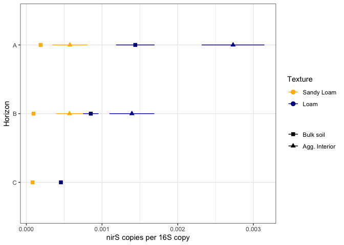<!-- --> \# All
Genes

## Combine data

NOTE: Only 19 samples have a complete dataset for all the genes and 16S

``` r
ddpcr_compiled <- 
  ddpcr_data_nirs_av %>% 
  full_join(ddpcr_data_nirk_av, by = c("site", "hzn", "rep", "bulk_agg")) %>% 
  full_join(ddpcr_data_glta_av, by = c("site", "hzn", "rep", "bulk_agg")) %>% 
  full_join(ddpcr_data_mcra_av, by = c("site", "hzn", "rep", "bulk_agg")) %>% 
  full_join(data_16s_adj, by = c("site", "hzn", "rep", "bulk_agg")) %>% 
  mutate(
    total_anaerobe_copies = 
      nirs_copies_per_g + nirk_copies_per_g + mcra_copies_per_g + glta_copies_per_g
  ) 
```

``` r
ddpcr_compiled %>% 
  ggplot(
    aes(y = hzn, x = total_anaerobe_copies, shape = bulk_agg, color = site)
  ) +
  geom_point(size = 3) +
  scale_y_discrete(limits = rev) + 
  scale_color_manual(
    values = site_colors,
    labels = site_names,
    name = "Texture"
  ) +
  scale_shape_manual(
    values = agg_shapes,
    labels = agg_names,
    name = NULL
  ) +
  theme_bw() + 
  labs(
    x = "nirK+nirS+gltA+mcrA copies per g soil",
    y = "Horizon"
  )
```

    ## Warning: Removed 11 rows containing missing values (`geom_point()`).

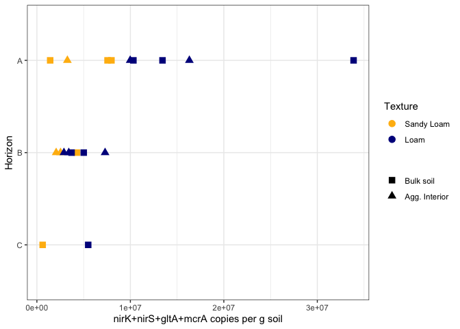<!-- -->

``` r
ddpcr_compiled %>% 
  mutate(
    prop_anaerobe = total_anaerobe_copies / sixteenS_copies_per_g
  ) %>% 
  ggplot(
    aes(y = hzn, x = prop_anaerobe, shape = bulk_agg, color = site)
  ) +
  geom_point(size = 3) +
  scale_y_discrete(limits = rev) + 
  scale_color_manual(
    values = site_colors,
    labels = site_names,
    name = "Texture"
  ) +
  scale_shape_manual(
    values = agg_shapes,
    labels = agg_names,
    name = NULL
  ) +
  theme_bw() + 
  labs(
    x = "(nirK+nirS+gltA+mcrA) per 16S",
    y = "Horizon"
  )
```

    ## Warning: Removed 11 rows containing missing values (`geom_point()`).

<!-- -->

``` r
ddpcr_compiled %>% 
  mutate(
    prop_anaerobe = total_anaerobe_copies / sixteenS_copies_per_g
  ) %>% 
  group_by(site, hzn, bulk_agg) %>% 
  summarise(
    mean_prop_an = mean(prop_anaerobe, na.rm = TRUE),
    se_prop_an = sd(prop_anaerobe) / sqrt(n())
  ) %>% 
  ggplot(
    aes(y = hzn, x = mean_prop_an, shape = bulk_agg, color = site)
  ) +
  geom_pointrange(
    aes(
      xmin = mean_prop_an - se_prop_an, 
      xmax = mean_prop_an + se_prop_an
    )
  ) + 
  scale_y_discrete(limits = rev) + 
  scale_color_manual(
    values = site_colors,
    labels = site_names,
    name = "Texture"
  ) +
  scale_shape_manual(
    values = agg_shapes,
    labels = agg_names,
    name = NULL
  ) +
  theme_bw() + 
  labs(
    x = "(nirK+nirS+gltA+mcrA) per 16S",
    y = "Horizon"
  )
```

    ## `summarise()` has grouped output by 'site', 'hzn'. You can override using the
    ## `.groups` argument.

    ## Warning: Removed 7 rows containing missing values (`geom_segment()`).

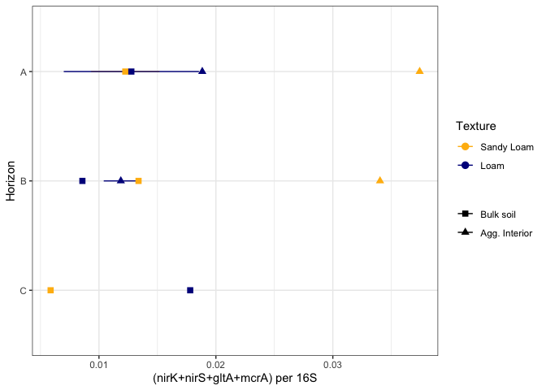<!-- -->

# Stacked Bar Charts

## Copies per g soil

``` r
ddpcr_stacked_bar_data <-
  ddpcr_compiled %>% 
  select(-c(contains("conc"), total_anaerobe_copies)) %>% 
  pivot_longer(
    cols = contains("copies_per_g"),
    names_to = "target_gene",
    values_to = "copies_per_g"
  ) %>% 
  mutate(across(target_gene, ~str_extract(.,"nirs|nirk|glta|mcra|sixteenS")))
```

### 16S

``` r
ddpcr_stacked_bar_data %>% 
  filter(target_gene == "sixteenS") %>% 
  group_by(site, hzn, bulk_agg, target_gene) %>% 
  summarise(
    avg_copies_per_g = mean(copies_per_g, na.rm = TRUE),
    se_copies_per_g = sd(copies_per_g, na.rm = TRUE) / sqrt(n())
  ) %>% 
  mutate(
    site_bulk_agg = 
      factor(
        str_c(site, bulk_agg), 
        levels = c("TIN", "TB", "RB", "RIN")
      )
  ) %>% 
  ggplot(
    aes(
      x = avg_copies_per_g,
      y = hzn,
      fill = site,
      alpha = fct_rev(bulk_agg)
    )
  ) + 
  geom_col(position = "dodge") + 
  geom_errorbarh(
    aes(xmin = avg_copies_per_g, xmax = avg_copies_per_g + se_copies_per_g),
    position = "dodge"
  ) +
  scale_y_discrete(limits = rev) +
  scale_fill_manual(
    values = site_colors,
    labels = site_names,
    name = "Texture"
  ) +
  scale_alpha_manual(
    values = agg_alpha,
    labels = agg_names,
    name = NULL
  ) +
  theme_bw() + 
  labs(
    y = "Horizon",
    x = "Copies per g soil"
  )
```

    ## `summarise()` has grouped output by 'site', 'hzn', 'bulk_agg'. You can override
    ## using the `.groups` argument.

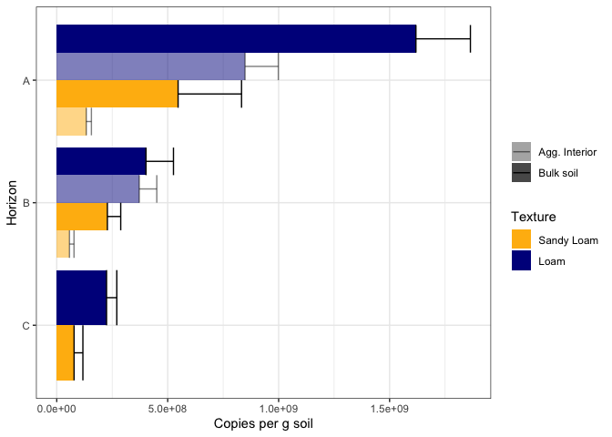<!-- -->

### nirS

``` r
ddpcr_stacked_bar_data %>% 
  filter(target_gene == "nirs") %>% 
  group_by(site, hzn, bulk_agg, target_gene) %>% 
  summarise(
    avg_copies_per_g = mean(copies_per_g, na.rm = TRUE),
    se_copies_per_g = sd(copies_per_g, na.rm = TRUE) / sqrt(n())
  ) %>% 
  mutate(
    site_bulk_agg = 
      factor(
        str_c(site, bulk_agg), 
        levels = c("TIN", "TB", "RB", "RIN")
      )
  ) %>% 
  ggplot(
    aes(
      x = avg_copies_per_g,
      y = hzn,
      fill = site,
      alpha = fct_rev(bulk_agg)
    )
  ) + 
  geom_col(position = "dodge") + 
  geom_errorbarh(
    aes(xmin = avg_copies_per_g, xmax = avg_copies_per_g + se_copies_per_g),
    position = "dodge"
  ) +
  scale_y_discrete(limits = rev) +
  scale_fill_manual(
    values = site_colors,
    labels = site_names,
    name = "Texture"
  ) +
  scale_alpha_manual(
    values = agg_alpha,
    labels = agg_names,
    name = NULL
  ) +
  theme_bw() + 
  labs(
    y = "Horizon",
    x = "Copies per g soil"
  )
```

    ## `summarise()` has grouped output by 'site', 'hzn', 'bulk_agg'. You can override
    ## using the `.groups` argument.

    ## Warning: Removed 1 rows containing missing values (`geom_errorbarh()`).

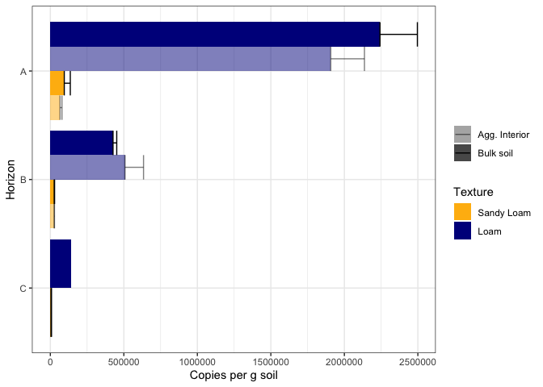<!-- -->

### nirK

``` r
ddpcr_stacked_bar_data %>% 
  filter(target_gene == "nirk") %>% 
  group_by(site, hzn, bulk_agg, target_gene) %>% 
  summarise(
    avg_copies_per_g = mean(copies_per_g, na.rm = TRUE),
    se_copies_per_g = sd(copies_per_g, na.rm = TRUE) / sqrt(n())
  ) %>% 
  mutate(
    site_bulk_agg = 
      factor(
        str_c(site, bulk_agg), 
        levels = c("TIN", "TB", "RB", "RIN")
      )
  ) %>% 
  ggplot(
    aes(
      x = avg_copies_per_g,
      y = hzn,
      fill = site,
      alpha = fct_rev(bulk_agg)
    )
  ) + 
  geom_col(position = "dodge") + 
  geom_errorbarh(
    aes(xmin = avg_copies_per_g, xmax = avg_copies_per_g + se_copies_per_g),
    position = "dodge"
  ) +
  scale_y_discrete(limits = rev) +
  scale_fill_manual(
    values = site_colors,
    labels = site_names,
    name = "Texture"
  ) +
  scale_alpha_manual(
    values = agg_alpha,
    labels = agg_names,
    name = NULL
  ) +
  theme_bw() + 
  labs(
    y = "Horizon",
    x = "Copies per g soil"
  )
```

    ## `summarise()` has grouped output by 'site', 'hzn', 'bulk_agg'. You can override
    ## using the `.groups` argument.

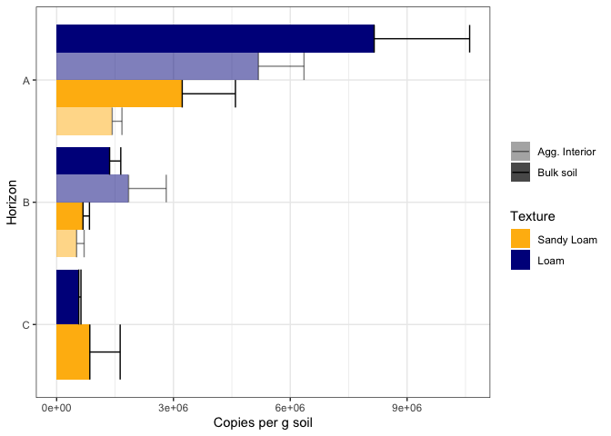<!-- -->

### gltA

``` r
ddpcr_stacked_bar_data %>% 
  filter(target_gene == "glta") %>% 
  group_by(site, hzn, bulk_agg, target_gene) %>% 
  summarise(
    avg_copies_per_g = mean(copies_per_g, na.rm = TRUE),
    se_copies_per_g = sd(copies_per_g, na.rm = TRUE) / sqrt(n())
  ) %>% 
  mutate(
    site_bulk_agg = 
      factor(
        str_c(site, bulk_agg), 
        levels = c("TIN", "TB", "RB", "RIN")
      )
  ) %>% 
  ggplot(
    aes(
      x = avg_copies_per_g,
      y = hzn,
      fill = site,
      alpha = fct_rev(bulk_agg)
    )
  ) + 
  geom_col(position = "dodge") + 
  geom_errorbarh(
    aes(xmin = avg_copies_per_g, xmax = avg_copies_per_g + se_copies_per_g),
    position = "dodge"
  ) +
  scale_y_discrete(limits = rev) +
  scale_fill_manual(
    values = site_colors,
    labels = site_names,
    name = "Texture"
  ) +
  scale_alpha_manual(
    values = agg_alpha,
    labels = agg_names,
    name = NULL
  ) +
  theme_bw() + 
  labs(
    y = "Horizon",
    x = "Copies per g soil"
  )
```

    ## `summarise()` has grouped output by 'site', 'hzn', 'bulk_agg'. You can override
    ## using the `.groups` argument.

    ## Warning: Removed 1 rows containing missing values (`geom_errorbarh()`).

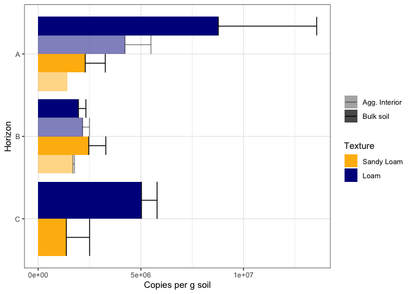<!-- -->

### mcrA

``` r
ddpcr_stacked_bar_data %>% 
  filter(target_gene == "mcra") %>% 
  group_by(site, hzn, bulk_agg, target_gene) %>% 
  summarise(
    avg_copies_per_g = mean(copies_per_g, na.rm = TRUE),
    se_copies_per_g = sd(copies_per_g, na.rm = TRUE) / sqrt(n())
  ) %>% 
  mutate(
    site_bulk_agg = 
      factor(
        str_c(site, bulk_agg), 
        levels = c("TIN", "TB", "RB", "RIN")
      )
  ) %>% 
  ggplot(
    aes(
      x = avg_copies_per_g,
      y = hzn,
      fill = site,
      alpha = fct_rev(bulk_agg)
    )
  ) + 
  geom_col(position = "dodge") + 
  geom_errorbarh(
    aes(xmin = avg_copies_per_g, xmax = avg_copies_per_g + se_copies_per_g),
    position = "dodge"
  ) +
  scale_y_discrete(limits = rev) +
  scale_fill_manual(
    values = site_colors,
    labels = site_names,
    name = "Texture"
  ) +
  scale_alpha_manual(
    values = agg_alpha,
    labels = agg_names,
    name = NULL
  ) +
  theme_bw() + 
  labs(
    y = "Horizon",
    x = "Copies per g soil"
  )
```

    ## `summarise()` has grouped output by 'site', 'hzn', 'bulk_agg'. You can override
    ## using the `.groups` argument.

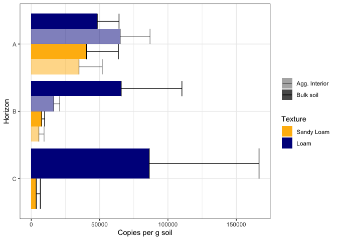<!-- -->

## Copies normalized to 16S

``` r
sixteenS_abund <- 
  ddpcr_stacked_bar_data %>% 
  filter(target_gene == "sixteenS") %>% 
  select(-target_gene) %>% 
  rename(sixteenS_copies_per_g = copies_per_g)


ddpcr_stacked_bar_prop_data <- 
  ddpcr_stacked_bar_data %>% 
  left_join(sixteenS_abund, by = c("site", "hzn", "rep", "bulk_agg")) %>% 
  mutate(
    copies_per_16S = copies_per_g / sixteenS_copies_per_g
  )
```

### nirS

``` r
ddpcr_stacked_bar_prop_data %>% 
  filter(target_gene == "nirs") %>% 
  group_by(site, hzn, bulk_agg, target_gene) %>% 
  summarise(
    avg_copies_per_16S = mean(copies_per_16S, na.rm = TRUE),
    se_copies_per_16S = sd(copies_per_16S, na.rm = TRUE) / sqrt(n())
  ) %>% 
  mutate(
    site_bulk_agg = 
      factor(
        str_c(site, bulk_agg), 
        levels = c("TIN", "TB", "RB", "RIN")
      )
  ) %>% 
  ggplot(
    aes(
      x = avg_copies_per_16S,
      y = hzn,
      fill = site,
      alpha = fct_rev(bulk_agg)
    )
  ) + 
  geom_col(position = "dodge") + 
  geom_errorbarh(
    aes(xmin = avg_copies_per_16S, xmax = avg_copies_per_16S + se_copies_per_16S),
    position = "dodge"
  ) +
  scale_y_discrete(limits = rev) +
  scale_fill_manual(
    values = site_colors,
    labels = site_names,
    name = "Texture"
  ) +
  scale_alpha_manual(
    values = agg_alpha,
    labels = agg_names,
    name = NULL
  ) +
  theme_bw() + 
  labs(
    y = "Horizon",
    x = "Copies per 16S copy"
  )
```

    ## `summarise()` has grouped output by 'site', 'hzn', 'bulk_agg'. You can override
    ## using the `.groups` argument.

    ## Warning: Removed 2 rows containing missing values (`geom_errorbarh()`).

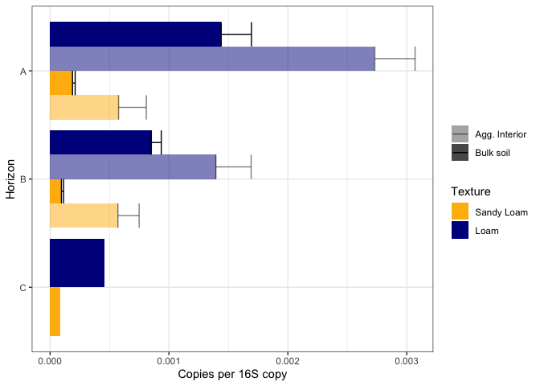<!-- -->

### nirK

``` r
ddpcr_stacked_bar_prop_data %>% 
  filter(target_gene == "nirk") %>% 
  group_by(site, hzn, bulk_agg, target_gene) %>% 
  summarise(
    avg_copies_per_16S = mean(copies_per_16S, na.rm = TRUE),
    se_copies_per_16S = sd(copies_per_16S, na.rm = TRUE) / sqrt(n())
  ) %>% 
  mutate(
    site_bulk_agg = 
      factor(
        str_c(site, bulk_agg), 
        levels = c("TIN", "TB", "RB", "RIN")
      )
  ) %>% 
  ggplot(
    aes(
      x = avg_copies_per_16S,
      y = hzn,
      fill = site,
      alpha = fct_rev(bulk_agg)
    )
  ) + 
  geom_col(position = "dodge") + 
  geom_errorbarh(
    aes(xmin = avg_copies_per_16S, xmax = avg_copies_per_16S + se_copies_per_16S),
    position = "dodge"
  ) +
  scale_y_discrete(limits = rev) +
  scale_fill_manual(
    values = site_colors,
    labels = site_names,
    name = "Texture"
  ) +
  scale_alpha_manual(
    values = agg_alpha,
    labels = agg_names,
    name = NULL
  ) +
  theme_bw() + 
  labs(
    y = "Horizon",
    x = "Copies per 16S copy"
  )
```

    ## `summarise()` has grouped output by 'site', 'hzn', 'bulk_agg'. You can override
    ## using the `.groups` argument.

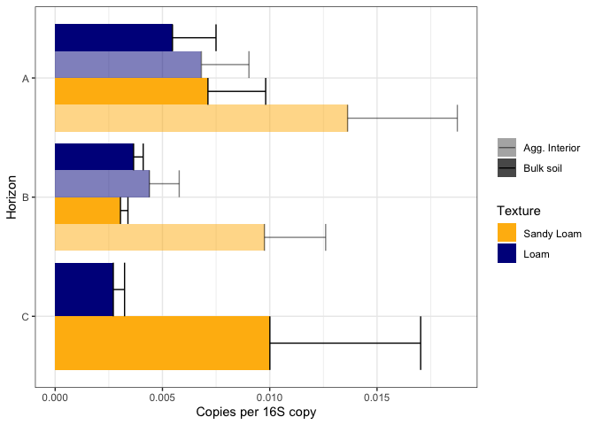<!-- -->

### gltA

``` r
ddpcr_stacked_bar_prop_data %>% 
  filter(target_gene == "glta") %>% 
  group_by(site, hzn, bulk_agg, target_gene) %>% 
  filter(copies_per_16S != Inf) %>% 
  summarise(
    avg_copies_per_16S = mean(copies_per_16S, na.rm = TRUE),
    se_copies_per_16S = sd(copies_per_16S, na.rm = TRUE) / sqrt(n())
  ) %>% 
  mutate(
    site_bulk_agg = 
      factor(
        str_c(site, bulk_agg), 
        levels = c("TIN", "TB", "RB", "RIN")
      )
  ) %>% 
  ggplot(
    aes(
      x = avg_copies_per_16S,
      y = hzn,
      fill = site,
      alpha = fct_rev(bulk_agg)
    )
  ) + 
  geom_col(position = "dodge") + 
  geom_errorbarh(
    aes(xmin = avg_copies_per_16S, xmax = avg_copies_per_16S + se_copies_per_16S),
    position = "dodge"
  ) +
  scale_y_discrete(limits = rev) +
  scale_fill_manual(
    values = site_colors,
    labels = site_names,
    name = "Texture"
  ) +
  scale_alpha_manual(
    values = agg_alpha,
    labels = agg_names,
    name = NULL
  ) +
  theme_bw() + 
  labs(
    y = "Horizon",
    x = "Copies per 16S copy"
  )
```

    ## `summarise()` has grouped output by 'site', 'hzn', 'bulk_agg'. You can override
    ## using the `.groups` argument.

    ## Warning: Removed 1 rows containing missing values (`geom_errorbarh()`).

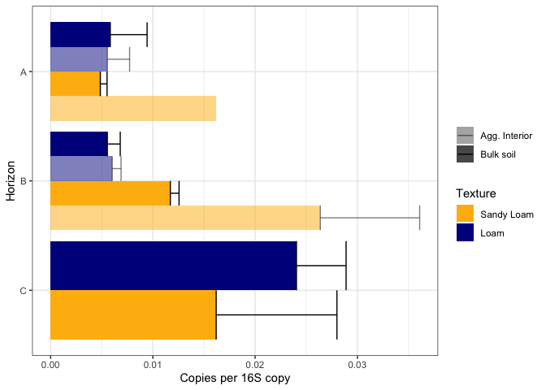<!-- -->

### mcrA

``` r
ddpcr_stacked_bar_prop_data %>% 
  filter(target_gene == "mcra") %>% 
  group_by(site, hzn, bulk_agg, target_gene) %>% 
  filter(copies_per_16S != Inf) %>% 
  summarise(
    avg_copies_per_16S = mean(copies_per_16S, na.rm = TRUE),
    se_copies_per_16S = sd(copies_per_16S, na.rm = TRUE) / sqrt(n())
  ) %>% 
  mutate(
    site_bulk_agg = 
      factor(
        str_c(site, bulk_agg), 
        levels = c("TIN", "TB", "RB", "RIN")
      )
  ) %>% 
  ggplot(
    aes(
      x = avg_copies_per_16S,
      y = hzn,
      fill = site,
      alpha = fct_rev(bulk_agg)
    )
  ) + 
  geom_col(position = "dodge") + 
  geom_errorbarh(
    aes(xmin = avg_copies_per_16S, xmax = avg_copies_per_16S + se_copies_per_16S),
    position = "dodge"
  ) +
  scale_y_discrete(limits = rev) +
  scale_fill_manual(
    values = site_colors,
    labels = site_names,
    name = "Texture"
  ) +
  scale_alpha_manual(
    values = agg_alpha,
    labels = agg_names,
    name = NULL
  ) +
  theme_bw() + 
  labs(
    y = "Horizon",
    x = "Copies per 16S copy"
  )
```

    ## `summarise()` has grouped output by 'site', 'hzn', 'bulk_agg'. You can override
    ## using the `.groups` argument.

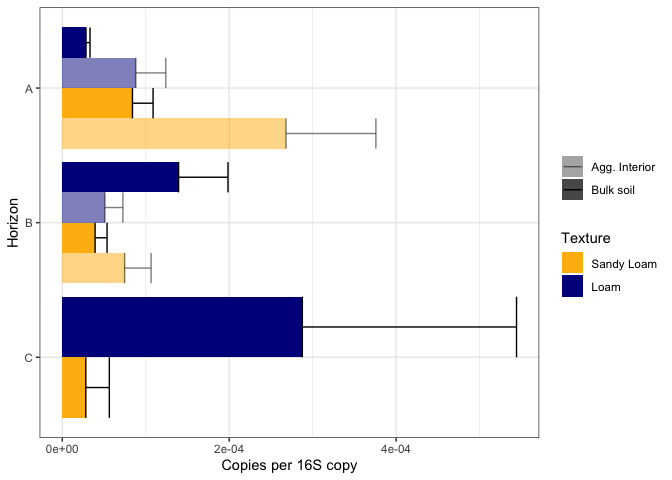<!-- -->

### Totals

``` r
ddpcr_stacked_bar_prop_data
```

    ## # A tibble: 150 × 8
    ## # Groups:   site, hzn, rep [18]
    ##    site  hzn     rep bulk_agg target_gene copies_per_g sixteenS_copi…¹ copies_…²
    ##    <chr> <chr> <int> <chr>    <chr>              <dbl>           <dbl>     <dbl>
    ##  1 R     A         1 B        nirs             163718.     1088986926.   1.50e-4
    ##  2 R     A         1 B        nirk            3659883.     1088986926.   3.36e-3
    ##  3 R     A         1 B        glta            4066537.     1088986926.   3.73e-3
    ##  4 R     A         1 B        mcra              87034.     1088986926.   7.99e-5
    ##  5 R     A         1 B        sixteenS     1088986926.     1088986926.   1   e+0
    ##  6 R     A         1 IN       nirs              61614.      152385113.   4.04e-4
    ##  7 R     A         1 IN       nirk            1122259.      152385113.   7.36e-3
    ##  8 R     A         1 IN       glta                NaN       152385113. NaN      
    ##  9 R     A         1 IN       mcra              68216.      152385113.   4.48e-4
    ## 10 R     A         1 IN       sixteenS      152385113.      152385113.   1   e+0
    ## # … with 140 more rows, and abbreviated variable names ¹​sixteenS_copies_per_g,
    ## #   ²​copies_per_16S

``` r
ddpcr_stacked_bar_prop_data %>% 
  filter(target_gene != "sixteenS") %>% 
  ggplot(
    aes(y = bulk_agg, x = copies_per_g, alpha = bulk_agg, fill = target_gene)
  ) +
  geom_col() +
  scale_y_discrete(limits = rev) + 
  scale_alpha_manual(
    values = agg_alpha,
    labels = agg_names,
    name = NULL
  ) +
  facet_grid(cols = vars(site), rows = vars(hzn)) +
  theme_bw() + 
  labs(
    x = "nirK+nirS+gltA+mcrA copies per g soil",
    y = "Horizon"
  )
```

    ## Warning: Removed 13 rows containing missing values (`position_stack()`).

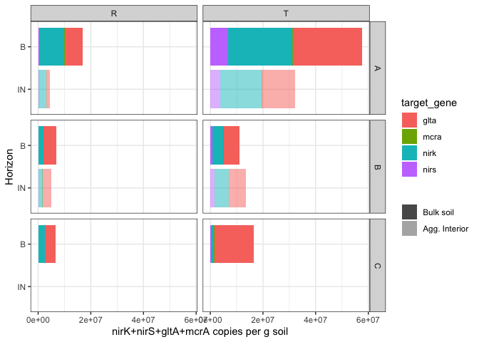<!-- -->

``` r
ddpcr_stacked_bar_prop_data %>% 
  filter(target_gene != "sixteenS", copies_per_16S != Inf) %>% 
  ggplot(
    aes(y = bulk_agg, x = copies_per_16S, alpha = bulk_agg, fill = target_gene)
  ) +
  geom_col() +
  scale_y_discrete(limits = rev) + 
  scale_alpha_manual(
    values = agg_alpha,
    labels = agg_names,
    name = NULL
  ) +
  facet_grid(cols = vars(site), rows = vars(hzn)) +
  theme_bw() + 
  labs(
    x = "nirK+nirS+gltA+mcrA copies per 16S",
    y = "Horizon"
  )
```

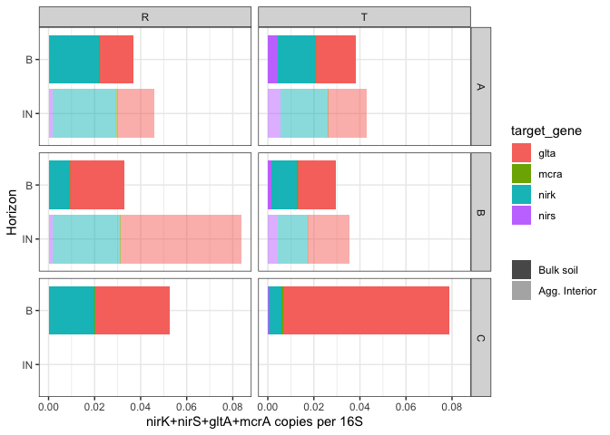<!-- -->
